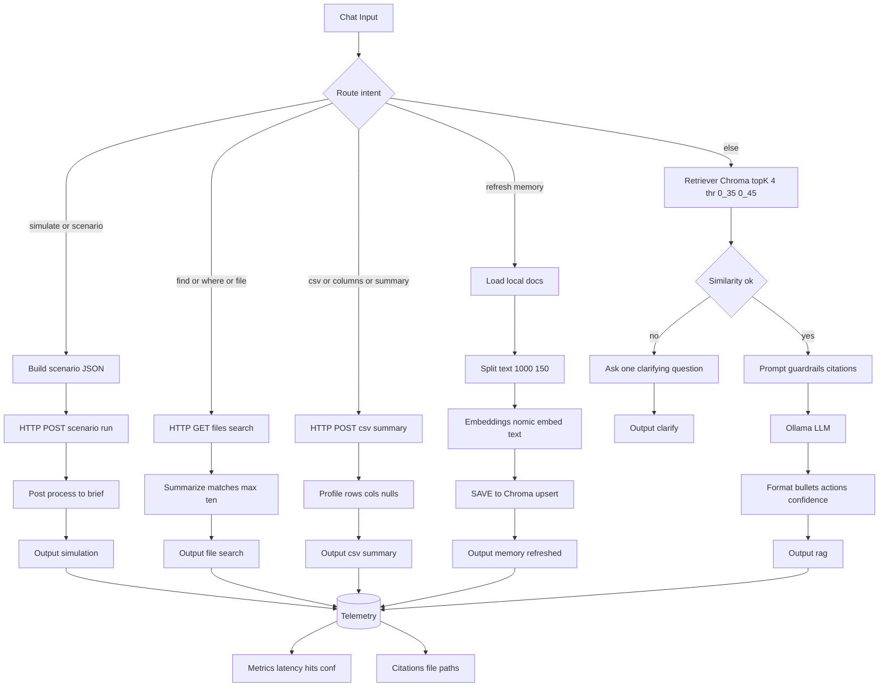

# 🚀 AI Agent Mastery: 28-Day Professional Track

[](LICENSE)
[]()
[]()
[]()

---

## 📑 Table of Contents

* [Overview](#overview)  
* [Who This Is For](#who-this-is-for)  
* [Learning Outcomes](#learning-outcomes)  
* [Professional Deliverables](#professional-deliverables)  
* [Course Structure](#course-structure)  
* [Folder Structure](#folder-structure)  
* [Week 1: Foundations](#week-1-foundations)  
* [Week 2: Governance & Workflows](#week-2-governance--workflows)  
* [Week 3: Data Agents & Scenario Planning](#week-3-data-agents--scenario-planning)  
* [Week 4: Autonomous Strategic Agents](#week-4-autonomous-strategic-agents)  
* [Mermaid Workflow Diagram](#mermaid-workflow-diagram)  
* [License](#license)

---

## Overview

The **AI Agent Mastery: 28-Day Professional Track** is a *career-focused builder program* for professionals, analysts, and leaders who want to design **deployable, boardroom-ready AI agents** in under an hour.  

It’s been upgraded to include **local-first tools (Ollama, Chroma, Flowise, FastAPI)** with **Ethiopia-relevant use cases**: healthcare, permits, budgeting, and policy simulations.

No fluff.  
No “someday” theory.  
Every day ends with an artifact you can commit, demo, or present.

---

## Who This Is For

* **Data & Policy Professionals:** Build auditable AI workflows with citations.  
* **Entrepreneurs & Nonprofits:** Prototype civic and financial micro-tools.  
* **Analysts & MBAs:** Apply frameworks (SWOT, Porter’s, OKRs) with repo evidence.  
* **Military Transitioners:** Convert mission planning skills into AI simulations.  
* **Public-Sector Leaders:** Use local-first AI to stress-test policies before rollout.  

---

## Learning Outcomes

By the end of this track, you will be able to:

* Deploy **repo-grounded RAG agents** with Flowise + Ollama.  
* Use **retrievers, routers, and guardrails** for safe outputs.  
* Build **scenario planners** with Monte Carlo-lite simulations.  
* Apply **strategic frameworks** (SWOT, Porter, OKRs) with JSON + briefs.  
* Run **boardroom demos** with citations, probabilities, and one-click scripts.  

---

## Professional Deliverables

You’ll graduate with:

* 📄 **Strategic Prompt Files** (SWOT, Porter’s, OKRs, Exec Brief)  
* 📊 **Flowise Chatflows** (search, CSV summary, scenario runner)  
* 🤖 **Autonomous agent** with memory + refreshable RAG  
* 🎥 **Investor/stakeholder demo pack** (screenshots, scripts, reports)  
* 📑 A final **Ethiopia-focused case study** mapping problem → solution → KPIs  

---

## Course Structure

* **Week 1 (Foundations):** Prompt discipline, repo grounding, first agent.  
* **Week 2 (Governance & Workflows):** File search, CSV summaries, context packs, board-ready workflows.  
* **Week 3 (Data Agents & Scenario Planning):** Visualization, Colab-based scenario planner, FastAPI tools.  
* **Week 4 (Autonomous Strategic Agents):** Refreshable memory, SWOT/Porter/OKR modules, simulation-triggered agents, investor demo.  

Every week ends with a **rubric check**: ✅ Runs | ✅ Documented | ✅ Deployed | ✅ Cited | ✅ KPI-ready.

---

## Folder Structure

```plaintext
ai-agent-mastery-28days/
│
├── Week1_Foundations/
│   ├── Day1/...
│   ├── ...
├── Week2_Governance_Workflows/
│   ├── Day8/...
│   ├── ...
├── Week3_Data_Agents/
│   ├── Day15/...
│   ├── ...
├── Week4_Autonomous_Strategic_Agents/
│   ├── Day22/...
│   ├── Day28/...
├── scripts/        # FastAPI server (local_tools_server.py)
├── assets/         # Evidence pack (screenshots, charts, exports)
├── templates/      # Strategic prompt files (SWOT, Porter, OKRs, Exec Brief)
├── docs/           # Diagrams, case studies, rubrics
└── README.md
````

---

## Week 1: Foundations

* **Day 1–7:** Prompting, repo context, research, synthesis, first Q\&A bot.
* Deliverable: **Foundations agent** (citations + memory buffer).

---

## Week 2: Governance & Workflows

* **Day 8–14:** Governance-aware prompts, civic workflows, Databutton micro-tools.
* **Day 14:** Mini-project → PRD v2, visuals, demo script.
* Deliverables: **Governance prompts, PRD v2, demo script.**

---

## Week 3: Data Agents & Scenario Planning

* **Day 15–21:** Colab analysis, visualization briefs, ranking/trend charts.
* **Day 22:** Local Flowise RAG (Ollama + Chroma).
* **Day 23:** Multi-tool agent (file search, CSV summary, RAG fallback).
* **Day 26:** Monte Carlo-lite planner (Colab notebook + report).
* Deliverables: **Scenario planner, CSV summaries, charts.**

---

## Week 4: Autonomous Strategic Agents

* **Day 24:** Refreshable RAG (memory refresh command).
* **Day 25:** Strategic frameworks (SWOT, Porter’s, OKRs with JSON + briefs).
* **Day 27:** Scenario-triggered agent (simulate → summarize → action items).
* **Day 28:** Investor demo (one-click runbook, crib sheet, evidence pack).
* Deliverables: **Autonomous agent, investor-ready demo pack.**

---

## Mermaid Workflow Diagram



---

## License

This project is licensed under the **DACR License** — see the [LICENSE](LICENSE) file for details.

```


