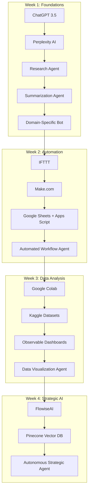

# 🚀 AI Agent Mastery: 28-Day Professional Track

[](LICENSE)
[]()
[]()
[]()

---

## 📑 Table of Contents
- [Overview](#overview)
- [Who This Is For](#who-this-is-for)
- [Course Structure](#course-structure)
- [Folder Structure](#folder-structure)
- [Week 1: ChatGPT 3.5 + Perplexity](#week-1-chatgpt-35--perplexity)
- [Week 2: Automation Workflows](#week-2-automation-workflows)
- [Week 3: Data Analysis Agents](#week-3-data-analysis-agents)
- [Week 4: Autonomous Strategic Agents](#week-4-autonomous-strategic-agents)
- [Mermaid Workflow Diagram](#mermaid-workflow-diagram)
- [License](#license)

---

## Overview
The **AI Agent Mastery: 28-Day Professional Track** is a *serious, career-focused* AI mastery program built for professionals who need **real, deployable AI agents** starting Day 1.

No fluff.  
No “learn someday” theory.  
Every lesson builds an **actual working tool** you can deploy immediately, using **only free resources**.

---

## Who This Is For
- **Data Professionals:** Automate research, cleaning, and analysis
- **Entrepreneurs:** Rapidly prototype business tools
- **Analysts:** Build sector-specific research agents
- **MBA/PMP Candidates:** AI-enhanced strategic frameworks
- **Military Transitioners:** Convert mission planning skills into AI-driven workflows

---

## Course Structure
- **Week 1:** *Foundations* — ChatGPT 3.5 + Perplexity for research & synthesis
- **Week 2:** *Automation Workflows* — IFTTT, Make.com, Google Sheets + Apps Script
- **Week 3:** *Data Analysis Agents* — Google Colab, Kaggle, Observable
- **Week 4:** *Autonomous Strategic Agents* — FlowiseAI, AgentGPT, Pinecone

---

## Folder Structure
```plaintext
ai-agent-mastery-28days/
│
├── Week1_ChatGPT_Perplexity/
│   ├── Day1/lesson.md
│   ├── ...
├── Week2_Automation_Workflows/
│   ├── Day8/lesson.md
│   ├── ...
├── Week3_Data_Analysis_Agents/
│   ├── Day15/lesson.md
│   ├── ...
├── Week4_Autonomous_Strategic_Agents/
│   ├── Day22/lesson.md
│   ├── ...
├── assets/
├── docs/
├── scripts/
└── README.md
````

---

## Week 1: ChatGPT 3.5 + Perplexity

* **Day 1:** Setup & First Prompt
* **Day 2:** Structured Prompt Engineering
* **Day 3:** Combining Perplexity & ChatGPT
* **Day 4:** Building a Research Agent
* **Day 5:** Summarization Agent
* **Day 6:** Domain-Specific Q\&A Bot
* **Day 7:** Weekly Review & Deployment

---

## Week 2: Automation Workflows

* **Day 8:** Introduction to Workflow Automation
* **Day 9:** Setting Up IFTTT for AI Triggers
* **Day 10:** Make.com Scenario Building Basics
* **Day 11:** Google Sheets Data Automation
* **Day 12:** Apps Script for Custom AI Functions
* **Day 13:** Combining IFTTT, Make, and Google Sheets
* **Day 14:** Weekly Review — Deploy a Fully Automated Agent

---

## Week 3: Data Analysis Agents

* **Day 15:** Google Colab for AI & Data Projects
* **Day 16:** Accessing & Cleaning Data from Kaggle
* **Day 17:** Building Data Summarization Agents
* **Day 18:** Introduction to Observable for Visualization
* **Day 19:** Interactive Dashboard Creation in Observable
* **Day 20:** Merging Multiple Data Sources in AI Agents
* **Day 21:** Weekly Review — Deploy a Visualization-Enhanced AI Agent

---

## Week 4: Autonomous Strategic Agents

* **Day 22:** Introduction to FlowiseAI (No-Code AI Agent Builder)
* **Day 23:** Creating a Multi-Tool AI Agent in FlowiseAI
* **Day 24:** Introduction to Pinecone Vector Database
* **Day 25:** Adding Long-Term Memory to AI Agents
* **Day 26:** Using AgentGPT for Autonomous Task Execution
* **Day 27:** Integrating Strategic Decision-Making into Agents
* **Day 28:** Final Review & Portfolio Showcase — Deploy Your AI Team

---

## Mermaid Workflow Diagram



---

## License

This project is licensed under the **DACR License** — see the [LICENSE](LICENSE) file for details.

```

---

If you replace your current README with this one and push, GitHub will show the **entire 28-day plan** clearly for mentees, investors, and recruiters.  

If you want, I can also **add collapsible `<details>` sections** so each week’s daily plan can be expanded or hidden — that makes the README more compact but still detailed.  

Do you want me to format it that way?
```


