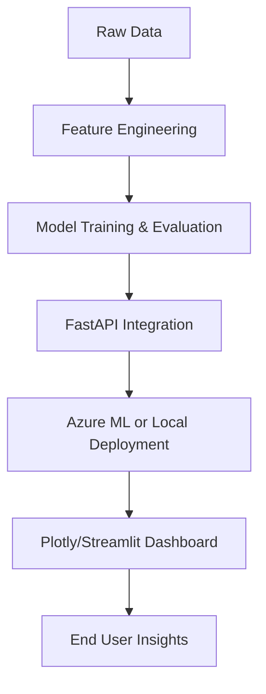

# 🚀 AI Model Mastery: Microsoft SWE Track

[-4C4EFF?style=for-the-badge&logo=shield&logoColor=white)](./LICENSE.md)
[]()
[]()
[]()

---

## 📑 Table of Contents

- [Overview](#-overview)
- [Who This Is For](#-who-this-is-for)
- [Learning Outcomes](#-learning-outcomes)
- [Professional Deliverables](#-professional-deliverables)
- [Course Structure](#-course-structure)
- [Folder Structure](#-folder-structure)
- [Week 1: Data & Model Foundations](#-week-1-data--model-foundations)
- [Week 2: Model Building & Evaluation](#-week-2-model-building--evaluation)
- [Week 3: AI Integration & APIs](#-week-3-ai-integration--apis)
- [Week 4: Capstone Project & Deployment](#-week-4-capstone-project--deployment)
- [Mermaid Architecture Diagram](#-mermaid-architecture-diagram)
- [License](#-license)

---

## 🧭 Overview

**AI Model Mastery: Microsoft SWE Track** is a *hands-on, 20-day professional accelerator* designed for aspiring Software Engineers preparing for **technical roles at Microsoft and other AI-driven organizations**.

This version builds directly upon the **AI Agent Mastery** framework — but pivots from *agent orchestration* to *AI model engineering*, helping mentees develop full-stack proficiency in:

- Python-based model building  
- Data preprocessing and optimization  
- API integration (FastAPI, Azure ML)  
- Version control (GitHub)  
- Deployment readiness  

Every day concludes with a working artifact that could be shared in an interview or demo — reinforcing the core competencies of modern SWE roles.

---

## 👥 Who This Is For

- 🎓 **Aspiring Software Engineers** preparing for Microsoft, Meta, or Google.  
- 💻 **Bootcamp & CS Grads** seeking *applied* AI/ML projects for their portfolio.  
- ⚙️ **Developers transitioning into AI/ML engineering** who need structure.  
- 🧠 **Mentees or Students** under guided mentorship wanting practical deliverables.

---

## 🎯 Learning Outcomes

By completing this track, you’ll be able to:

- Build, train, and evaluate **machine learning models** using Python & scikit-learn.  
- Create and expose **AI APIs** using FastAPI.  
- Integrate models into **Azure ML pipelines** for cloud-scale deployment.  
- Apply **version control discipline** and collaborative GitHub practices.  
- Understand **system design trade-offs** and AI governance fundamentals.

---

## 📁 Professional Deliverables

You’ll graduate with:

- 🧾 **Model Notebooks** (regression, classification, NLP)  
- ⚙️ **FastAPI microservice** exposing your trained model  
- ☁️ **Azure ML pipeline demo** (or local container deployment)  
- 📊 **Plotly/Streamlit dashboard** showing metrics and predictions  
- 📑 **GitHub-ready README + Model Card** documenting model ethics, data lineage, and results  
- 🎥 **Capstone video or demo script** showcasing your final product  

---

## 🗓️ Course Structure

| Week       | Focus                                         | Deliverable                                             |
| ----------- | --------------------------------------------- | ------------------------------------------------------- |
| **Week 1** | Data loading, cleaning, and model foundations | Baseline regression/classification notebook             |
| **Week 2** | Model tuning & evaluation                     | Model evaluation notebook + Azure ML setup              |
| **Week 3** | AI integration with APIs                      | Working FastAPI endpoint + test client                  |
| **Week 4** | Capstone project                              | Deployed model (containerized) + dashboard presentation |

---

## 🧱 Folder Structure

```plaintext
ai-model-mastery/
│
├── week1_data_and_basics/
│   ├── 01_data_loading.ipynb
│   ├── 02_feature_engineering.ipynb
│   ├── 03_model_basics_linear_regression.ipynb
│   └── README.md
│
├── week2_build_a_model/
│   ├── 01_train_model_classification.ipynb
│   ├── 02_model_evaluation.ipynb
│   ├── 03_azure_ml_pipeline_setup.md
│   └── README.md
│
├── week3_ai_integration/
│   ├── 01_using_openai_api.ipynb
│   ├── 02_build_chatbot_fastapi.ipynb
│   ├── 03_frontend_connection.md
│   └── README.md
│
├── week4_capstone/
│   ├── dataset/
│   ├── model.py
│   ├── app.py
│   ├── Dockerfile
│   ├── dashboard_plotly.ipynb
│   └── README.md
│
└── docs/
    ├── technical_overview.md
    ├── interview_readiness_checklist.md
    └── github_etiquette_for_microsoft.md
````

---

## 🧩 Week 1: Data & Model Foundations

Learn the lifecycle of a dataset — from raw CSV to model-ready form.
You’ll explore:

* Exploratory Data Analysis (EDA)
* Feature scaling, normalization, and encoding
* Linear regression model training and interpretation
* Evaluation metrics (MAE, MSE, R²)

**Deliverable:** Clean dataset + baseline regression model notebook.

---

## 🔬 Week 2: Model Building & Evaluation

Deepen your skills with:

* Decision trees, random forests, and logistic regression
* Model tuning via GridSearchCV
* Overfitting and bias-variance tradeoff
* Azure ML experiment tracking

**Deliverable:** Evaluated model with accuracy + feature importance charts.

---

## ⚙️ Week 3: AI Integration & APIs

Turn your model into an intelligent service:

* Expose via **FastAPI endpoint**
* Test and document with Swagger UI
* Add authentication and error handling
* Connect optional **Plotly Studio** or **Streamlit** dashboard

**Deliverable:** API + working test client.

---

## 🌐 Week 4: Capstone Project & Deployment

Package, present, and scale:

* Containerize model with Docker
* Deploy via Azure ML or local instance
* Create dashboard of predictions and KPIs
* Write model card + README summary

**Deliverable:** End-to-end deployable AI system.

---

## 🧭 Mermaid Architecture Diagram



---

## ⚖️ License

This project is licensed under the **DACR License** — see the [LICENSE](LICENSE) file for details.

```

```


