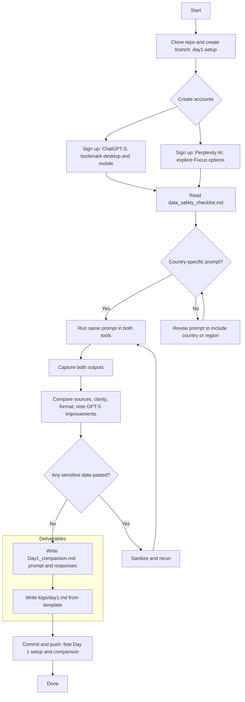

# Week 1 — Day 1: Executive AI Opportunity Workshop (Top‑of‑Funnel Lead Generation)

**Save as:** `wk01/day01_executive_ai_opportunity_workshop.md`

**CXO Lens:** This is not training; it’s pipeline creation. A 90‑minute, non‑technical, board‑credible workshop that surfaces one high‑ROI automation opportunity and sets up **Phase 1: Paid Discovery**. Integration, privacy, and value capture are positioned from minute one.

---

## Positioning

* **What it is:** A sharp, 90‑minute session for partners/executives at ICP firms. No code, no tooling tours—**business outcomes only**.
* **Goal:** Teach leaders *how to identify* high‑ROI automation opportunities using our framework; leave with a prioritized, qualified use case.
* **Business model:** Free or nominal fee (\$500) as a **marketing expense / lead magnet**.
* **Primary outcome:** A concrete, scoped use case + executive sponsor buy‑in → direct handoff to **Phase 1: Paid Discovery**.

> **Non‑goals:** Building solutions live; debating MLOps stacks; internal IT replacement. We enable **Private AI** within their constraints.

---

## Audience & ICP

* **Primary:** Managing Partners, BU/Function Heads, Operations, Strategy.
* **Secondary:** IT, Data/Analytics, Risk/Legal (invited for credibility and acceleration).

---

## Core Messages (talk track)

1. **AI adoption ≠ value capture.** We close the activation‑to‑impact gap with governance + change control.
2. **Private AI first.** Your data stays your data (contracts, scopes/claims, auditability).
3. **Start with a single, boring, high‑ROI workflow.** Prove lift in weeks, not months.

---

## Agenda (90 Minutes)

**00–05 | Executive framing**

* Outcomes, ground rules (no tech rabbit holes), today’s deliverables.

**05–15 | The 3 lenses**

* **Value lens:** Revenue, cost, risk.
* **Feasibility lens:** Data availability/quality, access, system touchpoints.
* **Readiness lens:** Process ownership, change appetite, control gates.

**15–35 | Opportunity Storm (guided)**

* Collect 6–10 candidate workflows (billing, onboarding, case intake, account review).
* Classify: **Manual → Structured → Repetitive → Governable**.

**35–55 | Scoring & Prioritization**

* Use the **Automation Opportunity Canvas** (below).
* Scorecard: Value (0–5), Feasibility (0–5), Risk (0–5, inverted), Time‑to‑Impact (0–5).
* Compute **Opportunity Index** = (Value + Feasibility + TTI) – Risk.

**55–70 | Private AI guardrails**

* Data boundaries, scopes/claims, audit facts, human‑in‑the‑loop checkpoints.
* Clarify SoR/SoT and required integrations (ERP/CRM/ITSM, email, file stores).
* Identify change gates (CAB‑as‑code preview for Phase 2).

**70–85 | Executive decision & CTA**

* Select the **one** use case (name the owner, data sources, policy constraints).
* Draft the **Phase 1: Paid Discovery** brief (below).
* Tentative calendar hold for Discovery kick‑off.

**85–90 | Close & next steps**

* Confirm decision log, follow‑ups, and artifact delivery within 24–48h.

---

## Automation Opportunity Canvas (worksheet)

| Section                         | Prompts                                                         |
| ------------------------------- | --------------------------------------------------------------- |
| **Workflow name**               | What is the job‑to‑be‑done? Who owns it?                        |
| **Business value**              | Cost saved, revenue protected/created, risk reduced (quantify). |
| **Users & volume**              | Who touches this? Vol/day or cases/week.                        |
| **Inputs**                      | Systems, documents, forms, emails, tickets.                     |
| **Outputs**                     | Decisions, updates, messages, records.                          |
| **Policy constraints**          | PII/PHI/PCI? Retention? Legal hold? Region?                     |
| **Integration touchpoints**     | ERP/CRM/ITSM, SSO, file storage, email, messaging.              |
| **Observability**               | What gets logged, traced, and measured?                         |
| **Change control**              | Who approves changes? What’s the rollback?                      |
| **Success metric (North Star)** | e.g., cycle time ↓, accuracy ↑, leakage ↓, backlog ↓.           |

### Scorecard (prioritize 1–3)

| Dimension          | 0       | 1      | 2      | 3               | 4       | 5                |
| ------------------ | ------- | ------ | ------ | --------------- | ------- | ---------------- |
| **Value**          | None    | Minor  | Useful | Material        | High    | Transformational |
| **Feasibility**    | Blocked | Risky  | Doable | Straightforward | Easy    | Trivial          |
| **Risk (invert)**  | Severe  | High   | Medium | Manageable      | Low     | Minimal          |
| **Time‑to‑Impact** | 6+ mo   | 3–6 mo | 2–3 mo | 4–8 wks         | 2–4 wks | ≤2 wks           |

**Opportunity Index** = (Value + Feasibility + Time‑to‑Impact) – Risk
Pick the **highest index** with clear ownership and clean data access.

---

## Phase 1: Paid Discovery (handoff package)

**Purpose:** Validate feasibility, quantify ROI, and produce a run‑plan + SOW for Phase 2.
**Duration:** 2–3 weeks. **Commercials:** Fixed fee (e.g., \$10–\$25k).
**Artifacts:**

* Discovery brief (problem, scope, stakeholders, constraints).
* Data map (SoR/SoT, fields, access pattern), risks & mitigations.
* POC experiment plan + acceptance criteria.
* Executive report‑out with ROI model and Phase 2 backlog.

**Template — Discovery Brief (1‑pager)**

* **Use case:** *e.g., Claims intake triage*.
* **Owner:** *VP Operations*.
* **Systems:** *CRM, ITSM, file store, email*.
* **Data:** *PDF forms, tickets, customer profiles*.
* **Guardrails:** *PII, region lock, 90‑day retention*.
* **Success:** *Reduce triage time 60%; cut rework 30%*.

---

## Private AI One‑Pager (leave‑behind)

* **Data boundary:** Your tenant; encrypted at rest & in transit; zero training on your data.
* **Access model:** OAuth2/OIDC; scopes/claims; admin‑visible audit facts.
* **Change control:** CAB‑as‑code; version pinning; rollback plan.
* **Observability:** Trace IDs per request; PII redaction; cost per 1k calls tracked.

---

## Sales Enablement (how this feeds pipeline)

* **CRM fields to capture:** Exec sponsor, use case title, owner, index score, expected ROI, risk notes, system list, next meeting date.
* **Follow‑up sequence:**

  1. **T+4h:** Thank‑you + decision log + Discovery proposal (calendar link).
  2. **T+48h:** Case study relevant to use case + Private AI one‑pager.
  3. **T+7d:** Objection‑handling note to IT/Legal (see below) + deadline for hold.

**Email snippet — proposal handoff**

> Subject: Next steps on \[Use Case] — Discovery brief & calendar
> Thanks for today’s session. As discussed, we recommend a 2–3 week Discovery to confirm feasibility and ROI. Draft brief attached; here’s a direct calendar link for kick‑off. We’ll align IT/Legal early to de‑risk data access and controls.

---

## Objection Handling (for IT/Legal/Operations)

* **Security:** mTLS, least privilege, just‑in‑time credentials; no shared secrets.
* **Privacy:** No cross‑tenant training; field‑level redaction; data residency respected.
* **Compliance:** Evidence to audit lake; policy‑as‑code mapping to ISO/SOC2/NIST.
* **Run risk with a leash:** Canary, rate limits, idempotency, DLQ, rapid rollback.

---

## Metrics for Week 1

* Workshop → **Discovery conversion rate** (%).
* Avg **Opportunity Index** of chosen use cases.
* **Time‑to‑kick‑off** (days).
* Stakeholder **alignment score** (simple post‑session poll).
* **Forecasted ROI vs Discovery cost** (ratio).

---

## Preview — Day 2 & Day 3 (Mid‑/Bottom‑of‑Funnel tie‑in)

* **Day 2: PICO Prompting (Persona · Instructions · Context · Output).**

  * Translate the chosen executive use case into **PICO artifacts**: decision rubric, input schema, output contract, guardrails.
  * Deliver **prompt pack** + evaluation checklist (precision/recall, hallucination traps, escalation rules).
* **Day 3: Stakeholder Alignment Session (Sales Acceleration).**

  * Bespoke briefing for IT, Legal, Operations on the selected use case.
  * **Goal:** secure approvals to proceed with data access + Discovery timeline.
  * Includes slide kit, RACI, risk register, and FAQ.

---

## Materials (ready‑to‑ship today)

* Slides: 10–12 slides covering value→feasibility→readiness, Private AI, and Opportunity Index.
* Worksheets: Opportunity Canvas + Scorecard (print or digital).
* Templates: Discovery Brief (1‑pager), follow‑up emails, objection pack.
* Facilitator script: Opening (2m), framing (5m), storming (20m), scoring (20m), guardrails (15m), CTA (15m).

---

## Funnel Map (Mermaid)

---

## Acceptance & QA (for the facilitator)

* **One** named use case with owner, systems, policy constraints, and **Opportunity Index**.
* Discovery brief drafted; kick‑off hold proposed; CRM updated with fields above.
* Private AI one‑pager left behind; objection pack emailed to IT/Legal.
* Post‑session poll completed (alignment score captured).
