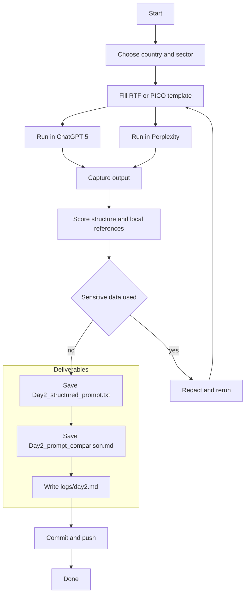

# Week 1 — Day 2: Structured Prompt Engineering (RTF + PICO with ChatGPT‑5)

**Save as:** `wk01/day02_structured_prompt_engineering.md`

**CXO Lens:** Day 2 converts *interest* into *repeatable outputs*. We standardize prompts so executives get consistent, board‑ready deliverables across countries and sectors. This feeds **mid‑funnel sales acceleration** by producing artifacts that de‑risk stakeholder alignment.

---

## 📌 Objectives

* Learn and apply **Role → Task → Format (RTF)** and **PICO (Persona · Instructions · Context · Output)**.
* Build a **reusable template** for country‑ and sector‑specific work.
* Compare performance in **ChatGPT‑5** vs **Perplexity AI**, noting improvements over 3.5.
* Log results and commit using vibe coding discipline.

> **Reminder (from Day 1):** Keep data **non‑sensitive**. Use public sources only.

---

## 🛠 Agenda (30–45 min)

1. **RTF and PICO overview** (5–7m)
2. **Draft your country‑specific template** (10–12m)
3. **Run in ChatGPT‑5 and Perplexity** (8–10m)
4. **Score and refine** (5–8m)
5. **Save artifacts + log + commit** (3–5m)

---

## RTF Formula

* **Role** — define the expert stance.
* **Task** — scope, constraints, evaluation.
* **Format** — explicit output contract.

**Examples**

* Role: *Caribbean agriculture policy advisor*
* Task: *Summarize top 3 risks for cassava exports in 2025 using government and university data*
* Format: *Return a bilingual Markdown table (English + local language) with citations and a 100‑word executive brief*

---

## PICO Framework

* **Persona** — who is speaking (authority, tone).
* **Instructions** — step sequence, do/don’t, evaluation criteria.
* **Context** — geography, sector, policy, data hints.
* **Output** — schema, length limits, language, citations.

**PICO vs RTF**

* **RTF** is fast for one‑off asks. **PICO** is better for **repeatability and transfer** across teams and markets.

---

## Template — RTF (drop‑in)

```text
Role: You are a {{country}} {{sector}} advisor who writes for executives. You prioritize official statistics and university sources.

Task: Identify the top 3 opportunities and top 3 risks in {{topic}} for {{year}}. Use recent public sources from {{country}} where available. Provide brief rationale and a numeric confidence for each item.

Format: Return two sections:
1) Executive Brief (120–150 words)
2) Markdown Table with columns: Item, Type (Opportunity|Risk), Why it matters, Source (name + year), Confidence (0–100)
Include a final bullet list of the top 3 actions an executive should take next.
```

## Template — PICO (drop‑in)

```text
Persona: Senior analyst supporting {{org}} leadership in {{country}} for {{sector}} decisions.

Instructions:
- Collect facts from government, multilateral, and university pages.
- Prefer sources from the last 24 months; if none exist, state the gap.
- Flag missing data explicitly under "Limitations".
- Write in clear business English suitable for a board packet.

Context: Geography={{country}}; Sector={{sector}}; Topic={{topic}}; Year={{year}}.

Output:
- Executive Brief (≤150 words)
- Findings Table (Markdown) with columns: Item, Evidence, Source, Date, Confidence
- Limitations (bullet list)
- Next Steps (3 bullets)
```

---

## What’s New in ChatGPT‑5 (for this exercise)

* **Better reasoning & structure** on multi‑step tasks.
* **Longer context** for country reports.
* **More resilient formatting** (tables, headings, bilingual sections).
* **Faster iterative refinement** when you add constraints.

> Record whether these advantages are visible vs your prior 3.5 experience.

---

## Steps

1. Pick a **country + sector + topic** (e.g., Ethiopia · Health · Clinic triage).
2. Fill the **RTF or PICO template** (above) with placeholders.
3. Run in **ChatGPT‑5**; save the output.
4. Run the same prompt in **Perplexity AI**; save the output.
5. Compare structure, local references, and readability.
6. Refine the template (tighten output schema, add word limits, add bilingual outputs if needed).

---

## Comparison Criteria (score 1–5)

* **Local sources** cited
* **Structure** matches contract
* **Readability** for executives
* **Actionability** (clear next steps)
* **Consistency** on rerun

> Keep notes on where **ChatGPT‑5** outperforms 3.5 expectations.

---

## 📂 Deliverables

* `Day2_structured_prompt.txt` — your finalized **RTF or PICO** template.
* `Day2_prompt_comparison.md` — outputs from **ChatGPT‑5 vs Perplexity** with commentary.
* `/logs/day2.md` — reflection log.
* Commit: `feat: Day 2 structured prompt engineering (RTF/PICO + GPT5 vs Perplexity)`

---

## ✅ Rubric (Self‑Check)

* [ ] Structured, localized template created (RTF or PICO)
* [ ] Prompt tested in both tools
* [ ] Comparison saved with notes on GPT‑5 improvements
* [ ] Reflection log added
* [ ] Commit pushed

---

## 📝 Reflection Prompts

1. Tool Differences — Which tool handled local references better?
2. GPT‑5 vs Older Versions — Noticeable gains in reasoning, formatting, local accuracy?
3. Workflow Fit — Where does this template add **real value** in your country/sector?
4. Surprises — Any unexpected wins (bilingual support, structure, citations)?
5. Next Iteration — Tighten outputs, add redaction rules, or introduce bilingual variants.

---

## Role Relevance (who benefits)

* **Data pros:** cleaner, standardized outputs for local datasets.
* **Entrepreneurs:** reusable market‑intel briefs.
* **Analysts:** consistent sections for policy and sector reports.
* **MBA/PMP:** board‑ready one‑pagers.
* **Military transition:** mission‑style instructions for public service contexts.

---

## Workflow (Mermaid)



---

## Tips

* Keep prompts **short but explicit**; the output schema does the heavy lifting.
* Add **limits** (words, bullets, table columns) to improve repeatability.
* When in doubt, **state assumptions** and **flag missing data**.

