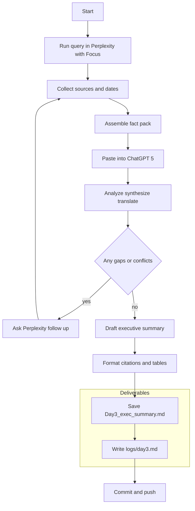

# Week 1 — Day 3: Perplexity + ChatGPT‑5 Workflow

**Save as:** `wk01/day03_perplexity_plus_gpt5_workflow.md`

**CXO Lens:** Day 3 operationalizes research to executive output. Perplexity gathers fresh, sourced facts; ChatGPT‑5 converts those into board‑ready analysis with structure, translation, and clear decisions.

---

## 📌 Objectives

* Use **Perplexity** to gather recent, sourced data (preferably local or regional).
* Use **ChatGPT‑5** to analyze, synthesize, translate, and format data.
* Note **ChatGPT‑5 improvements vs 3.5** in multi‑source analysis and formatting.
* Combine tools into a single **research → analysis → executive output** workflow.
* Log results, reflect, and commit using vibe coding discipline.

> Reminder: Only paste **public, non‑sensitive** information.

---

## 🛠 Agenda (30–45 min)

1. **Perplexity fact pack** (10–12m)
2. **ChatGPT‑5 analysis and formatting** (10–12m)
3. **Workflow comparison and refinement** (6–8m)
4. **Save artifacts + log + commit** (3–5m)

---

## Step 1 — Gather Facts in Perplexity

* Choose a **country‑relevant query**, for example:

  * Top 3 climate risks for agriculture in Belize in 2025
  * Healthcare staffing challenges in Ethiopia in 2025
* Use **Focus** options and ensure results include **citations and dates**.
* Export or copy the synthesis and the **URL + publisher + date** for each citation.

**Fact pack fields** (capture into a scratch file):

* Source title
* Publisher
* URL
* Publication date
* Extracted claim or statistic (1–2 sentences)

---

## Step 2 — Transfer into ChatGPT‑5

Paste the Perplexity fact pack into ChatGPT‑5 and instruct it to:

* **Summarize and analyze** the findings.
* **Deduplicate** overlapping points; flag contradictions.
* Organize as a **professional output** (executive summary, tables, or bilingual sections as needed).
* Highlight **local gaps** (missing data, outdated sources) and recommend next steps to close them.

### Why ChatGPT‑5 (vs 3.5) helps here

* Handles **larger fact packs** without losing structure.
* Produces **clean Markdown** tables and headings with fewer retries.
* Stronger **multi‑step reasoning** (e.g., grouping risks by economic, health, social impact).
* More consistent **translation** or dual‑language output when requested.

---

## Step 3 — Compare Workflows

* **Perplexity** → fact‑gathering with citations and dates.
* **ChatGPT‑5** → analysis, synthesis, translation, formatting, and decision framing.
* **Synergy check:** Did GPT‑5 reconcile conflicts, expose gaps, or just repackage?

---

## Step 4 — Refine and Save

* Tighten instructions until output is **boardroom‑ready** (clear headings, citations with dates, crisp executive tone).
* Save the final version as an **executive summary**.

---

## 📂 Deliverables

* `Day3_exec_summary.md` — final brief produced by ChatGPT‑5 using Perplexity data.
* `/logs/day3.md` — reflection log (template below).
* Commit: `feat: Day 3 combined workflow (Perplexity + GPT5)`

---

## ✅ Rubric (Self‑Check)

* [ ] Query run in Perplexity with **sources and dates** captured
* [ ] Data transferred into ChatGPT‑5 and **refined**
* [ ] Executive summary saved to repo
* [ ] Reflection log added (1–2 sentences per section)
* [ ] Notes on **GPT‑5 vs 3.5** included
* [ ] Commit pushed with clear message

---

## 📝 Reflection Prompts (Day 3)

1. **Tool differences** — How did Perplexity’s fact‑based output differ from GPT‑5’s analysis?
2. **GPT‑5 improvements** — Did longer context, reasoning, or formatting exceed 3.5 expectations?
3. **Workflow fit** — Where does this save time in your context (gov briefings, NGO reports, market scans)?
4. **Surprises and gaps** — Did GPT‑5 surface contradictions or missing local sources?
5. **Next iteration** — How will you refine the handoff prompt or output template?

---

## 🎯 Role Relevance

* **Data pros:** integrate real‑time local data into structured analytics.
* **Entrepreneurs:** repeatable market and policy intelligence briefs.
* **Analysts:** rapid synthesis of breaking events into exec summaries.
* **MBA/PMP:** board‑ready outputs with citations and local context.
* **Military transition:** SITREP‑style discipline; facts in, refined intelligence out.

---

## Handoff Prompt Template (drop‑in)

```text
You are preparing a board‑ready executive summary for {{country}} on {{topic}} for {{year}}.

Input: I will paste a fact pack with source title, publisher, URL, date, and a short extract. Some items may overlap or conflict.

Tasks:
1) Deduplicate and reconcile contradictions. Note any conflicts explicitly.
2) Classify findings by theme (e.g., economic, health, social, policy).
3) Produce an Executive Summary (120–150 words) followed by:
   - Findings Table (Markdown) with columns: Theme, Claim, Source, Date, Confidence 0–100
   - Gaps and Limitations (bullets)
   - Recommended Next Steps (3 bullets)
4) Keep citations compact: Publisher, Year. Include the URL only once in a final Sources section.
```

---

## Executive Summary Skeleton (Markdown)

```markdown
# Executive Summary — {{topic}} in {{country}} ({{year}})

## Key Findings
| Theme | Claim | Source | Date | Confidence |
|---|---|---|---|---|

## Gaps and Limitations
- 

## Recommended Next Steps
- 

## Sources
- Publisher — Title (Year). URL
```

---

## Comparison Matrix Template (1–5 scale)

```markdown
| Criterion | Perplexity | GPT‑5 |
|---|---:|---:|
| Local sources and dates |  |  |
| Structure fidelity |  |  |
| Readability for execs |  |  |
| Actionability |  |  |
| Consistency on rerun |  |  |
| Reconciliation of conflicts |  |  |
```

---

## Workflow (Mermaid)



---

## Tips

* Keep the fact pack tidy. Short, sourced extracts beat raw dumps.
* Ask GPT‑5 to **show conflicts** instead of smoothing them away.
* Standardize tables and headings so every summary looks familiar to execs.

