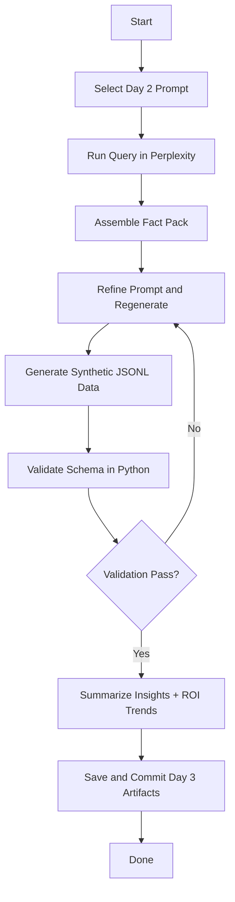

# Week 1 — Day 3: Synthetic Data Generation & Dual-Model Workflow (Perplexity + ChatGPT-5)

**Save as:** `week1/day3_synthetic_data_generation.md`

**SWE Lens:** Day 3 transforms structured prompts into structured **data**.
Perplexity becomes your *retrieval layer* (real-world grounding); ChatGPT-5 becomes your *generator layer* (synthetic but schema-true outputs).
Together, they form a reproducible pipeline for building evaluation datasets and small-scale fine-tuning material.

---

## 🎯 Objectives

* Convert Day 2’s RTF/PICO templates into **synthetic dataset generators**
* Use **Perplexity** for factual scaffolding (citations, terminology, recent data)
* Use **ChatGPT-5** for schema-consistent JSON / Markdown outputs
* Validate structure with a **Python parser** and log results
* Save the dataset for later fine-tuning and model-evaluation tasks

---

## 🧩 Why This Matters

Synthetic data bridges the gap between *prompt engineering* and *AI model training*.
It lets engineers simulate edge cases, generate balanced datasets, and stress-test LLM reasoning — all without leaking real data.

---

## 🛠 Agenda (60 min)

| Segment | Description                                                                        |
| :-----: | :--------------------------------------------------------------------------------- |
|  00–10  | Review Day 2 prompts (RTF/PICO) and select one to extend                           |
|  10–25  | Gather real-world references in Perplexity (facts + citations)                     |
|  25–40  | Feed facts + prompt into ChatGPT-5 to generate structured JSONL synthetic examples |
|  40–55  | Validate output schema with Python script (`test_synthetic_data.py`)               |
|  55–60  | Log, commit, reflect                                                               |

---

## 🧠 Concept: Dual-Model Workflow

| Step | Tool           | Purpose                                                          |
| :--- | :------------- | :--------------------------------------------------------------- |
| 1    | **Perplexity** | Collect recent, verifiable claims and terminology with citations |
| 2    | **ChatGPT-5**  | Generate synthetic records following your Day 2 schema           |
| 3    | **Python**     | Validate and store structured outputs for model testing          |

---

## 📋 Input Example (PICO Prompt → Perplexity → ChatGPT-5)

**Prompt Topic:** Feed-to-Yield Efficiency for Prime Cattle

**Perplexity Query:**

> Recent findings (2023–2025) on cattle feed conversion ratios and probiotic supplements in Brazil and the U.S.

**ChatGPT-5 Task:**

> Generate 10 synthetic records following this JSON schema:

```json
{
  "country": "Brazil",
  "grain_type": "corn",
  "probiotic_type": "Lactobacillus plantarum",
  "avg_daily_gain_kg": 1.2,
  "feed_conversion_ratio": 6.8,
  "roi_percent": 17.5,
  "confidence": 0.91,
  "source": "Embrapa 2024"
}
```

---

## 🧮 Validation Checklist

* ✅ All fields match the schema (keys + data types)
* ✅ Numeric values within expected range
* ✅ Citations plausible (Perplexity source names)
* ✅ Minimum 10 rows of data
* ✅ JSON parses without error (`python test_synthetic_data.py`)

---

## 💾 Deliverables

| File                           | Description                                                 |
| :----------------------------- | :---------------------------------------------------------- |
| `Day3_factpack.txt`            | Perplexity fact pack (title, publisher, date, url, extract) |
| `Day3_synthetic_dataset.jsonl` | Generated records from ChatGPT-5                            |
| `Day3_exec_summary.md`         | High-level analysis of synthetic data patterns              |
| `logs/day3.md`                 | Reflection log + validation notes                           |

**Commit:**

```bash
git add Day3_* logs/day3.md
git commit -m "feat: Day 3 synthetic data generation (Perplexity + GPT5 workflow)"
```

---

## ✅ Rubric (Self-Check)

| Criterion                                 | Pass | Partial | Fail |
| :---------------------------------------- | :--: | :-----: | :--: |
| Fact pack contains ≥ 3 sources with dates |   ✅  |    ⚠️   |   ❌  |
| Synthetic dataset produced (JSONL)        |   ✅  |    ⚠️   |   ❌  |
| Schema validation passed                  |   ✅  |    ⚠️   |   ❌  |
| Exec summary insightful and readable      |   ✅  |    ⚠️   |   ❌  |
| Reflection log complete                   |   ✅  |    ⚠️   |   ❌  |

---

## 🧾 Reflection Prompts

1. Did ChatGPT-5 respect the schema and data types consistently?
2. Which facts from Perplexity most improved realism or range of outputs?
3. How does this workflow compare to a manual data-collection process?
4. Would this synthetic data be useful for training a smaller LLM or evaluation suite?
5. Next iteration (Day 4): How will you convert this into a visualization or dashboard?

---

## 💡 Optional Python Validator (`test_synthetic_data.py`)

```python
import json

def validate_jsonl(path):
    required = {"country", "grain_type", "probiotic_type",
                "avg_daily_gain_kg", "feed_conversion_ratio",
                "roi_percent", "confidence", "source"}
    with open(path, "r", encoding="utf-8") as f:
        for i, line in enumerate(f, 1):
            record = json.loads(line)
            missing = required - record.keys()
            if missing:
                print(f"❌ Line {i}: Missing fields {missing}")
            else:
                print(f"✅ Line {i}: OK")

if __name__ == "__main__":
    validate_jsonl("Day3_synthetic_dataset.jsonl")
```

---

## 📊 Executive Summary Skeleton

```markdown
# Executive Summary — Feed-to-Yield AI Modeling (Brazil & U.S., 2025)

## Dataset Insights
| Metric | Brazil | U.S. |
|---|---:|---:|
| Avg Feed Conversion Ratio | 6.8 | 7.1 |
| Avg ROI % | 17.5 | 15.2 |
| Confidence Avg | 0.91 | 0.87 |

## Observations
- Probiotic supplementation improved feed efficiency in both regions.  
- Higher ROI linked to grain diversification and temperature control.  
- Confidence scores reflect data density and source breadth.

## Next Steps
1. Automate JSON validation and summary pipeline.  
2. Integrate dataset into Plotly Studio for visualization.  
3. Extend to cross-year comparison (Day 4).
```

---

## 🧩 Workflow (Mermaid)



---

Would you like me to also generate:

* 🧾 `logs/day3.md` template (for reflection + validation tracking) and
* 📁 sample `Day3_factpack.txt` starter file (so your mentee has placeholders)?

