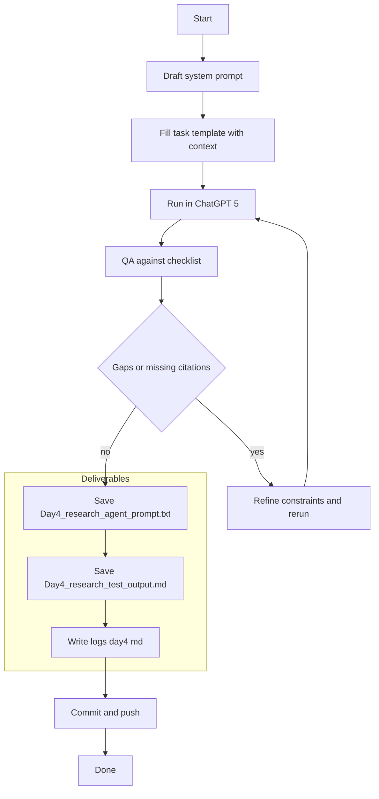

# Week 1 — Day 4: Building a Research Agent (ChatGPT‑5 Enhanced)

**Save as:** `wk01/day04_research_agent.md`

**CXO Lens:** Day 4 productizes research. We standardize a topic‑agnostic agent so teams deliver **repeatable, board‑ready briefs** across countries and sectors, with governance and auditability built in.

---

## 📌 Objectives

* Create a **topic‑agnostic research agent prompt** using **ChatGPT‑5**.
* Standardize research tasks for reuse across industries and local sectors.
* Note **ChatGPT‑5 vs 3.5** improvements in consistency and structure.
* Save both the **prompt template** and a **test output**, then log and commit.

> **Data safety reminder:** Use **public, non‑sensitive** sources only.

---

## 🛠 Agenda (30–45 min)

1. Draft agent prompt (RTF + PICO) — 10m
2. Run a test topic in GPT‑5 — 10m
3. QA against checklist — 7m
4. Save artifacts + log + commit — 5–8m

---

## RTF + PICO Design

* **Role (Persona):** authoritative analyst for a named country/sector, writing for executives.
* **Task (Instructions):** collect from public gov/university/multilateral sources; synthesize; flag gaps; produce actions.
* **Format (Output):** strict Markdown contract (brief + table + gaps + next steps), optional bilingual.
* **Context:** country, sector, topic, year, policy constraints.

---

## Drop‑in: Research Agent — System Prompt

```text
You are a senior research analyst producing board‑ready briefs. You prioritize recent public sources from government, universities, and multilaterals. You write clearly for executives and surface gaps and risks.

Rules:
- Cite publisher and year inline; list URLs once in a Sources section.
- Prefer sources ≤ 24 months old; if older, mark as "legacy" and explain why.
- Keep claims concise; avoid speculation; show contradictions explicitly.
- If data is missing, add a "Gaps and Limitations" section.
- If requested, provide bilingual outputs with the same structure.
```

## Drop‑in: Research Agent — Task Template

```text
Context: Country={{country}}; Sector={{sector}}; Topic={{topic}}; Year={{year}}.

Tasks:
1) Produce an Executive Brief (120–150 words).
2) Create a Findings Table (Markdown) with columns: Theme, Claim, Source, Date, Confidence (0–100).
3) Add Gaps and Limitations (bullets).
4) Add Recommended Next Steps (3 bullets).
5) Provide a Sources list with Publisher — Title (Year) and URL.
Optional: Add a mirrored bilingual section in {{language}}.
```

---

## Why GPT‑5 (vs 3.5) excels here

* **Longer, steadier structure** for multi‑section outputs.
* **Cleaner Markdown** tables and headings.
* **Better multi‑step reasoning** for classification and de‑duplication.
* **More reliable bilingual rendering** when requested.

Capture observed improvements in your reflection.

---

## Steps

1. Pick a **country + sector + topic** (e.g., Belize · Agriculture · Food security; Ethiopia · Health · Staffing).
2. Paste the **System Prompt** and fill the **Task Template** placeholders.
3. Run in **ChatGPT‑5** and save the output.
4. Validate against the checklist below; iterate once if needed.
5. Save artifacts; log and commit.

---

## QA Checklist (Definition of Done)

* Executive Brief is **120–150 words**, decision‑ready.
* Findings Table present with **Theme, Claim, Source, Date, Confidence**.
* **Citations compact** inline; URLs listed once in **Sources**.
* **Gaps and Limitations** explicitly list missing or outdated data.
* **Next Steps** include 3 concrete, scoped actions.
* (If bilingual) English and local language **mirror the same structure**.

---

## 📂 Deliverables

* `Day4_research_agent_prompt.txt` — final reusable prompt (system + task).
* `Day4_research_test_output.md` — AI‑generated research report.
* `/logs/day4.md` — reflection log.
* Commit: `feat: Day 4 research agent (GPT5 prompt + test output)`

---

## ✅ Rubric (Self‑Check)

* [ ] Prompt written using **RTF/PICO** and saved as `.txt`.
* [ ] Test output saved as `.md` and matches the **QA checklist**.
* [ ] Reflection notes include **GPT‑5 vs 3.5** observations.
* [ ] Commit pushed with a clear message.

---

## 📝 Reflection Prompts

1. **Prompt strength:** Did GPT‑5 adhere to structure without reminders?
2. **Improvements vs 3.5:** Clearer formatting, bilingual fidelity, better synthesis?
3. **Workflow fit:** Where would this agent save time (gov briefings, NGO reports, market scans)?
4. **Surprises:** Any highlighted source gaps or contradictions?
5. **Next iteration:** Add constraints, formatting rules, or local source requirements.

---

## Executive Report Skeleton (Markdown)

```markdown
# Executive Summary — {{topic}} in {{country}} ({{year}})

## Key Findings
| Theme | Claim | Source | Date | Confidence |
|---|---|---|---|---|

## Gaps and Limitations
- 

## Recommended Next Steps
- 

## Sources
- Publisher — Title (Year). URL
```

---

## Workflow (Mermaid)



---

## Tips

* Keep the **output schema fixed**; swap context freely to compare topics and countries.
* Ask GPT‑5 to **show contradictions**, not smooth them over.
* If outputs drift, restate the **QA checklist** in the prompt on the next run.

