# Week 1 — Day 4: Data Visualization & Model Insight Dashboards (Plotly Studio)

**Save as:** `week1/day4_data_viz_insights_plotly.md`

---

## 🎯 Purpose

Transform your Day 3 synthetic dataset into an **executive-ready analytics dashboard** and a set of **SWE-grade artifacts** (charts, data dictionary, and reusable prompts) that will support model design and stakeholder conversations.

---

## 🧩 Learning Objectives

1. Load and shape `Day3_synthetic_dataset.jsonl` for visualization.
2. Build a **Plotly Studio** dashboard with KPI tiles, trend lines, distributions, and comparison views.
3. Add **filters** (country, probiotic, grain) and **rich tooltips** that explain model-relevant context.
4. Generate a concise **narrative insight** (from metrics → business language).
5. (Optional) Expose the dataset via **FastAPI** to simulate a product surface.

---

## ⚙️ Prereqs

* Completed **Day 3** with `Day3_synthetic_dataset.jsonl`
* Environment from **Day 1** + structured prompting from **Day 2**

---

## 🛠 Agenda (60–75 min)

|  Time | Segment                                                   |
| ----: | --------------------------------------------------------- |
|  0–10 | Convert JSONL → CSV & profile columns                     |
| 10–40 | Build Plotly Studio dashboard (tiles + visuals + filters) |
| 40–55 | Add narrative insight + export images                     |
| 55–75 | (Optional) FastAPI read endpoint + quick smoke test       |

---

## 📦 Step 1 — Convert JSONL → CSV (quick script)

Save as `week1/day4_jsonl_to_csv.py`:

```python
import json, csv, sys
from pathlib import Path

src = Path("Day3_synthetic_dataset.jsonl")
dst = Path("Day4_dataset.csv")

required = ["country","grain_type","probiotic_type",
            "avg_daily_gain_kg","feed_conversion_ratio",
            "roi_percent","confidence","source"]

with src.open("r", encoding="utf-8") as f, dst.open("w", newline="", encoding="utf-8") as out:
    writer = csv.DictWriter(out, fieldnames=required)
    writer.writeheader()
    for line in f:
        rec = json.loads(line)
        row = {k: rec.get(k, "") for k in required}
        writer.writerow(row)

print(f"✅ Wrote {dst} with columns: {', '.join(required)}")
```

Run:

```bash
python week1/day4_jsonl_to_csv.py
```

---

## 🧭 Step 2 — Data Dictionary (paste into repo)

Save as `week1/Day4_data_dictionary.md`:

* **country** *(str)* — “Brazil” or “United States”
* **grain_type** *(str)* — e.g., corn, barley, sorghum
* **probiotic_type** *(str)* — e.g., *L. plantarum*, *B. subtilis*
* **avg_daily_gain_kg** *(float)* — Avg daily weight gain (kg)
* **feed_conversion_ratio** *(float)* — Feed kg per kg gain (lower is better)
* **roi_percent** *(float)* — Estimated ROI (%)
* **confidence** *(float 0–1)* — Confidence in record plausibility
* **source** *(str)* — Short publisher/year label (from fact pack)

Include expected ranges (sanity checks):

* `avg_daily_gain_kg`: 0.8–1.8
* `feed_conversion_ratio`: 5.5–8.5
* `roi_percent`: 5–25
* `confidence`: 0.75–0.98

---

## 📊 Step 3 — Plotly Studio Dashboard (tile + charts)

### 3.1 Upload

* Upload **Day4_dataset.csv** into **Plotly Studio**.

### 3.2 Global Filters

* **Country**, **Probiotic Type**, **Grain Type** (apply to all visuals).

### 3.3 KPI Tiles (top row)

* **Avg Feed Conversion Ratio** (lower is better)
* **Avg Daily Gain (kg)**
* **Avg ROI (%)**
* **Mean Confidence**

> Secondary values: show delta vs other country (if both present).

### 3.4 Core Visuals

1. **Distribution**: Histogram of `feed_conversion_ratio` (facet by `country`)
2. **Comparison**: Box plot of `avg_daily_gain_kg` by `probiotic_type` (color by `country`)
3. **Relationship**: Scatter `feed_conversion_ratio` (x) vs `roi_percent` (y); size = `avg_daily_gain_kg`; color = `probiotic_type`
4. **Leaderboard**: Bar of `roi_percent` (mean) by `grain_type` (grouped by country)

### 3.5 Tooltips (shared spec)

* Show: `country`, `probiotic_type`, `grain_type`, `avg_daily_gain_kg`, `feed_conversion_ratio`, `roi_percent`, `confidence`, `source`.
* Include **short interpretation** in tooltip footer:
  “FCR lower is better; ROI often rises when FCR falls and ADG climbs.”

---

## 🧠 Step 4 — Plotly Studio “AI Assistant” Prompts (copy/paste)

**Prompt A — Dashboard Scaffold**

> Build a **Feed-to-Yield Insights** dashboard from *Day4_dataset.csv*.
> Add KPI tiles: Average FCR, Average ADG (kg), Average ROI (%), Mean Confidence.
> Charts: (1) Histogram of FCR (facet by Country), (2) Box plot of ADG by Probiotic Type colored by Country, (3) Scatter FCR vs ROI with size = ADG and color = Probiotic Type, (4) Bar chart of mean ROI by Grain Type grouped by Country.
> Add global filters for Country, Probiotic Type, Grain Type; apply to all charts.
> Configure tooltips to show all fields and the message “FCR ↓ is better; ROI tends to increase as FCR improves and ADG rises.”

**Prompt B — Narrative Insight Card**

> Generate a concise (120–150 words) **executive narrative** from the current filters.
> Explain how probiotic type and grain choice influence FCR and ROI.
> Highlight the strongest combo (grain × probiotic × country) and any tradeoffs.
> End with 3 next-step actions for a breeding program.

---

## 🧪 Step 5 — Optional FastAPI Read Endpoint (SWE polish)

Save as `week1/day4_app.py`:

```python
from fastapi import FastAPI
import csv

app = FastAPI(title="Feed-to-Yield API")

@app.get("/records")
def records(limit: int = 50, country: str | None = None):
    path = "Day4_dataset.csv"
    out = []
    with open(path, newline="", encoding="utf-8") as f:
        for row in csv.DictReader(f):
            if country and row["country"] != country:
                continue
            out.append(row)
            if len(out) >= limit:
                break
    return {"count": len(out), "items": out}
```

Run locally:

```bash
uvicorn week1.day4_app:app --reload
# Test: http://127.0.0.1:8000/records?limit=5&country=Brazil
```

---

## 📝 Executive Narrative Skeleton (for the repo)

Save as `week1/Day4_exec_narrative.md`:

```markdown
# Executive Narrative — Feed-to-Yield Dashboard ({{date}})

**Headline:** Probiotics + Grain alignment deliver measurable FCR and ROI gains.

**What the dashboard shows:**  
- FCR distribution by country and probiotic type  
- ADG differences across probiotic choices  
- ROI response as FCR declines and ADG rises  
- Grain types that consistently lift ROI

**Key callouts (auto-filled from current filters):**  
- Top combo: {{probiotic}} on {{grain}} in {{country}}  
- Median FCR vs top quartile gap: {{value}}  
- ROI spread (p25 → p75): {{value}} %

**Next 3 moves:**  
1. Validate top combo with a 4-week A/B feed protocol.  
2. Track methane proxy alongside ADG to avoid unintended tradeoffs.  
3. Add cost-per-kg-beef tile to the dashboard for decision parity.
```

---

## 📂 Deliverables

* `Day4_dataset.csv` (from Day 3 JSONL)
* `week1/Day4_data_dictionary.md`
* `week1/Day4_exec_narrative.md`
* `week1/day4_data_viz_insights_plotly.md` (this lesson)
* (Optional) `week1/day4_app.py`

**Commit:**

```bash
git add Day4_dataset.csv week1/*.md week1/day4_app.py
git commit -m "feat: Day 4 Plotly dashboard + narrative + optional API"
```

---

## ✅ Rubric (Self-Check)

* [ ] CSV created from JSONL with required columns
* [ ] Plotly Studio dashboard built with 4 visuals + 3 filters
* [ ] KPI tiles configured and tooltips enriched
* [ ] Executive narrative drafted and saved
* [ ] (Optional) API endpoint runs locally and returns records
* [ ] Commit pushed

---

## 🪶 Reflection Prompts (log to `logs/day4.md`)

1. Which visual best exposes the **FCR ↔ ROI** relationship?
2. Did filters or tooltips change how non-technical stakeholders read the chart?
3. What metric would you add to reduce **decision ambiguity** (e.g., cost per kg beef)?
4. How would you validate that insights hold up with **real** (non-synthetic) data?

---

## 🧭 Workflow (Mermaid)

```mermaid
flowchart TB
  A[Start] --> B[Convert JSONL→CSV]
  B --> C[Upload CSV to Plotly Studio]
  C --> D[Create filters + KPI tiles]
  D --> E[Add hist/box/scatter/bar]
  E --> F[Configure tooltips + narrative]
  F --> G{Optional: FastAPI}
  G --Yes--> H[Run /records endpoint]
  G --No--> I[Skip]
  H --> J[Export PNG/PDF and save narrative]
  I --> J[Export PNG/PDF and save narrative]
  J --> K[Commit & push]
```



---

