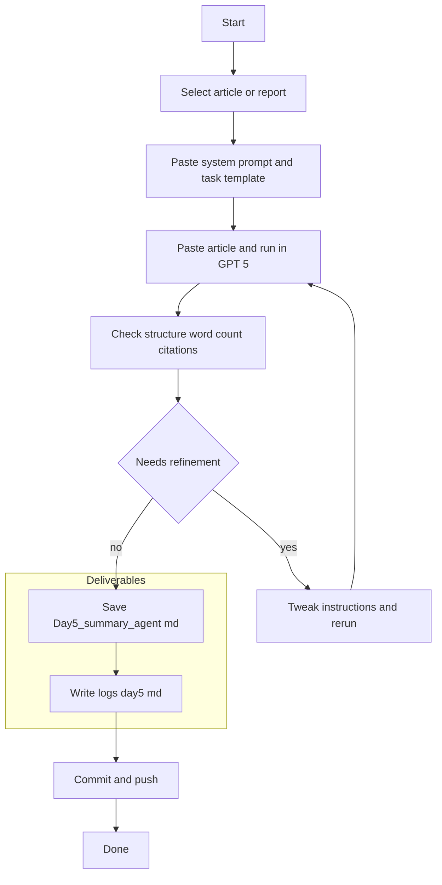

# Week 1 — Day 5: Summarization Agent (ChatGPT‑5 Enhanced)

**Save as:** `wk01/day05_summarization_agent.md`

**CXO Lens:** Day 5 turns long reports into **concise, board‑ready briefs**. We standardize length, tone, structure, and bilingual variants so teams can ship consistent executive outputs in minutes.

---

## 📌 Objectives

* Convert long‑form content into **concise, executive‑ready summaries**.
* Control **length, structure, tone, citations, and bilingual outputs**.
* Note **ChatGPT‑5 vs 3.5** improvements in summarization accuracy and formatting.
* Log results, reflect, and commit.

> **Data safety:** Summarize **public, non‑sensitive** materials only.

---

## 🛠 Agenda (30–45 min)

1. Select input content (5–7m)
2. Run the Summarization Agent prompt (10–12m)
3. Refine for structure, tone, and bilingual needs (8–10m)
4. Save artifacts + log + commit (5–8m)

---

## Drop‑in: Summarization Agent — System Prompt

```text
You are an executive brief writer. You produce structured, concise summaries for decision makers. You retain key facts and cite publisher and year compactly, listing URLs only once in a Sources section.

Rules:
- Obey word limits and section structure exactly.
- Prefer recent sources (≤ 24 months); mark older items as legacy.
- Show contradictions or uncertainty rather than smoothing them out.
- If asked, produce a bilingual abstract with the same meaning in both languages.
```

## Drop‑in: Summarization Agent — Task Template

```text
Context: Audience = government executive; Country = {{country}}; Topic = {{topic}}; Year = {{year}}.

Input: I will paste a 2–3 page article or report after these instructions.

Tasks:
1) Executive Summary of {{word_count}} words with headings and bullet points.
2) Include exactly 3 key statistics with compact citations (Publisher, Year).
3) Provide a 2‑sentence bilingual abstract in English and {{language}}.
4) Add a short section: Limitations and Open Questions.
5) Add Sources list with Publisher — Title (Year). URL

Tone: neutral, decision‑oriented. Formatting: clean Markdown.
```

**Length presets:**

* 100 words = elevator brief
* 300 words = board one‑pager
* 600 words = cabinet brief

---

## Why GPT‑5 (vs 3.5) excels here

* **Tighter control** of word counts and section boundaries.
* **Cleaner Markdown** (bullets, tables, headings) with fewer retries.
* **Longer input handling** without losing flow.
* **More consistent bilingual abstracts** when requested.

Capture any observed improvement in your reflection log.

---

## Steps

1. Choose a 2–3 page article or report (local or regional preferred).
2. Paste **System Prompt** and **Task Template**; fill placeholders.
3. Paste the article below the instructions and run in **ChatGPT‑5**.
4. Check structure, word count, citations, and bilingual abstract.
5. Refine once if needed; then save the final output.

---

## 📂 Deliverables

* `Day5_summary_agent.md` — final polished summary.
* `/logs/day5.md` — reflection log.
* Commit: `feat: Day 5 summarization agent (GPT5)`

---

## ✅ Rubric (Self‑Check)

* [ ] Article/report selected and summarized.
* [ ] Output **structured** with headings and bullets.
* [ ] **Word count and tone** followed.
* [ ] 3 statistics included with compact citations.
* [ ] Bilingual abstract provided (if requested).
* [ ] Reflection log added and commit pushed.
* [ ] Notes on **GPT‑5 vs 3.5** improvements captured.

---

## 📝 Reflection Prompts (Day 5)

1. **Prompt control:** Did GPT‑5 follow word count, tone, and structure more precisely than older versions?
2. **Improvements:** Did longer input handling, formatting, or bilingual outputs stand out?
3. **Workflow fit:** Where can this save time (NGO reports, investor decks, board briefings, SITREPs)?
4. **Surprises:** What did GPT‑5 capture or miss vs expectations?
5. **Next iteration:** How would you adapt for a minister one‑pager or a board packet cover memo?

---

## Executive Summary Skeleton (Markdown)

```markdown
# Executive Summary — {{topic}} in {{country}} ({{year}})

## Highlights
- 
- 
- 

## Key Statistics
- Stat 1 — Publisher, Year
- Stat 2 — Publisher, Year
- Stat 3 — Publisher, Year

## Limitations and Open Questions
- 

## Bilingual Abstract
**English:** 

**{{language}}:** 

## Sources
- Publisher — Title (Year). URL
```

---

## Workflow (Mermaid)



---

## Tips

* Keep the **task template** unchanged; vary only context and length.
* Ask GPT‑5 to **quote** short phrases when a statistic is critical.
* If outputs drift, restate the **QA items** in the next run.

