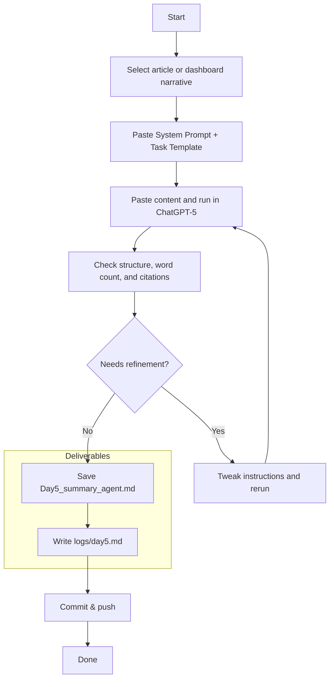

# Week 1 — Day 5: Summarization Agent ( ChatGPT-5 Enhanced )

**Save as:** `wk01/day05_summarization_agent.md`

---

## 🎯 Purpose

Day 5 teaches you to **condense dashboards, datasets, and research reports into decision-grade executive briefs.**
After visualizing insights in Plotly Studio and Plotly Express on Day 4, you now standardize how to narrate those visuals for boards, ministers, or investors.

---

## 📌 Objectives

* Turn quantitative outputs (Day 4 dashboards or reports) into concise, **executive-ready summaries**.
* Control **length, tone, structure, and bilingual variants** for consistency across teams.
* Observe **ChatGPT-5 vs 3.5** improvements in summarization precision and formatting.
* Log reflections and commit deliverables.

> ⚠️ Data Safety — Summarize only **public or synthetic (non-sensitive)** data.

---

## 🛠 Agenda ( 30–45 min )

|     Time    | Task                                                       |
| :---------: | :--------------------------------------------------------- |
|  0 – 7 min  | Select input content (Day 4 narrative or external article) |
|  7 – 20 min | Run the Summarization Agent prompt                         |
| 20 – 30 min | Refine for tone and bilingual needs                        |
| 30 – 45 min | Save summary + reflection + commit                         |

---

## 🧠 Drop-in: Summarization Agent — System Prompt

```text
You are an executive brief writer. You convert analytical or narrative material into structured, concise summaries for decision makers.
Retain key facts, trends, and contradictions. Cite publisher and year compactly, listing URLs once in a Sources section.

Rules:
- Follow the requested word limit and Markdown structure exactly.
- Prefer recent sources (≤ 24 months); mark older ones as legacy.
- Highlight uncertainty instead of removing it.
- If asked, include a bilingual abstract preserving identical meaning.
```

---

## 🧩 Drop-in: Summarization Agent — Task Template

```text
Context:
Audience = executive leadership
Country = {{country}}
Topic = {{topic}}
Year = {{year}}

Input:
I will paste either (a) an AI-generated dashboard narrative from Day 4 or
(b) a 2–3-page public report.

Tasks:
1) Write an Executive Summary of {{word_count}} words with clear headings and bullet points.
2) Include exactly 3 key statistics with compact citations (Publisher, Year).
3) Provide a 2-sentence bilingual abstract in English and {{language}}.
4) Add a “Limitations & Open Questions” section.
5) End with a compact Sources list (Publisher — Title (Year). URL).

Tone:
Neutral and decision-oriented.
Formatting:
Clean Markdown with headings and bullets.
```

**Length Presets**

| Type            | Words | Use Case                        |
| :-------------- | :---: | :------------------------------ |
| Elevator Brief  |  100  | Investor text or meeting open   |
| Board One-Pager |  300  | CXO or SVP summary              |
| Cabinet Brief   |  600  | Government or enterprise packet |

---

## 🚀 Why GPT-5 Excels

* Maintains precise word counts and section order.
* Produces clean Markdown without format drift.
* Handles long (2–4 page) inputs while preserving flow.
* Creates accurate bilingual sections without meaning loss.

---

## 🔁 Steps

1. Select a source text (choose your Day 4 executive narrative or a 2-3 page public report).
2. Paste the System Prompt and Task Template into ChatGPT-5, fill placeholders.
3. Paste the article or dashboard narrative below and run.
4. Check structure, word count, citations, and bilingual accuracy.
5. Save final summary and reflection, then commit.

---

## 📂 Deliverables

* `Day5_summary_agent.md` — final polished summary
* `/logs/day5.md` — reflection log
* Commit: `feat: Day 5 summarization agent (GPT5)`

---

## ✅ Rubric (Self-Check)

* [ ] Input article or dashboard narrative selected
* [ ] Output structured with headings and bullets
* [ ] Word count and tone match preset
* [ ] 3 statistics with compact citations
* [ ] Bilingual abstract (when requested)
* [ ] Reflection log added and commit pushed
* [ ] GPT-5 vs 3.5 improvements captured

---

## 📝 Reflection Prompts (Day 5)

1. Did GPT-5 obey word count and structure better than older models?
2. Was Markdown cleaner and tone more consistent?
3. Where could this save time (e.g., investor briefs, SITREPs, board reports)?
4. What did GPT-5 summarize especially well—or miss?
5. How might you adapt for a cabinet memo or board packet cover page?

---

## 🧱 Executive Summary Skeleton (Markdown)

```markdown
# Executive Summary — {{topic}} in {{country}} ({{year}})

## Highlights
- 
- 
- 

## Key Statistics
- Stat 1 — Publisher, Year  
- Stat 2 — Publisher, Year  
- Stat 3 — Publisher, Year  

## Limitations & Open Questions
- 

## Bilingual Abstract
**English:**  
 
**{{language}}:**  

## Sources
- Publisher — Title (Year). URL
```

---

## 🔄 Workflow (Mermaid)



---

## 💡 Tips

* Re-use this prompt for any long report or dashboard explanation.
* Tell GPT-5 to quote short phrases when precision matters.
* If outputs drift, repeat the QA rubric at the end of your prompt.
* Optional: Add a “Comparison to Previous Quarter” section for continuity reports.

---

