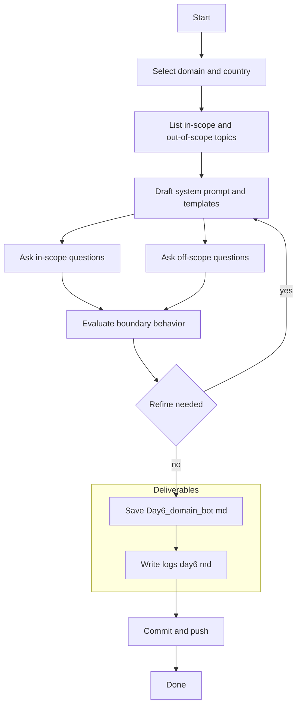

# Week 1 — Day 6: Domain‑Specific Q\&A Bot (ChatGPT‑5 Enhanced)

**Save as:** `wk01/day06_domain_specific_qa_bot.md`

**CXO Lens:** Day 6 reduces noise. We design a **scope‑bound advisory bot** that answers only within a defined domain and declines everything else gracefully. The result is a reliable aide for policy, agriculture, healthcare, or disaster response—fit for public‑facing FAQs or internal knowledge bases.

---

## 📌 Objectives

* Build a chatbot prompt restricted to a **single domain** (e.g., policy, agriculture, healthcare, disaster response).
* Train the AI to answer **only within scope** and to **politely reject** off‑topic queries.
* Leverage **ChatGPT‑5’s improved boundary control** and formatting discipline.
* Save transcript, reflect, and commit.

> **Data safety:** Use public, non‑sensitive examples; no personal data.

---

## 🛠 Agenda (30–45 min)

1. Pick a domain and define scope — 5–7m
2. Draft the bot system prompt — 10–12m
3. Test in‑scope and off‑scope questions — 10–12m
4. Refine boundaries; save transcript; log and commit — 5–8m

---

## Step 1 — Pick Your Domain

Choose a domain that matters to your country or sector.

* **Caribbean:** agriculture diversification, tourism risk reduction, hurricane readiness
* **Ethiopia:** healthcare staffing, education policy, digital infrastructure
* **General:** finance, cybersecurity, project management

> Define 3–6 **in‑scope topics** and 5–10 **off‑scope examples** up front. This improves boundary behavior.

---

## Drop‑in: Domain Bot — System Prompt

```text
You are a domain expert assistant restricted to a single scope. You answer only within the defined domain and decline other questions politely.

Scope:
- Country or region: {{country_or_region}}
- Domain: {{domain}} (e.g., agriculture diversification, healthcare staffing)
- In‑scope topics: {{topics_list}}
- Out‑of‑scope examples: {{oos_list}}

Policy:
- If a question is fully in scope, answer concisely with headings or bullets as needed.
- If borderline, state what is in scope and what is not, then answer the in‑scope portion only.
- If out of scope, reply: "That is outside this assistant’s domain. Please ask about {{domain}} topics." Optionally suggest a relevant alternative.
- Prefer public, recent sources; cite publisher and year compactly; list URLs once at the end as Sources.
- Keep answers ≤ 200 words unless asked otherwise.
- Support optional bilingual summaries: English plus {{language}}.
```

## Drop‑in: Response Contract

```text
When answering in scope, use this format:
1) Short answer (2–3 bullets or 1 short paragraph)
2) If requested: Bilingual summary in English and {{language}}
3) Sources: Publisher — Title (Year). URL
```

## Drop‑in: Refusal and Borderline Templates

```text
Refusal (out of scope):
That is outside this assistant’s domain. Please ask about {{domain}} topics such as {{topics_list}}.

Borderline handling:
Part of your question is outside scope. I can address the following in‑scope portion: {{in_scope_part}}. For the rest, consult a general resource or a different assistant.
```

---

## Step 2 — Craft Your Bot Prompt

Fill the placeholders in **System Prompt**, **Response Contract**, and **Refusal Templates**. Save the combined text as `Day6_domain_bot_prompt.txt` (optional but recommended for reuse).

---

## Step 3 — Test the Bot

Ask **3–4 in‑scope** questions and **1–2 off‑scope** questions.

* In‑scope example: *What are the biggest threats to cassava exports in 2025 in {{country}}?*
* Off‑scope example: *Who won the World Cup in 2022?*

Observe whether ChatGPT‑5:

* Stayed in scope
* Applied the refusal or borderline template
* Used compact citations and optional bilingual output

---

## Step 4 — Save the Transcript

Export the full conversation (questions and answers) as `Day6_domain_bot.md`.

---

## 📂 Deliverables

* `Day6_domain_bot.md` — transcript of domain Q\&A + boundary tests
* `/logs/day6.md` — reflection log
* Commit: `feat: Day 6 domain‑specific QA bot (GPT5)`

---

## ✅ Rubric (Self‑Check)

* [ ] Domain and scope defined clearly (in‑scope and out‑of‑scope lists)
* [ ] AI stayed in scope for relevant queries
* [ ] AI rejected off‑topic queries gracefully
* [ ] Markdown formatting and optional bilingual output used correctly
* [ ] Reflection log added and commit pushed

---

## 📝 Reflection Prompts (Day 6)

1. **Prompt effectiveness:** Did GPT‑5 follow rules better than 3.5 would?
2. **Boundary control:** Did it decline off‑topic questions without drifting?
3. **Workflow fit:** Where could a domain‑only bot reduce noise in your org?
4. **Surprises:** Did GPT‑5 handle borderline questions helpfully?
5. **Next iteration:** Add stricter limits or a human‑handoff fallback?

---

## QA Checklist

* Refusal language consistent and polite
* Borderline logic used when applicable
* Citations compact, URLs listed once in Sources
* Answers ≤ 200 words unless expanded by request
* Optional bilingual output mirrors the English structure

---

## Comparison Matrix Template (1–5 scale)

```markdown
| Criterion | Score |
|---|---:|
| Stayed in scope |  |
| Quality of refusal |  |
| Structure and clarity |  |
| Citation quality |  |
| Bilingual fidelity |  |
| User satisfaction (self‑rated) |  |
```

---

## Workflow (Mermaid)



---

## Tips

* Pre‑commit your **scope lists** alongside the prompt; this creates a clear audit trail.
* Keep refusal tone neutral and helpful; suggest an in‑scope alternative.
* If scope drift appears, tighten the out‑of‑scope list and reduce max answer length.


