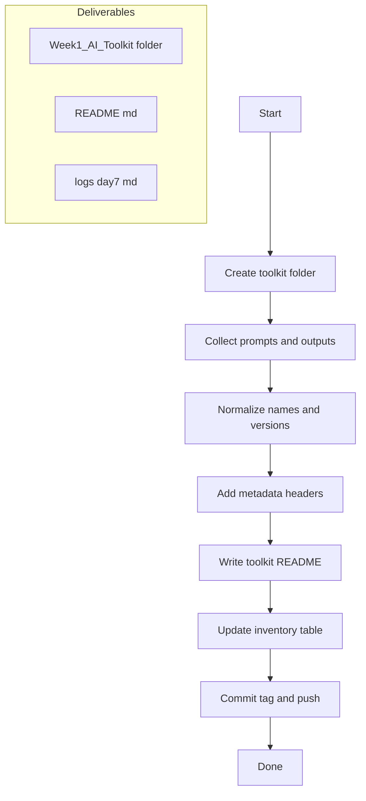

# Week 1 — Day 7: Toolkit Review & Deployment

**Save as:** `wk01/day07_toolkit_review_and_deployment.md`

**CXO Lens:** Day 7 converts experiments into a **repeatable product**. We package Week 1 assets as a governed, documented **AI Toolkit** that teams can deploy with confidence, reuse across sectors, and present as a portfolio artifact.

---

## 📌 Objectives

* Consolidate all **Week 1 outputs** into a reusable **AI Toolkit**.
* Standardize naming, versioning, and metadata for prompts and outputs.
* Author a toolkit **README** that explains purpose, usage, and limits.
* Produce an employer‑ and client‑ready portfolio artifact.

> Data safety: ensure all examples remain **public and non‑sensitive**.

---

## 🛠 Agenda (30–45 min)

1. Create toolkit folder and skeleton — 5m
2. Collect prompts and outputs — 10m
3. Normalize naming and add metadata — 8m
4. Write toolkit README and inventory — 10m
5. Commit, tag, and push — 5–7m

---

## Folder Structure (recommended)

```text
/Week1_AI_Toolkit/
  README.md
  /prompts/
    day01_prompt_pack.txt
    day02_structured_template.txt
    day03_handoff_prompt.txt
    day04_research_agent_prompt.txt
    day05_summarization_agent_prompt.txt
    day06_domain_bot_prompt.txt
  /outputs/
    Day1_comparison.md
    Day2_prompt_comparison.md
    Day3_exec_summary.md
    Day4_research_test_output.md
    Day5_summary_agent.md
    Day6_domain_bot.md
  /logs/
    day1.md
    day2.md
    day3.md
    day4.md
    day5.md
    day6.md
  /templates/
    metadata_header.yaml
    comparison_matrix.md
```

---

## Naming and Versioning

* **Files:** `dayNN_component_v{major}.{minor}.{patch}.{ext}`
  Example: `day04_research_agent_prompt_v1.0.0.txt`
* **Locales:** append ISO code if bilingual: `_en`, `_es`, `_am`
  Example: `day05_summary_agent_en_es_v1.0.0.md`
* **Semantic versioning:** MAJOR for breaking format changes; MINOR for additions; PATCH for copy fixes.

---

## Metadata Header (paste at top of each prompt file)

```yaml
---
name: Day 4 Research Agent
purpose: Topic‑agnostic research briefs for executives
owner: <your name or team>
domain: <policy|health|agriculture|disaster>
locale: <en|es|am|bi>
version: 1.0.0
last_updated: <YYYY‑MM‑DD>
inputs: [country, sector, topic, year]
outputs: [executive_brief, findings_table, gaps, next_steps, sources]
limits: public sources only; URLs in Sources section
---
```

---

## Toolkit README Template (drop‑in)

```markdown
# Week 1 AI Toolkit

## Purpose
Reusable prompts and output patterns to generate executive‑ready briefs, comparisons, and domain Q&A.

## How to use
1) Pick the relevant prompt in /prompts.  
2) Fill placeholders (country, sector, topic, year).  
3) Run in ChatGPT‑5; save outputs to /outputs.  
4) Log reflections in /logs.

## Inventory
| Agent | Files | Use when | Inputs | Outputs | Limits |
|---|---|---|---|---|---|
| Day 1 Comparison | Day1_comparison.md | Compare GPT‑5 vs Perplexity on a local query | prompt | side‑by‑side results | public data only |
| Day 2 Structured Prompt | day02_structured_template.txt; Day2_prompt_comparison.md | Need consistent RTF or PICO output | country, sector, topic, year | table + brief | public data only |
| Day 3 Handoff | day03_handoff_prompt.txt; Day3_exec_summary.md | Perplexity facts → GPT‑5 summary | fact pack | executive summary | cite publisher + year |
| Day 4 Research Agent | day04_research_agent_prompt.txt; Day4_research_test_output.md | Board‑ready research brief | country, sector, topic, year | brief + findings table | urls in Sources only |
| Day 5 Summarization | day05_summarization_agent_prompt.txt; Day5_summary_agent.md | Condense long reports | article text | headings + bullets + stats | word count enforced |
| Day 6 Domain Bot | day06_domain_bot_prompt.txt; Day6_domain_bot.md | Scope‑bound Q&A | scope lists | concise answers or refusal | ≤ 200 words |

## Governance
- Semantic versioning across prompts.  
- Public‑data only; remove any sensitive content before commit.

## Changelog
- v1.0.0 initial release.
```

---

## Inventory Checklist

* Prompts in `/prompts` match their **Day** and include metadata header.
* Outputs in `/outputs` render cleanly and follow their **QA checklists**.
* Logs in `/logs` exist for Days 1–6.
* README includes inventory table and governance notes.

---

## Commit and Tag

```bash
git add Week1_AI_Toolkit
git commit -m "feat: Day 7 Week 1 toolkit deployment"
git tag -a week1-toolkit-v1.0.0 -m "Week 1 Toolkit initial release"
git push && git push --tags
```

---

## 📂 Deliverables

* `/Week1_AI_Toolkit/` with all prompt and output files
* `Week1_AI_Toolkit/README.md` summarizing agents
* `/logs/day7.md` reflection log
* Commit: `feat: Day 7 Week 1 toolkit deployment`

---

## ✅ Rubric (Self‑Check)

* [ ] All assets collected into toolkit
* [ ] Toolkit README created with inventory
* [ ] Metadata and versioning applied
* [ ] Reflection log added
* [ ] Commit and tag pushed

---

## 📝 Reflection Prompts

1. **Toolkit value:** Which agent is most reusable and why?
2. **Workflow fit:** Which tool adds the most professional value?
3. **Surprises:** Which agent improved most during Week 1?
4. **Next iteration:** What should Week 2 add to expand the toolkit?

---

## Workflow (Mermaid)



---

## What “Great” Looks Like

A clean, documented toolkit that a hiring manager or client can open and understand in minutes: **clear purpose, consistent outputs, versioned prompts, and disciplined governance.**

