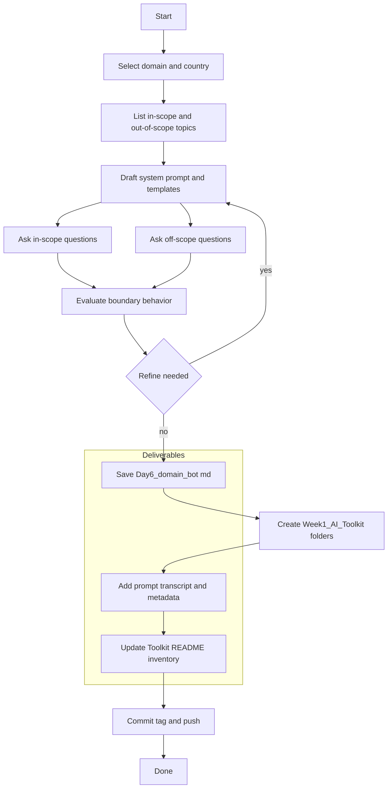

# Week 1 — **Bonus**: Domain Bot → Toolkit

**Save as:** `wk01/bonus_day06_07_domain_bot_to_toolkit.md`

**CXO Lens:** Turn a scope‑bound Q\&A assistant into a deployable, versioned **AI Toolkit component**. The outcome is a reliable domain advisor **and** a portfolio‑ready artifact with governance, naming, and reuse baked in.

---

## 📌 Objectives

**Part A — Domain‑Specific Q\&A Bot**

* Build a chatbot prompt restricted to a **single domain** and country/region.
* Enforce **in‑scope only** answers; gracefully refuse off‑topic questions.
* Use compact citations and optional bilingual summaries.

**Part B — Toolkit Packaging**

* Standardize naming, versioning, and metadata for the bot.
* Add the bot to a `Week1_AI_Toolkit` with README and inventory.
* Commit and tag for reuse as a portfolio artifact.

> **Data safety:** Use **public, non‑sensitive** examples throughout.

---

## 🛠 Agenda (60–75 min)

1. **Scope & rules** (6–8m) — Define domain, region, in‑scope, out‑of‑scope.
2. **Draft prompt** (12–15m) — System + response contract + refusal templates.
3. **Test & refine** (12–15m) — In‑scope and off‑scope questions.
4. **Save transcript** (5m) — Export conversation.
5. **Package** (15–20m) — Folder, metadata header, README inventory, versioning.
6. **Commit & tag** (3–5m) — Push toolkit with semantic version.

---

## Part A — Build the Domain Bot

### Step 1 — Define Scope

List 3–6 **in‑scope topics** and 5–10 **out‑of‑scope** examples.

* **Caribbean:** agriculture diversification, tourism risk reduction, hurricane readiness
* **Ethiopia:** healthcare staffing, education policy, digital infrastructure
* **General:** finance, cybersecurity, project management

### Step 2 — Drop‑in Prompts

**System Prompt**

```text
You are a domain expert assistant restricted to a single scope. You answer only within the defined domain and decline other questions politely.

Scope:
- Country or region: {{country_or_region}}
- Domain: {{domain}}
- In‑scope topics: {{topics_list}}
- Out‑of‑scope examples: {{oos_list}}

Policy:
- If a question is fully in scope, answer concisely with headings or bullets as needed.
- If borderline, state what is in scope and what is not, then answer the in‑scope portion only.
- If out of scope, reply: That is outside this assistant’s domain. Please ask about {{domain}} topics.
- Prefer recent public sources; cite publisher and year compactly; list URLs once at the end as Sources.
- Keep answers ≤ 200 words unless asked otherwise.
- Support optional bilingual summaries: English plus {{language}}.
```

**Response Contract**

```text
When answering in scope, use this format:
1) Short answer (2–3 bullets or 1 short paragraph)
2) If requested: Bilingual summary in English and {{language}}
3) Sources: Publisher — Title (Year). URL
```

**Refusal & Borderline Templates**

```text
Refusal (out of scope):
That is outside this assistant’s domain. Please ask about {{domain}} topics such as {{topics_list}}.

Borderline handling:
Part of your question is outside scope. I can address the following in‑scope portion: {{in_scope_part}}. For the rest, consult a general resource or a different assistant.
```

### Step 3 — Test the Bot

Ask **3–4 in‑scope** and **1–2 off‑scope** questions.

* In‑scope example: What are the biggest threats to cassava exports in 2025 in {{country}}?
* Off‑scope example: Who won the World Cup in 2022?

Confirm the assistant:

* Stays in scope; uses refusal or borderline language as needed
* Provides compact citations and optional bilingual output

### Step 4 — Save Transcript

Export the full conversation as `Day6_domain_bot.md`.

**QA Checklist**

* Refusal language consistent and polite
* Borderline logic used when applicable
* Citations compact; URLs listed once in Sources
* Answers ≤ 200 words unless expanded by request
* Optional bilingual output mirrors English structure

**Comparison Matrix (1–5)**

```markdown
| Criterion | Score |
|---|---:|
| Stayed in scope |  |
| Quality of refusal |  |
| Structure and clarity |  |
| Citation quality |  |
| Bilingual fidelity |  |
| User satisfaction (self‑rated) |  |
```

---

## Part B — Package into the Week 1 AI Toolkit

### Step 5 — Folder Structure

```text
/Week1_AI_Toolkit/
  README.md
  /prompts/
    day06_domain_bot_prompt_v1.0.0.txt
  /outputs/
    Day6_domain_bot.md
  /logs/
    day6.md
  /templates/
    metadata_header.yaml
```

### Step 6 — Metadata Header (paste at top of prompt file)

```yaml
---
name: Day 6 Domain Bot
purpose: Scope‑bound Q&A for a specific domain and region
owner: <your name or team>
domain: <policy|health|agriculture|disaster|finance|cybersecurity>
locale: <en|es|am|bi>
version: 1.0.0
last_updated: <YYYY‑MM‑DD>
inputs: [country_or_region, domain, topics_list, oos_list, language]
outputs: [answer_or_refusal, bilingual_summary_optional, sources]
limits: public sources only; max 200 words unless requested; URLs in Sources
---
```

### Step 7 — Toolkit README Inventory (add this row)

```markdown
| Agent | Files | Use when | Inputs | Outputs | Limits |
|---|---|---|---|---|---|
| Day 6 Domain Bot | day06_domain_bot_prompt_v1.0.0.txt; Day6_domain_bot.md | Scope‑bound FAQs or internal knowledge bases | country_or_region, domain, topics_list, oos_list | concise answers or refusal + optional bilingual | ≤ 200 words; public data only |
```

### Step 8 — Naming & Versioning

* Files: `dayNN_component_v{major}.{minor}.{patch}.{ext}`
* Locales: append `_en`, `_es`, `_am` as needed
* SemVer: **MAJOR** breaking changes; **MINOR** additive; **PATCH** text fixes

### Step 9 — Commit & Tag

```bash
git add Week1_AI_Toolkit
git commit -m "feat: add Day 6 domain bot and package into Week 1 toolkit"
git tag -a week1-toolkit-v1.0.0 -m "Week 1 Toolkit initial release"
git push && git push --tags
```

---

## 📂 Deliverables

* `Day6_domain_bot.md` — transcript of domain Q\&A + boundary tests
* `/Week1_AI_Toolkit/` updates — prompt, output, metadata, README row
* `/logs/day6.md` and (optional) `/logs/day7.md` — reflection logs

---

## ✅ Rubric (Self‑Check)

* [ ] Domain and scope defined; prompt includes response and refusal templates
* [ ] Transcript shows in‑scope answers and graceful refusals
* [ ] Prompt file has metadata header and version `v1.0.0`
* [ ] Toolkit README updated with inventory row
* [ ] Commit and tag pushed

---

## 📝 Reflection Prompts

1. **Boundary control:** Where did the bot handle borderline questions well or poorly?
2. **Governance:** What metadata fields or limits improved reliability?
3. **Reuse:** Which teams could adopt this bot as‑is next week?
4. **Next iteration:** What would justify a **MINOR** vs **MAJOR** version bump?

---

## Workflow (Mermaid)



---

## What “Great” Looks Like

A scope‑disciplined advisor **and** a clean, versioned toolkit entry that another team can reuse tomorrow—no extra meetings required.
