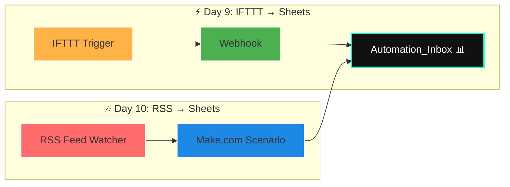

# 🎶 Day 10 — Vibe Coding with Make.com: *RSS → Google Sheets*

---

## 🌟 Objective

Build an **auto-pilot intel pipeline**: every time a blog updates or a feed drops, your Google Sheet catches it instantly.
No FOMO. No copy-paste. Just flow.

⏱ **Timebox:** ≤ 30 minutes

---

## 🌀 Build the Flow

### 1️⃣ Step Into Make.com

* Go to [make.com](https://www.make.com)
* Sign in (free tier is perfect)

---

### 2️⃣ Orchestrate Your Scenario 🎼

**Module 1 → RSS Watcher**

* Paste in a feed that matters:

  * Tech news → for analysts
  * Market blogs → for entrepreneurs
  * Healthcare/Defense → for veterans in transition

**Module 2 → Google Sheets: Add Row**

* Connect Google Sheets
* Target: `Automation_Inbox`
* Map your vibe fields:

| Sheet Column | Data Flow               |
| ------------ | ----------------------- |
| `Timestamp`  | `now()`                 |
| `Source`     | `RSS`                   |
| `Title`      | RSS item title          |
| `URL`        | RSS item link           |
| `Notes`      | leave blank / quick tag |
| `Status`     | `new`                   |

---

## 🔗 Workflow Map



💡 *Your `Automation_Inbox` is now a unified signal board catching feeds from both IFTTT and Make.com.*

---

## ✅ Test & Automate

* **Run once** → confirm new row lands in your sheet
* Flip **Scheduling ON** → recommended: *every 30 minutes*

---

## 📂 Deliverable

Create `Day10_scenario_notes.md` with:

* Feed URL used
* Sheet/tab name
* Interval chosen
* *One-liner: why this feed matters to you*

---

## 🎯 Who Benefits

* **Analysts** → constant trend signals
* **Entrepreneurs** → competitor radar
* **PM / MBAs** → evidence for decks
* **Veterans** → news flow for new roles

---

## 💻 Commit the Energy

```powershell
cd "C:\Users\Veteran\ai-agent-mastery-28days"
git add "Week2_Automation_Workflows/Day10/lesson.md"
git commit -m "Day 10: modern RSS → Google Sheets pipeline"
git push
```

*(Optional placeholder file)*

```powershell
ni -Type File "Week2_Automation_Workflows/Day10/Day10_scenario_notes.md" -Force | Out-Null
git add "Week2_Automation_Workflows/Day10/Day10_scenario_notes.md"
git commit -m "Day 10: add notes placeholder"
git push
```

---

## 🖼 Bonus

Want me to export that workflow diagram in **dark-mode SVG/PNG** so you can drop it in LinkedIn posts and NPower slides?

---

