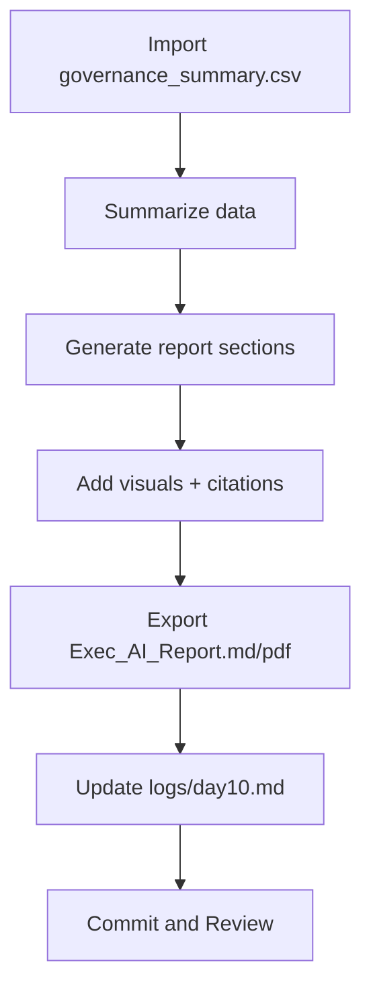

# ⚡ Day 10 — Executive AI Report Agent

*(Data → Narrative → Decision Lens)*

---

## 🎯 Purpose

Day 10 teaches the system to **summarize and communicate** what your Day 9 dashboard *means* — not just what it shows.
The result is an **AI-generated, board-ready report** that combines metrics, risk analysis, and policy alignment in one Markdown or PDF artifact.

By the end you’ll have:

* A self-updating **executive summary generator**.
* A clear link between **data telemetry + governance storytelling**.
* An automated file ready to drop into your **Week 2 Toolkit**.

---

## 📌 Objectives

* Parse build and governance data to produce a **plain-language executive report**.
* Standardize tone, structure, and evidence sections for leadership.
* Compare **GPT-5 vs 3.5** output quality on precision and tone.
* Export a versioned report (`Exec_AI_Report_v1.md` / `.pdf`).

---

## 🛠 Agenda (≈ 45 min)

|   Time  | Task                                                     |
| :-----: | :------------------------------------------------------- |
|  0 – 10 | Set up folder + copy `governance_summary.csv` from Day 9 |
| 10 – 25 | Run the Report Agent prompt → generate executive summary |
| 25 – 35 | Refine for tone + visuals + citations                    |
| 35 – 45 | Save final report + reflection + commit                  |

---

## 📂 Setup

```bash
mkdir -p wk02/day10
cp wk02/day09/governance_summary.csv wk02/day10/
touch wk02/day10/executive_ai_report_agent.md
```

---

## 🧠 Drop-in Prompt — Executive AI Report Agent

```text
Role: Executive Intelligence Analyst Copilot.

Input: governance_summary.csv (build stage data + policy/ethics/compliance risk flags).

Tasks:
1) Summarize the current pipeline status in ≤ 150 words.  
2) Highlight High risk items in plain English (why they matter to leaders).  
3) Provide a Governance Summary Table (columns: Stage, Risk, Owner, Action Needed).  
4) Add sections:  
  - **Executive Insights (3 bullets)**  
  - **Risks & Recommendations (3 bullets)**  
  - **Next Steps & Responsible Parties**  
  - **Sources & Evidence (citations)**  
5) Tone: boardroom-ready (MBA style), balanced and fact-based.  
6) Add optional visual summary (ASCII bar or small chart placeholder).  
```

---

## 📊 Example Output Skeleton

```markdown
# 🧭 Executive AI Governance Report — Sprint 42 (Oct 2025)

## Pipeline Summary
All five stages active; Build and Test gates show pending ethical review.

## Governance Summary
| Stage | Risk | Owner | Action Needed |
|:--|:--|:--|:--|
| Plan | Low | Amy Chen | Maintain policy alignment |
| Build | High | DevOps Bot | Complete Ethics checklist |
| Test | High | Luis Rivera | Bias scan re-run |
| Deploy | Medium | Sarah Lee | Compliance review |
| Monitor | Low | System | OK |

## Executive Insights
- Governance coverage ↑ to 86%; two gates await sign-off.  
- Ethics and bias validation lagging due to new data model.  
- No security incidents reported this cycle.

## Risks & Recommendations
- Add automated bias scan in CI/CD.  
- Increase lead visibility on Build/Test metrics.  
- Introduce decision log for board traceability.

## Next Steps
1) Luis → Bias retest by Oct 15.  
2) Sarah → Compliance sign-off before deploy.  
3) Amy → Update policy alignment matrix.

## Sources & Evidence
- governance_summary.csv (2025-10-14)  
- constraints.md (Day 7 Context Pack)
```

---

## 📂 Deliverables

* `wk02/day10/executive_ai_report_agent.md` (report prompt + output)
* `wk02/day10/governance_summary.csv` (input)
* Optional: `Exec_AI_Report_v1.pdf` (export)
* `/logs/day10.md` (3-bullet reflection)

Commit:

```bash
git add wk02/day10
git commit -m "feat(day10): executive AI report agent + governance summary"
```

---

## ✅ Rubric (Self-Check)

| Criterion                                                        | Met? |
| :--------------------------------------------------------------- | :--: |
| Report references data from Day 9                                |  ☑️  |
| Sections present (Summary, Insights, Risks, Next Steps, Sources) |  ☑️  |
| Tone = executive, concise, factual                               |  ☑️  |
| Governance actions clear and assignable                          |  ☑️  |
| Reflection log complete                                          |  ☑️  |

---

## 📝 Reflection Prompts (Day 10)

1. Which metric or risk surprised you most?
2. How can AI distinguish signal from noise in governance data?
3. Would you trust this report as-is for a board briefing? If not, why?
4. What visual element would make this report immediately actionable?

---

## 🧭 Workflow (Mermaid)



---

## 💡 Tips

* Use **governance language in your summaries** (e.g., “Ethics Review pending,” “Compliance Gate green”).
* If you export to PDF, append Day 9 chart images for visual context.
* Run GPT-3.5 and GPT-5 side-by-side to compare factual consistency and tone.
* Embed “Evidence & Risks” boxes to mirror your Day 7 context pack discipline.

---


