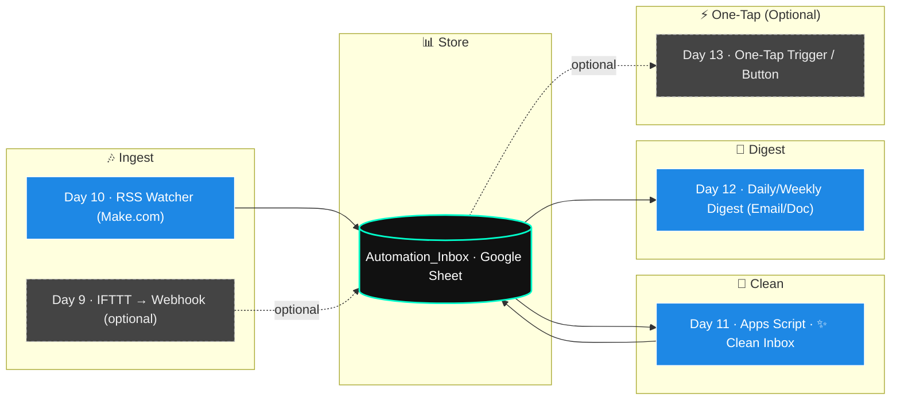

# 🎧 Day 11 — Vibe Coding with Apps Script: *Clean + De-Dupe Your Inbox*

---

## 🌟 Objective

Keep your `Automation_Inbox` **high-signal and clutter-free** with a one-tap cleaner that:

* Trims whitespace
* Removes blank rows
* **De-duplicates by URL** (smart normalization so the same link isn’t saved twice)

⏱ **Timebox:** ≤ 30 minutes

---

## 🌀 Build the Tool

### 1️⃣ Open Apps Script

In your `Automation_Inbox` Google Sheet → **Extensions → Apps Script**

---

### 2️⃣ Paste This Script (drop-in ready)

> Assumes **Row 1 = header** and **URL = Column D**.
> Change the **CONFIG** at top if your tab or URL column differs.

```javascript
/***** CONFIG *****/
const CONFIG = {
  sheetName: "Sheet1",      // change if your tab name is different
  urlColIndex: 4,           // 1-based index: Column D = 4
  headerRow: 1              // header row number
};
/*******************/

function onOpen() {
  SpreadsheetApp.getUi()
    .createMenu("⚙️ AI Mastery")
    .addItem("✨ Clean Inbox", "CleanInbox")
    .addToUi();
}

function CleanInbox() {
  const ui = SpreadsheetApp.getUi();
  const ss = SpreadsheetApp.getActive();
  const sh = ss.getSheetByName(CONFIG.sheetName) || ss.getSheets()[0];

  const range = sh.getDataRange();
  const values = range.getValues();
  if (values.length <= CONFIG.headerRow) {
    ui.alert("No data to clean.");
    return;
  }

  const header = values[CONFIG.headerRow - 1];
  const body = values.slice(CONFIG.headerRow);

  // 1) Trim + remove empty rows
  const trimmed = body
    .map(row => row.map(c => (typeof c === "string" ? c.trim() : c)))
    .filter(row => row.join("") !== "");

  // 2) Normalize URL then dedupe
  const urlIdx = CONFIG.urlColIndex - 1;
  const seen = new Set();
  const deduped = [];
  let blanks = 0;
  let dupes = 0;

  for (const r of trimmed) {
    const raw = (r[urlIdx] || "").toString().trim();
    if (!raw) {
      // If there’s no URL, fall back to row fingerprint
      const key = JSON.stringify(r);
      if (!seen.has(key)) {
        seen.add(key);
        deduped.push(r);
      } else {
        dupes++;
      }
      blanks++;
      continue;
    }

    const norm = normalizeUrl(raw);
    const key = `u:${norm}`;
    if (!seen.has(key)) {
      seen.add(key);
      // write normalized URL back so your sheet stays tidy
      r[urlIdx] = norm;
      deduped.push(r);
    } else {
      dupes++;
    }
  }

  // 3) Rewrite sheet (preserve header)
  sh.clearContents();
  sh.getRange(1, 1, 1, header.length).setValues([header]);
  if (deduped.length) {
    sh.getRange(2, 1, deduped.length, deduped[0].length).setValues(deduped);
  }

  const msg = [
    `✨ Clean complete`,
    `Original rows: ${body.length}`,
    `After trim/dedupe: ${deduped.length}`,
    `Blank rows removed: ${trimmed.length - deduped.length < 0 ? 0 : blanks}`,
    `Duplicates removed: ${dupes}`
  ].join("\n");

  // Toast + Alert for quick feedback
  ss.toast("Inbox cleaned ✨", "AI Mastery", 3);
  ui.alert(msg);
}

/**
 * Normalize URL for smarter dedupe:
 * - Lowercase host
 * - Remove UTM/query noise + fragments
 * - Trim trailing slashes
 */
function normalizeUrl(input) {
  try {
    const u = new URL(input);
    u.hash = "";
    // keep only meaningful params
    const keep = new URLSearchParams();
    for (const [k, v] of u.searchParams) {
      if (!/^utm_/.test(k) && k.toLowerCase() !== "gclid" && k.toLowerCase() !== "fbclid") {
        keep.set(k, v);
      }
    }
    u.search = keep.toString() ? "?" + keep.toString() : "";

    u.hostname = u.hostname.toLowerCase();

    // Remove trailing slash unless it's the root
    if (u.pathname !== "/" && u.pathname.endsWith("/")) {
      u.pathname = u.pathname.replace(/\/+$/, "");
    }

    return u.toString();
  } catch (e) {
    // If not a valid URL, return the original trimmed string
    return (input || "").toString().trim();
  }
}
```

---

## ▶️ Run It

* Reload the sheet (or just wait a second)
* Use menu: **⚙️ AI Mastery → ✨ Clean Inbox**

> If your tab isn’t `"Sheet1"`, either rename it or update `CONFIG.sheetName`.

---

## 🔎 Deliverable (quick log)

Create `Day11_cleanup_log.md` with:

* Rows before vs. after
* Blank rows removed
* Duplicates removed
* (Optional) One note about any messy sources you noticed

---

## 🎯 Why This Hits Different

* **Analysts / PMs / MBAs** → reliable inputs for downstream analysis
* **Entrepreneurs** → tighter weekly updates and decks
* **Veterans in Transition** → cleaner signal tracking for target roles

---

## 💻 Commit the Energy

```powershell
cd "C:\Users\Veteran\ai-agent-mastery-28days"
git add "Week2_Automation_Workflows/Day11/lesson.md"
git commit -m "Day 11: vibe-coded Apps Script cleaner with URL normalization + dedupe"
git push
```

*(Optional placeholder file)*

```powershell
ni -Type File "Week2_Automation_Workflows/Day11/Day11_cleanup_log.md" -Force | Out-Null
git add "Week2_Automation_Workflows/Day11/Day11_cleanup_log.md"
git commit -m "Day 11: add cleanup log placeholder"
git push
```

---

## 🧭 Bonus (keep the vibe flowing)

Love it. Here’s a **paste-ready Mermaid pipeline map** that matches your vibe (dark-ish accents, bold labels) and shows **Day 10 → Day 11 → Day 12** — plus an optional **Day 13** branch if you want it.

---

## 🔗 Week 2 Pipeline Map (Ingest → Clean → Digest)



### How to use it

* Keep this block in **`Week2_Automation_Workflows/README.md`** or your **Day 11 `lesson.md`** under a “Workflow” section.
* GitHub renders Mermaid when fenced with ` ```mermaid ` exactly (no extra spaces).
* Don’t want Day 13 yet? Delete the **Trigger** subgraph + the dotted edge to keep the map tight.

---

## 📌 Tiny legend (optional to include under the diagram)

* **🎶 Ingest:** Sources that feed your intel (RSS via Make.com, IFTTT webhook from Day 9).
* **📊 Store:** Single source of truth (`Automation_Inbox` Sheet).
* **🧼 Clean:** Day 11 Apps Script menu action that trims, de-dupes, normalizes URLs.
* **📰 Digest:** Day 12 turns the clean sheet into a human-readable update (email, doc, or Notion).
* **⚡ One-Tap:** (Optional) Day 13 trigger button to kick off actions on demand.

---


