# 🎧 Day 12 — Vibe Coding with Apps Script: *Automated Daily Digest Email*

---

## 🌟 Objective

Auto-send a **polished HTML digest** of the freshest entries from `Automation_Inbox` — straight to your inbox.
No rummaging, just signal.

⏱ **Timebox:** ≤ 30 minutes

---

## ✅ Prereq

**Day 11** cleaner (`CleanInbox`) is working.

---

## 🌀 Build the Digest

### 1️⃣ Open Apps Script

`Automation_Inbox` → **Extensions → Apps Script**

---

### 2️⃣ Paste This (drop-in, configurable)

> Assumes **Row 1 = header** and columns: A:`Timestamp`, B:`Source`, C:`Title`, D:`URL`, E:`Notes`, F:`Status`.
> Adjust `CONFIG` if your sheet/tab/columns differ.

```javascript
/***** CONFIG *****/
const CONFIG_D12 = {
  sheetName: "Sheet1",              // your tab name
  headerRow: 1,                     // header row number
  col: { ts:1, src:2, title:3, url:4, notes:5, status:6 }, // 1-based
  timezone: "America/Chicago",
  subject: "Daily Intel Digest",
  limit: 10,                        // max items in email
  lookbackHours: 24,                // include items from last N hours
  onlyStatusNew: true,              // include only rows where Status == "new"
  markAsSent: true,                 // set Status="sent" after emailing
  to: Session.getActiveUser().getEmail()
};
/*******************/

function SendDailyDigest() {
  const ss = SpreadsheetApp.getActive();
  const sh = ss.getSheetByName(CONFIG_D12.sheetName) || ss.getSheets()[0];

  const lastRow = sh.getLastRow();
  const lastCol = sh.getLastColumn();
  if (lastRow <= CONFIG_D12.headerRow) return;

  const data = sh.getRange(CONFIG_D12.headerRow + 1, 1, lastRow - CONFIG_D12.headerRow, lastCol).getValues();
  const tz = CONFIG_D12.timezone;
  const now = new Date();
  const cutoff = new Date(now.getTime() - CONFIG_D12.lookbackHours * 3600 * 1000);

  // Filter rows
  let rows = data.filter(r => {
    const ts = toDateSafe(r[CONFIG_D12.col.ts - 1]);
    const status = (r[CONFIG_D12.col.status - 1] || "").toString().trim().toLowerCase();
    const inWindow = ts ? ts >= cutoff : true; // keep rows w/o ts if you want
    const statusOk = CONFIG_D12.onlyStatusNew ? (status === "new") : true;
    return inWindow && statusOk;
  });

  // Sort newest first (by timestamp if available)
  rows.sort((a, b) => {
    const ta = toDateSafe(a[CONFIG_D12.col.ts - 1])?.getTime() || 0;
    const tb = toDateSafe(b[CONFIG_D12.col.ts - 1])?.getTime() || 0;
    return tb - ta;
  });

  if (CONFIG_D12.limit && rows.length > CONFIG_D12.limit) {
    rows = rows.slice(0, CONFIG_D12.limit);
  }

  // Build HTML
  const html = buildDigestHtml(rows, tz);
  if (!rows.length) {
    // Still send a minimal heartbeat so you know it ran (optional)
    MailApp.sendEmail({
      to: CONFIG_D12.to,
      subject: CONFIG_D12.subject + " (no new items)",
      htmlBody: emptyStateHtml(tz)
    });
    ss.toast("No new items. Sent heartbeat.", "Day 12", 3);
    return;
  }

  MailApp.sendEmail({
    to: CONFIG_D12.to,
    subject: CONFIG_D12.subject,
    htmlBody: html
  });

  // Optionally mark included rows as "sent"
  if (CONFIG_D12.markAsSent) {
    const statusCol = CONFIG_D12.col.status;
    const startRow = CONFIG_D12.headerRow + 1;
    rows.forEach(row => {
      const idx = data.findIndex(d =>
        JSON.stringify(d) === JSON.stringify(row)
      );
      if (idx >= 0) {
        sh.getRange(startRow + idx, statusCol).setValue("sent");
      }
    });
  }

  SpreadsheetApp.getActive().toast("Daily digest sent ✉️", "Day 12", 3);
}

function toDateSafe(v) {
  if (v instanceof Date) return v;
  if (typeof v === "string" && v.trim()) {
    const d = new Date(v);
    if (!isNaN(d.getTime())) return d;
  }
  return null;
}

function buildDigestHtml(rows, tz) {
  const title = "Daily Intel Digest";
  const intro = Utilities.formatDate(new Date(), tz, "EEE, MMM d @ h:mma");

  const cards = rows.map(r => {
    const ts = toDateSafe(r[CONFIG_D12.col.ts - 1]);
    const when = ts ? Utilities.formatDate(ts, tz, "MMM d, h:mma") : "—";
    const src = esc(r[CONFIG_D12.col.src - 1]);
    const t = esc(r[CONFIG_D12.col.title - 1]);
    const url = esc(r[CONFIG_D12.col.url - 1]);
    const notes = esc(r[CONFIG_D12.col.notes - 1]);
    return `
      <tr>
        <td style="padding:12px;border-bottom:1px solid #222;">
          <div style="font-size:14px;opacity:.8;">${when} · ${src}</div>
          <div style="font-size:16px;font-weight:600;margin:4px 0 6px;">
            ${t || "(No title)"}${url ? ` — <a href="${url}" style="color:#7dd3fc;text-decoration:none;">Open</a>` : ""}
          </div>
          ${notes ? `<div style="font-size:13px;opacity:.9;">${notes}</div>` : ""}
        </td>
      </tr>`;
  }).join("");

  return `
  <div style="background:#0b0b0b;color:#eee;font-family:Inter,Segoe UI,Arial,sans-serif;padding:20px;">
    <h2 style="margin:0 0 6px 0;font-weight:700;">${title}</h2>
    <div style="opacity:.75;margin:0 0 14px 0;">${intro} · Last ${CONFIG_D12.lookbackHours}h · max ${CONFIG_D12.limit} items</div>
    <table width="100%" cellspacing="0" cellpadding="0" style="border-collapse:collapse;background:#111;border:1px solid #222;border-radius:8px;overflow:hidden;">
      ${cards || ""}
    </table>
    <div style="margin-top:14px;font-size:12px;opacity:.6;">
      Source: Automation_Inbox · Status filter: ${CONFIG_D12.onlyStatusNew ? "new" : "any"} · TZ: ${tz}
    </div>
  </div>`;
}

function emptyStateHtml(tz) {
  const intro = Utilities.formatDate(new Date(), tz, "EEE, MMM d @ h:mma");
  return `
  <div style="background:#0b0b0b;color:#eee;font-family:Inter,Segoe UI,Arial,sans-serif;padding:20px;">
    <h2 style="margin:0 0 6px 0;font-weight:700;">Daily Intel Digest</h2>
    <div style="opacity:.75;margin-bottom:8px;">${intro}</div>
    <div style="background:#111;border:1px solid #222;border-radius:8px;padding:16px;">
      No new items in the last ${CONFIG_D12.lookbackHours} hours.
    </div>
  </div>`;
}

function esc(v) {
  if (v == null) return "";
  return String(v)
    .replace(/&/g,"&amp;")
    .replace(/</g,"&lt;")
    .replace(/>/g,"&gt;")
    .replace(/"/g,"&quot;");
}
```

---

## ▶️ Trigger It (once a day)

Apps Script **Triggers** (clock icon) → **+ Add Trigger**

* Function: `SendDailyDigest`
* Event source: **Time-driven**
* Type: **Day timer**
* Time: e.g., **8:00 AM** (America/Chicago)

---

## ✅ Test

Run `SendDailyDigest()` once:

* Email arrives
* Shows up to **10** newest items from the last **24h** (configurable)
* If `markAsSent: true`, those items’ **Status** becomes `sent`

---

## 📂 Deliverable

Create `Day12_digest_test.md`:

* [ ] Trigger time set
* [ ] Manual test successful
* [ ] Email received + formatting OK
* [ ] (If enabled) Rows marked `sent`

---

## 🎯 Why This Hits

* **Analysts/PMs** → crisp, scannable briefs for standups & decks
* **Entrepreneurs** → daily market pulse, zero effort
* **Veterans in transition** → tracked intel without breaking focus

---

## 💻 Commit the Energy

```powershell
cd "C:\Users\Veteran\ai-agent-mastery-28days"
git add "Week2_Automation_Workflows/Day12/lesson.md"
git commit -m "Day 12: vibe-coded HTML digest with lookback window + mark-as-sent"
git push
```

---

Perfect — here’s a **paste-ready Mermaid diagram** that shows **Day 10 → Day 11 → Day 12** with the **mark-as-sent loopback** to the Sheet. Drop this under a “Workflow” header in your Day 12 `lesson.md` or the Week 2 README.

---

## 🔗 Week 2 Flow — Ingest → Clean → Digest (+ mark-as-sent)

```mermaid
flowchart LR
    %% --- CLUSTERS ---
    subgraph Ingest["🎶 Ingest"]
        RSS["Day 10 · RSS Watcher (Make.com)"]
        IFTTT["Day 9 · IFTTT → Webhook (optional)"]
    end

    subgraph Store["📊 Store"]
        SHEET[("Automation_Inbox · Google Sheet")]
    end

    subgraph Clean["🧼 Clean"]
        CLEAN["Day 11 · Apps Script · ✨ CleanInbox()"]
    end

    subgraph Digest["📰 Digest"]
        D12["Day 12 · SendDailyDigest()"]
    end

    %% --- MAIN FLOW ---
    RSS --> SHEET
    IFTTT -. optional .-> SHEET
    SHEET --> CLEAN --> SHEET
    SHEET --> D12
    D12 -. mark-as-sent .-> SHEET

    %% --- STYLES ---
    classDef hub fill:#111,stroke:#00FFCC,color:#fff,stroke-width:2px
    classDef mod fill:#1E88E5,stroke:#fff,color:#fff
    classDef opt fill:#444,stroke:#bbb,color:#eee,stroke-dasharray: 4 3

    class SHEET hub
    class RSS,CLEAN,D12 mod
    class IFTTT opt
```



> Tip: make sure the fence starts with **\`\`\`mermaid** (exactly) so GitHub renders it.

---

### (Optional) Compact banner version

```mermaid
flowchart LR
    RSS["Day 10 · RSS (Make)"] --> SHEET[("Automation_Inbox")]
    IFTTT["Day 9 · IFTTT (opt)"] -.-> SHEET
    SHEET --> CLEAN["Day 11 · CleanInbox()"]
    CLEAN --> SHEET
    SHEET --> D12["Day 12 · SendDailyDigest()"]
    D12 -. mark-as-sent .-> SHEET

    classDef hub fill:#111,stroke:#00FFCC,color:#fff,stroke-width:2px
    classDef mod fill:#1E88E5,stroke:#fff,color:#fff
    classDef opt fill:#444,stroke:#bbb,color:#eee,stroke-dasharray: 4 3
    class SHEET hub
    class RSS,CLEAN,D12 mod
    class IFTTT opt
```



Want me to also add a **Day 13 one-tap trigger** branch (e.g., “Send Now” button) to this map or export a **dark-mode SVG/PNG** for slides/LinkedIn?


