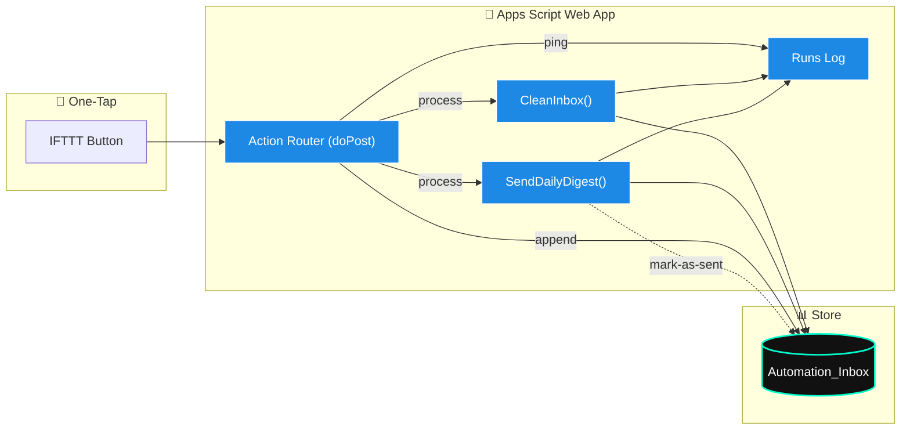
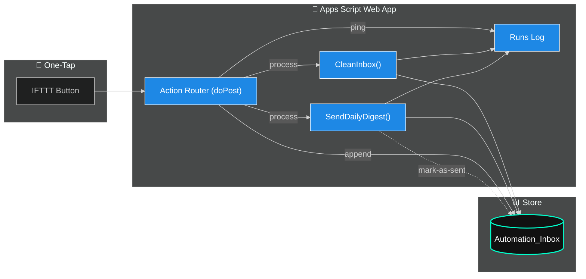

# 🎛️ Day 13 — Vibe Coding: *One-Tap “Process Now” from Your Phone*

Kick off your **Clean → Digest** pipeline with a single tap (IFTTT Button).
No laptop. No friction. Just signal.

⏱ **Timebox:** ≤ 30 minutes

---

## ✅ Prereqs

* **Day 11**: `CleanInbox()` working
* **Day 12**: `SendDailyDigest()` working

---

## 🧩 What You’ll Add (modernized)

* **Secure webhook** (shared secret token)
* **Action router** (`process`, `append`, `ping`)
* **Locking + rate-limit** (avoid double runs)
* **Run logs** sheet (observability: status, items sent, duration)
* **JSON responses** (clean integrations + testing)

---

## 🛠 Add/Replace Your Webhook (drop-in)

> Put this in the same Apps Script project as Day 11/12.
> If you used `openById("YOUR_SHEET_ID")`, keep doing that—swap the `getActive()` line.

```javascript
/***** CONFIG: Day 13 *****/
const D13 = {
  sheetName: "Sheet1",                 // your data tab
  runsLogSheet: "Runs",                // log tab (auto-created)
  sharedSecret: "CHANGE_ME",           // set to a long random string
  minMinutesBetweenRuns: 1,            // simple rate limit for 'process'
  enableClean: true,                   // call CleanInbox()
  enableDigest: true,                  // call SendDailyDigest()
  useOpenById: false,                  // set true and add SHEET_ID if desired
  SHEET_ID: ""                         // only used when useOpenById=true
};
/*************************************/

function _getSheet() {
  if (D13.useOpenById && D13.SHEET_ID) {
    return SpreadsheetApp.openById(D13.SHEET_ID);
  }
  return SpreadsheetApp.getActive();
}

function doPost(e) {
  try {
    const req = parseRequest(e);
    if (!authOk(req)) return json({ ok:false, error:"unauthorized" }, 401);

    switch ((req.action || "").toLowerCase()) {
      case "ping":
        return json({ ok:true, ts:new Date().toISOString() });

      case "append": {
        const ss = _getSheet();
        const sh = ss.getSheetByName(D13.sheetName) || ss.getSheets()[0];
        sh.appendRow([
          new Date(),
          req.source || "IFTTT",
          req.title  || "",
          req.url    || "",
          req.notes  || "",
          req.status || "new"
        ]);
        return json({ ok:true, result:"APPENDED" });
      }

      case "process":
      default:
        return handleProcess();
    }
  } catch (err) {
    return json({ ok:false, error:String(err) }, 500);
  }
}

function handleProcess() {
  const lock = LockService.getScriptLock();
  const started = Date.now();
  const ss = _getSheet();
  const logSh = ss.getSheetByName(D13.runsLogSheet) || ss.insertSheet(D13.runsLogSheet);
  ensureRunsHeader_(logSh);

  // simple rate-limit
  const lastRun = PropertiesService.getScriptProperties().getProperty("D13_LAST_RUN_TS");
  if (lastRun && Date.now() - Number(lastRun) < D13.minMinutesBetweenRuns * 60 * 1000) {
    return json({ ok:false, error:"rate_limited" }, 429);
  }

  try {
    lock.tryLock(10000); // 10s
  } catch (e) {
    return json({ ok:false, error:"locked" }, 423);
  }

  let status = "OK";
  let itemsSent = 0;

  try {
    if (D13.enableClean && typeof CleanInbox === "function") {
      CleanInbox();
    }

    if (D13.enableDigest && typeof SendDailyDigest === "function") {
      // capture count by scanning Day12 config if available
      const before = new Date();
      SendDailyDigest();
      const after = new Date();
      // optional: infer count via Day12’s mark-as-sent logic (skip here for simplicity)
      itemsSent = -1; // unknown; keep a placeholder or adapt SendDailyDigest() to return count
    }
  } catch (e) {
    status = "ERROR: " + e;
  } finally {
    const durationMs = Date.now() - started;
    PropertiesService.getScriptProperties().setProperty("D13_LAST_RUN_TS", String(Date.now()));
    logRun_(logSh, new Date(), status, itemsSent, durationMs);
    lock.releaseLock();
  }

  return json({ ok:true, result:"PROCESSED", itemsSent });
}

/* ---------- helpers ---------- */

function parseRequest(e) {
  const body = (e && e.postData && e.postData.contents) ? e.postData.contents : "{}";
  let data = {};
  try { data = JSON.parse(body); } catch (_) {}
  // Also allow querystring ?action=...&token=...
  const qs = e && e.parameter ? e.parameter : {};
  return {
    action: data.action || qs.action || "process",
    token:  data.token  || qs.token,
    title:  data.title,
    url:    data.url,
    source: data.source,
    notes:  data.notes,
    status: data.status
  };
}

function authOk(req) {
  if (!D13.sharedSecret) return true; // if you really want it open (not recommended)
  return req.token === D13.sharedSecret;
}

function json(obj, code) {
  const out = ContentService.createTextOutput(JSON.stringify(obj));
  out.setMimeType(ContentService.MimeType.JSON);
  if (code) {
    // Apps Script can’t set HTTP status directly; still return body with code as hint
    return out;
  }
  return out;
}

function ensureRunsHeader_(sh) {
  const first = sh.getRange(1,1,1,4).getValues()[0];
  if (first.join("") === "") {
    sh.getRange(1,1,1,4).setValues([["Timestamp","Status","ItemsSent","DurationMs"]]);
  }
}

function logRun_(sh, when, status, itemsSent, durationMs) {
  sh.appendRow([when, status, itemsSent, durationMs]);
}
```

---

## 🚀 Redeploy as Web App

* **Deploy → Manage deployments → New deployment**
* **Execute as:** *Me*
* **Access:** *Anyone* (you’re protecting with a token)
* Copy your **Web App URL** → you’ll pass `token` with requests.

---

## 📱 Create the IFTTT Button

* **If**: *Button widget*
* **Then**: *Webhooks → Make a web request*

  * **URL**: `YOUR_WEB_APP_URL`
  * **Method**: `POST`
  * **Content Type**: `application/json`
  * **Body**:

    ```json
    { "action": "process", "token": "CHANGE_ME" }
    ```

> Bonus buttons to add later:
>
> * **“Append quick note”**: `{ "action":"append", "token":"CHANGE_ME", "title":"Idea", "url":"", "notes":"call back prospect", "status":"new" }`
> * **“Ping health”**: `{ "action":"ping", "token":"CHANGE_ME" }`

---

## 🔎 Test (manual + CLI)

* Tap the IFTTT button → expect **`PROCESSED`** response & email
* Optional local test:

  ```bash
  curl -X POST "YOUR_WEB_APP_URL" \
    -H "Content-Type: application/json" \
    -d '{"action":"process","token":"CHANGE_ME"}'
  ```

---

## 📂 Deliverable: `Day13_end_to_end_checklist.md`

* [ ] IFTTT Button created
* [ ] Web App redeployed (URL confirmed)
* [ ] Button press returns **PROCESSED**
* [ ] Sheet cleaned (note change count)
* [ ] Digest email received (timestamp)
* [ ] `Runs` sheet shows status + duration

---

## 🔐 Quick Security Notes (teach-able moments)

* **Use a long `sharedSecret`** (store in IFTTT’s body).
* Regenerate + redeploy if the URL leaks.
* Later: narrow **Access** to *Anyone with link* or add IP allowlisting via proxy.

---

## 🧭 Why This Hits

* **Analysts / PMs / Founders** → tap once before standups or sales calls
* **Veterans in Transition** → interview-ready brief from your phone
* **Instructor-friendly** → clean code, clear logs, safe defaults

---

## 💻 Commit the Energy

```powershell
cd "C:\Users\Veteran\ai-agent-mastery-28days"
git add "Week2_Automation_Workflows/Day13/lesson.md"
git commit -m "Day 13: one-tap webhook with token auth, lock, rate-limit, and run logs"
git push
```

---

## 🔗 Workflow (One-Tap → Clean → Digest → Log)



---

Awesome — here’s both:

# 📱 iOS Shortcut (Siri-ready) — “Process Now”

**What it does:** One tap or “Hey Siri, Process Now” → sends `{"action":"process","token":"…"}`
to your Apps Script Web App.

## How to build it (2 minutes)

1. Open **Shortcuts** → **+** → **Add Action**.
2. Search **Get Contents of URL**.
3. Configure:

   * **URL:** `https://<your-apps-script-web-app-url>`
   * **Method:** **POST**
   * **Request Body:** **JSON**
   * **JSON:**

     ```
     {
       "action": "process",
       "token": "CHANGE_ME"
     }
     ```
   * **Headers (optional):** `Content-Type: application/json`
4. (Optional) Add **Show Result** to see the JSON `{"ok":true,"result":"PROCESSED"}`.
5. Tap the **…** (top-right):

   * **Name:** `Process Now`
   * **Icon:** choose something bold (bolt/rocket)
   * **Add to Home Screen** (for true one-tap)
   * **Add to Siri** → record: **“Process Now”**

### Bonus Shortcut: “Append Quick Note”

1. New Shortcut → **Ask for Text** (Prompt: “Note to inbox?”).
2. **Get Contents of URL** (POST JSON):

   ```
   {
     "action": "append",
     "token": "CHANGE_ME",
     "title": "Quick Note",
     "url": "",
     "notes": "📝 [[Shortcut Input]]",
     "status": "new"
   }
   ```
3. Name: `Append Quick Note` → Add to Siri: “Save a quick note”.

> Tip: if you want both on one screen, group them into a **Shortcuts folder** called *Vibe Coding*.

---

# 🖼 Dark-Mode SVG/PNG Export of Your Mermaid Diagram

You’ve already got the Mermaid blocks. Here are three clean ways to export **dark-mode** assets for slides/LinkedIn.

## Option A — Mermaid Live Editor (fastest)

1. Go to **Mermaid Live Editor** (search: “mermaid live editor”).
2. Paste your diagram (e.g., Day 13 flow).
3. In **Theme**, choose **Dark**.
4. **Export** → **SVG** (best for slides) or **PNG** (best for LinkedIn).

## Option B — VS Code (local, repeatable)

1. Install extensions:

   * **“Markdown Preview Mermaid Support”** or **“vscode-mermaid-preview.”**
2. Create `flow.mmd` with your diagram.
3. Open preview → **Export** → **SVG/PNG**.

   * If theme isn’t dark, add to top of file:

     ```mermaid
     %%{ init: { 'theme': 'dark' } }%%
     ```
   * (You can keep your custom `classDef` styles; they’ll still apply.)

## Option C — GitHub Action (auto-render on push)

Add this workflow (renders SVGs on commit using Mermaid CLI docker):

```yaml
name: Render Mermaid
on:
  push:
    paths:
      - 'Week2_Automation_Workflows/**.mmd'
jobs:
  render:
    runs-on: ubuntu-latest
    steps:
      - uses: actions/checkout@v4
      - name: Render to SVG
        run: |
          docker run --rm -v $PWD:/work minlag/mermaid-cli \
            -i Week2_Automation_Workflows/Day13/flow.mmd \
            -o Week2_Automation_Workflows/Day13/flow.svg \
            -t dark
      - name: Commit SVG
        run: |
          git config user.name "github-actions"
          git config user.email "actions@github.com"
          git add Week2_Automation_Workflows/Day13/flow.svg
          git commit -m "Render Mermaid SVG (dark)"
          git push
```

---

# 📄 Paste-ready Day 13 Mermaid (dark-init included)




