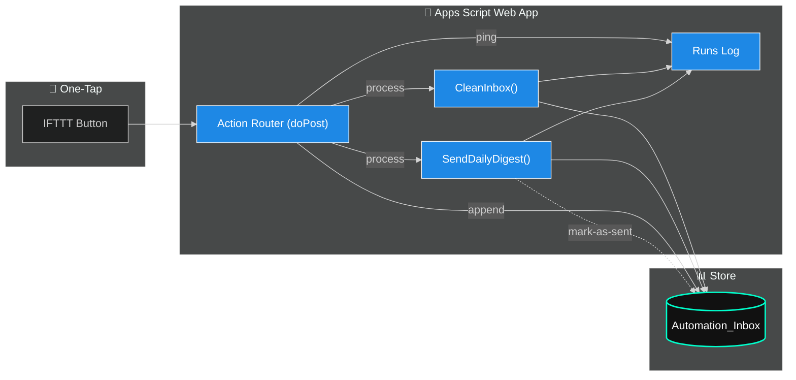

# 🎛️ Day 13 — Vibe Coding: *One-Tap “Process Now” from Your Phone*

Kick off your **Clean → Digest** pipeline with a single tap (IFTTT Button).
No laptop. No friction. Just signal.

⏱ **Timebox:** ≤ 30 minutes

---

## ✅ Prereqs

* **Day 11**: `CleanInbox()` working
* **Day 12**: `SendDailyDigest()` working

---

## 🧩 What You’ll Add (modernized)

* **Secure webhook** (shared secret token)
* **Action router** (`process`, `append`, `ping`)
* **Locking + rate-limit** (avoid double runs)
* **Run logs** sheet (status, items sent, duration)
* **JSON responses** (clean integrations + testing)

---

## 🛠 Add/Replace Your Webhook (drop-in)

> Put this in the **same Apps Script project** as Day 11/12.
> If you used `openById("YOUR_SHEET_ID")`, keep using it (toggle `useOpenById` below).

```javascript
/***** CONFIG: Day 13 *****/
const D13 = {
  sheetName: "Sheet1",                 // your data tab
  runsLogSheet: "Runs",                // log tab (auto-created)
  sharedSecret: "CHANGE_ME",           // set to a long random string
  minMinutesBetweenRuns: 1,            // simple rate limit for 'process'
  enableClean: true,                   // call CleanInbox()
  enableDigest: true,                  // call SendDailyDigest()
  useOpenById: false,                  // set true and add SHEET_ID if desired
  SHEET_ID: ""                         // only used when useOpenById=true
};
/*************************************/

function _getSheet() {
  if (D13.useOpenById && D13.SHEET_ID) {
    return SpreadsheetApp.openById(D13.SHEET_ID);
  }
  return SpreadsheetApp.getActive();
}

function doPost(e) {
  try {
    const req = parseRequest(e);
    if (!authOk(req)) return json({ ok:false, error:"unauthorized" }, 401);

    switch ((req.action || "").toLowerCase()) {
      case "ping":
        return json({ ok:true, ts:new Date().toISOString() });

      case "append": {
        const ss = _getSheet();
        const sh = ss.getSheetByName(D13.sheetName) || ss.getSheets()[0];
        sh.appendRow([
          new Date(),
          req.source || "IFTTT",
          req.title  || "",
          req.url    || "",
          req.notes  || "",
          req.status || "new"
        ]);
        return json({ ok:true, result:"APPENDED" });
      }

      case "process":
      default:
        return handleProcess();
    }
  } catch (err) {
    return json({ ok:false, error:String(err) }, 500);
  }
}

function handleProcess() {
  const lock = LockService.getScriptLock();
  const started = Date.now();
  const ss = _getSheet();
  const logSh = ss.getSheetByName(D13.runsLogSheet) || ss.insertSheet(D13.runsLogSheet);
  ensureRunsHeader_(logSh);

  // simple rate-limit
  const lastRun = PropertiesService.getScriptProperties().getProperty("D13_LAST_RUN_TS");
  if (lastRun && Date.now() - Number(lastRun) < D13.minMinutesBetweenRuns * 60 * 1000) {
    return json({ ok:false, error:"rate_limited" }, 429);
  }

  try {
    lock.tryLock(10000); // 10s
  } catch (e) {
    return json({ ok:false, error:"locked" }, 423);
  }

  let status = "OK";
  let itemsSent = 0;

  try {
    if (D13.enableClean && typeof CleanInbox === "function") {
      CleanInbox();
    }

    if (D13.enableDigest && typeof SendDailyDigest === "function") {
      // (Optional) adapt SendDailyDigest to return a count if desired.
      SendDailyDigest();
      itemsSent = -1; // unknown/placeholder
    }
  } catch (e) {
    status = "ERROR: " + e;
  } finally {
    const durationMs = Date.now() - started;
    PropertiesService.getScriptProperties().setProperty("D13_LAST_RUN_TS", String(Date.now()));
    logRun_(logSh, new Date(), status, itemsSent, durationMs);
    lock.releaseLock();
  }

  return json({ ok:true, result:"PROCESSED", itemsSent });
}

/* ---------- helpers ---------- */

function parseRequest(e) {
  const body = (e && e.postData && e.postData.contents) ? e.postData.contents : "{}";
  let data = {};
  try { data = JSON.parse(body); } catch (_) {}
  const qs = e && e.parameter ? e.parameter : {};
  return {
    action: data.action || qs.action || "process",
    token:  data.token  || qs.token,
    title:  data.title,
    url:    data.url,
    source: data.source,
    notes:  data.notes,
    status: data.status
  };
}

function authOk(req) {
  if (!D13.sharedSecret) return true; // open mode (not recommended)
  return req.token === D13.sharedSecret;
}

function json(obj, code) {
  const out = ContentService.createTextOutput(JSON.stringify(obj));
  out.setMimeType(ContentService.MimeType.JSON);
  return out; // Apps Script can't set HTTP status; include code in body if needed
}

function ensureRunsHeader_(sh) {
  const first = sh.getRange(1,1,1,4).getValues()[0];
  if (first.join("") === "") {
    sh.getRange(1,1,1,4).setValues([["Timestamp","Status","ItemsSent","DurationMs"]]);
  }
}

function logRun_(sh, when, status, itemsSent, durationMs) {
  sh.appendRow([when, status, itemsSent, durationMs]);
}
```

---

## 🚀 Redeploy as Web App

* **Deploy → Manage deployments → New deployment**
* **Execute as:** *Me*
* **Access:** *Anyone* (protected by token in request body)
* Copy your **Web App URL** (you’ll include `token` in the payload)

---

## 📱 Create the IFTTT Button

* **If**: Button widget
* **Then**: Webhooks → Make a web request

  * **URL**: `YOUR_WEB_APP_URL`
  * **Method**: `POST`
  * **Content Type**: `application/json`
  * **Body**:

    ```json
    { "action": "process", "token": "CHANGE_ME" }
    ```

**Bonus buttons**

* Append quick note:

  ```json
  { "action":"append", "token":"CHANGE_ME", "title":"Idea", "url":"", "notes":"call back prospect", "status":"new" }
  ```
* Ping health:

  ```json
  { "action":"ping", "token":"CHANGE_ME" }
  ```

---

## 🔎 Test (manual + CLI)

* Tap the IFTTT button → expect **`PROCESSED`** & a digest email
* CLI test:

  ```bash
  curl -X POST "YOUR_WEB_APP_URL" \
    -H "Content-Type: application/json" \
    -d '{"action":"process","token":"CHANGE_ME"}'
  ```

---

## 📱 iOS Shortcut (Siri-ready)

**Shortcuts** → **Get Contents of URL** → POST JSON:

```json
{ "action": "process", "token": "CHANGE_ME" }
```

Name it **Process Now** → Add to Siri: “Process Now”.

---

## 📂 Deliverable: `Day13_end_to_end_checklist.md`

* [ ] IFTTT Button created
* [ ] Web App redeployed (URL confirmed)
* [ ] Button press returns **PROCESSED**
* [ ] Sheet cleaned (note change count)
* [ ] Digest email received (timestamp)
* [ ] **Runs** sheet shows status + duration

---

## 🔐 Quick Security Notes

* Use a long **`sharedSecret`**; rotate if leaked.
* Keep Access at *Anyone* only if protected by token; otherwise narrow later.
* Consider a proxy for IP allowlisting if needed.

---

## 🧭 Why This Hits

* **Analysts / PMs / Founders** → one tap before standups or sales calls
* **Veterans in Transition** → interview-ready brief from your phone
* **Instructor-friendly** → clear code, logs, and safeguards

---

## 💻 Commit the Energy

```powershell
cd "C:\Users\Veteran\ai-agent-mastery-28days"
git add "Week2_Automation_Workflows/Day13/lesson.md"
git commit -m "Day 13: one-tap webhook with token auth, lock, rate-limit, and run logs"
git push
```

---

## 🔗 Workflow (One-Tap → Clean → Digest → Log)



---

## 🛠 Mermaid Troubleshooting (if preview fails)

* In **Markdown**: wrap with **\`\`\`mermaid** and ensure the **first line** inside is either `%%{ init... }%%` or a diagram type (`flowchart LR`, `graph TD`, etc.).
* In **.mmd** files: **no backticks**; first non-comment line must be a diagram type (you can keep the `%%{ init... }%%` line first).
* Avoid smart quotes “ ” → use straight quotes " ".
* If using VS Code, keep **one** Mermaid preview extension enabled.

```


