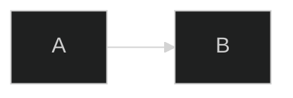

# 🎯 Day 14 — Vibe Coding: *Weekly Review & Deployment*

**Theme:** Turn Week 2 into a **repeatable, documented playbook** you can ship, demo, and reuse.

⏱ **Timebox:** ≤ 30 minutes

---

## ✅ By Now You Have

* **Day 9:** IFTTT → Apps Script Webhook → Google Sheets
* **Day 10:** Make.com RSS → Google Sheets (scheduled)
* **Day 11:** `CleanInbox()` (trim, blanks, dedupe by normalized URL)
* **Day 12:** `SendDailyDigest()` (polished HTML, lookback filter, mark-as-sent)
* **Day 13:** One-tap **Process Now** (IFTTT Button + secure webhook)

---

## 🛠 Ship the Playbook

### 1) Create the file

Add in this folder:

```
Week2_Playbook.md
```

### 2) Add screenshots (2–3)

Put into `/assets`:

* `sheet_inbox.png` — your `Automation_Inbox`
* `make_scenario.png` — your Make.com scenario
* `ifttt_applet.png` — your IFTTT Button/Webhooks

### 3) Link images (relative paths)

```markdown


```

### 4) Proof the flow (end-to-end)

Tap **Process Now** → confirm **capture → clean → digest** lands in email.

### 5) Commit & push

```powershell
cd "C:\Users\Veteran\ai-agent-mastery-28days"
git add "Week2_Automation_Workflows/Week2_Playbook.md" "assets/*"
git commit -m "Week 2: Automation Playbook (capture → clean → digest) + screenshots"
git push
```

---

## 📘 Week 2 Automation Playbook (paste into `Week2_Playbook.md`)

````markdown
# Week 2 Automation Playbook — *Intel Capture → Clean → Daily Digest*

> **Outcome:** A zero/low-cost pipeline that:
> - Captures industry intel / quick notes
> - Cleans & deduplicates entries
> - Delivers a daily HTML digest email (and one-tap refresh)

---

## Architecture

**Inputs**
- IFTTT Button/Note → Webhook → Apps Script → Google Sheet  
- Make.com RSS → Google Sheets (scheduled)

**Processing**
- Apps Script `CleanInbox()` (trim, blanks, normalized URL dedupe)

**Outputs**
- Apps Script `SendDailyDigest()` (HTML email; last 24h; up to N items)
- One-tap “process now” via `{ "action":"process","token":"***" }`

---

## Diagram
```mermaid
%%{ init: { "theme": "dark" } }%%
flowchart LR
  subgraph Ingest["🎶 Ingest"]
    IFTTT["IFTTT Button/Note"] -->|POST /webhook| GAS[Apps Script doPost]
    RSS["Make.com RSS"] -->|Add Row| SHEET[(Automation_Inbox)]
  end

  subgraph Process["🧼 Process"]
    CLEAN["CleanInbox()"]
  end

  subgraph Output["📰 Output"]
    DIGEST["SendDailyDigest()"]
    EMAIL["Daily HTML Email"]
  end

  GAS -->|Append Row| SHEET
  SHEET --> CLEAN --> SHEET
  SHEET --> DIGEST --> EMAIL
  Click["One-Tap Process"] -->|{action:'process'}| GAS

  classDef hub fill:#111,stroke:#00FFCC,color:#fff,stroke-width:2px
  classDef mod fill:#1E88E5,stroke:#fff,color:#fff
  class SHEET hub
  class GAS,CLEAN,DIGEST mod
```

---

## Setup (Concise)

1) **Google Sheet** `Automation_Inbox` with columns:  
`Timestamp | Source | Title | URL | Notes | Status`

2) **Apps Script**
- `doPost(e)` → logs rows & routes `{ action }` (process/append/ping)
- `CleanInbox()` → trims, removes blanks, dedupes by **normalized URL**
- `SendDailyDigest()` → emails most recent items (lookback window; optional mark-as-sent)

3) **IFTTT**
- Button → Webhooks POST `{ "action": "process", "token": "CHANGE_ME" }`
- Optional: Note → Webhooks → logs text with `status:"new"`

4) **Make.com**
- RSS → Google Sheets (Add Row), schedule ~30 min

5) **Security**
- Web app *Anyone* for demo; protect with `token` in body
- Rotate token if leaked; restrict later as needed

---

## Ops Guide

**Daily**
- Digest arrives (adjust trigger time if needed)
- Optional one-tap **Process Now** before standups/calls

**Weekly**
- Review RSS sources (quality)
- Spot-check `Runs` log for failures/latency

**Failure Modes**
- **No email** → Check Apps Script triggers & auth; review logs
- **No rows** → Confirm Make.com/IFTTT delivery
- **Dupes** → Verify `URL` column index + normalization

---

## SLA (lightweight)
- Target send window: **08:00 local (America/Chicago)**
- Max end-to-end (Process Now): **< 60s**
- Alert: if no digest 2 days in a row → manually run `SendDailyDigest()`

---

## Screenshots


---

## Reuse Patterns
- Swap RSS feeds per industry/role
- Replace IFTTT with **Google Forms → Apps Script**
- Push cleaned rows into **Docs/Slides** for auto-reports
````

---

## 🧪 QA Checklist (tick these)

* [ ] IFTTT Button triggers `PROCESSED` JSON
* [ ] `CleanInbox()` removed blanks & dupes (normalized URLs)
* [ ] Digest email shows correct **lookback window** & **limit**
* [ ] Items marked `sent` (if enabled)
* [ ] `Runs` sheet logs time + duration

---

## 🖼 Optional: Auto-render Mermaid to SVG (dark)

Add a GitHub Action if you want SVGs generated from `.mmd` files:

```yaml
name: Render Mermaid
on:
  push:
    paths:
      - 'Week2_Automation_Workflows/**.mmd'
jobs:
  render:
    runs-on: ubuntu-latest
    steps:
      - uses: actions/checkout@v4
      - name: Render to SVG
        run: |
          docker run --rm -v $PWD:/work minlag/mermaid-cli \
            -i Week2_Automation_Workflows/Day14/flow.mmd \
            -o Week2_Automation_Workflows/Day14/flow.svg \
            -t dark
      - name: Commit SVG
        run: |
          git config user.name "github-actions"
          git config user.email "actions@github.com"
          git add Week2_Automation_Workflows/Day14/flow.svg
          git commit -m "Week 2: render Mermaid SVG (dark)"
          git push
```

> If you keep diagrams inside Markdown, just use a ` ```mermaid ` fence with the **dark init** line first:



---

## 💼 Portfolio Nudge (optional)

Add a one-page **Showcase** (`Week2_Showcase.md`) with:

* 3 bullets on business value (speed, signal, zero-cost)
* 1 diagram + 1 digest screenshot
* “How it works” in 5 lines
* “Clone This” steps (copy + paste)

I can draft that one-pager next if you want it in your repo.

---


