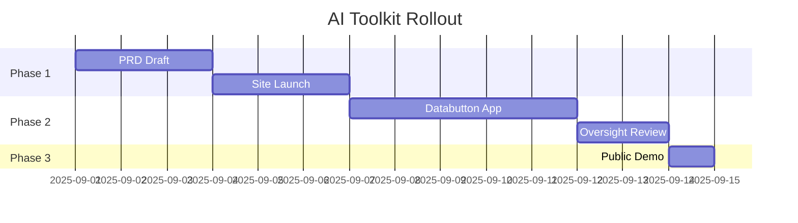

<!-- Licensed under DACR-1.1 — see LICENSE.md -->

# ⚡ Day 14 — Mini-Project 2: Refine BRD + Connect All the Dots

## 📌 Objective
- Update your **PRD** with what you actually shipped (site + app).  
- Add an **advanced process map** that shows the full workflow.  
- Write a **3–5 min demo script** that would hold in a **boardroom, council meeting, or donor pitch**.  
- Practice using **advanced visualization tools** (Mermaid, charts, dashboards) that make you boardroom-ready in minutes.  

---

## 🛠 Steps (≤45–60 min)

### 1. Revise PRD
- Update outcomes & scope based on real progress.  
- Save as `Week2_Vibe_Coding/Day14/PRD_v2.md`  

### 2. Add Advanced Process Map
- Create `Week2_Vibe_Coding/Day14/process_map.md`  

Start with a workflow but expand with **subflows + stakeholders**:  

```mermaid
flowchart LR
    subgraph Citizens
        U[Visitor]
    end

    subgraph Government
        H[Portfolio Site<br/>CTA] --> F[Lead Form or Email]
        F --> R[Policy Calculator<br/>Databutton]
        R --> O[Result + Call to Action]
    end

    U --> H
    O --> T[Follow-up Task in Backlog]

    subgraph Oversight
        G[Governance Review]
    end

    R --> G
    G --> T
````

---

### 3. Add Data Visualization

* Create `Week2_Vibe_Coding/Day14/visuals.md`
* Show a **chart that could be used in a board meeting**:

```mermaid
pie title Permit Backlog by Category
    "Building Permits" : 40
    "Business Licenses" : 25
    "Healthcare Approvals" : 20
    "Other" : 15
```

Or use a **Gantt chart** for project phases:



---

### 4. Write Demo Script

* Save as `Week2_Vibe_Coding/Day14/demo_script.md`

```md
# Demo Script (3–5 min)

1. **Problem + User (30s)**  
   - Example: Citizens wait weeks for permits → backlog grows → frustration.  

2. **Show Site (Hero → CTA)**  
   - Demo a simple landing page where a citizen requests service.  

3. **Show Databutton App (Input → Output)**  
   - Enter backlog size + staff count → instantly estimate clearance time.  

4. **Show Oversight Layer**  
   - Explain how the process map + governance checklist ensure accountability.  

5. **Tie Back to PRD + Context Pack**  
   - Highlight how PRD guided build, context packs prevented drift.  

6. **Next Step (1 Concrete Feature)**  
   - Add citizen feedback dashboard or bilingual support.  
```

---

## 📂 Deliverables

* `PRD_v2.md` (updated scope).
* `process_map.md` (advanced flow with stakeholders).
* `visuals.md` (at least 1 chart or diagram).
* `demo_script.md`.
* `/logs/day14.md`.

Commit:

```bash
git commit -m "feat(day14): PRD v2 + advanced process map + visuals + demo script"
```

---

## ✅ Rubric (Self-Check)

* [ ] PRD reflects shipped reality (not wishful thinking).
* [ ] Process map includes **stakeholders + oversight**.
* [ ] At least 1 **Mermaid chart or Gantt** included.
* [ ] Demo script is polished, under 5 minutes.

---

## 📝 Reflection Prompts

1. What did shipping teach you that your PRD missed?
2. Where did AI help most vs. where you needed human judgment?
3. Which visualization (flow, pie, Gantt) felt most “boardroom ready”?
4. What’s the **one metric** you’ll track next week?

---

## 🎯 Role Relevance

* **Execs/PMs/Analysts:** Present **strategy → working artifacts → measurable outputs** in one narrative.
* **Policy Leaders:** Use diagrams + data to **align stakeholders fast**.
* **Municipal Leaders (Ethiopia/Caribbean):** Show citizens and councils exactly how a policy/service will roll out.
* **Governance Teams:** Build trust by showing **oversight checkpoints and transparent metrics**.
* **Military Transition:** Translate mission-style ops flows into **civic boardroom presentations**.

---

✨ **Day 14 Vibe:** Anyone can ship a site. Few can connect the dots into a **governance-ready narrative** with visuals that hold in a boardroom. Today you did both.

```


