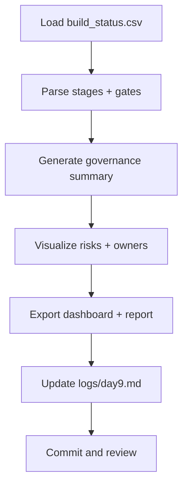

# ⚡ Day 9 — Governance-Aware Build Dashboard Agent

*(Automation + AI Oversight Lens)*

---

## 🎯 Purpose

Day 9 transforms your static **build flow (Day 8)** into a **live dashboard agent** that monitors engineering pipelines through a **governance lens**.

You’ll simulate how a single interface can surface:

* Build status, test coverage, and compliance gates.
* AI-generated insights on risk, bias, or missing reviews.
* Leadership-ready visuals linking **technical signals → policy accountability.**

---

## 📌 Objectives

* Create a **dashboard agent** that visualizes SDLC stages with live (or simulated) data.
* Integrate **governance checkpoints**: Policy → Ethics → Compliance.
* Generate summary insights (pass/fail, risk level, owner).
* Export a **governance-ready report** to the toolkit.

---

## 🛠 Agenda (≈ 45 min)

|   Time  | Task                                                     |
| :-----: | :------------------------------------------------------- |
|  0 – 10 | Set up folder + sample dataset (`build_status.csv`)      |
| 10 – 25 | Create dashboard spec (JSON + Mermaid + R/Python Plotly) |
| 25 – 40 | Generate risk summary + governance report                |
| 40 – 45 | Save + reflect + commit                                  |

---

## 🧩 Create Folders and Files

```bash
mkdir -p wk02/day09/dashboard
touch wk02/day09/dashboard_agent.md
touch wk02/day09/build_status.csv
```

---

## 🧠 Sample Dataset (`build_status.csv`)

```csv
Stage,Status,TestsPassed,PolicyGate,EthicsGate,ComplianceGate,Owner,LastUpdated
Plan,Complete,NA,Approved,NA,NA,Amy Chen,2025-10-14
Build,In Progress,85%,Pending,Pending,NA,DevOps Bot,2025-10-14
Test,Running,62%,NA,Reviewing,Pending,Luis Rivera,2025-10-14
Deploy,Pending,NA,Approved,Approved,Pending,Sarah Lee,2025-10-14
Monitor,Idle,NA,NA,NA,NA,System,2025-10-14
```

---

## 📊 Dashboard Spec (`dashboard_agent.md`)

````markdown
# ⚙️ Governance-Aware Build Dashboard Agent

This dashboard visualizes your SDLC flow with governance gates.

```mermaid
flowchart LR
  A[Plan] --> B[Build]
  B --> C[Test]
  C --> D[Deploy]
  D --> E[Monitor]
  E --> A[Iterate]

  %% Governance overlay
  A --> A1[Policy Gate]
  C --> C1[Ethics Review]
  D --> D1[Compliance Audit]
````

### 🧮 Example Logic (Pseudocode)

```python
import pandas as pd
df = pd.read_csv("build_status.csv")

def gov_summary(df):
  summary = []
  for _, r in df.iterrows():
    risk = "Low"
    if "Pending" in [r.PolicyGate, r.EthicsGate, r.ComplianceGate]:
      risk = "High"
    summary.append({
      "Stage": r.Stage,
      "Status": r.Status,
      "Risk": risk,
      "Owner": r.Owner
    })
  return pd.DataFrame(summary)

summary = gov_summary(df)
summary.to_csv("governance_summary.csv", index=False)
```

### 📊 Visualization Concept

* Plotly or R Shiny bar chart: Stages (x) vs Risk Level (y).
* Color code: 🟢 Low  🟠 Medium  🔴 High.
* Tooltip: Owner + Last Updated.
* Export as HTML (`build_governance_dashboard.html`).

````

---

## 📂 Deliverables
- `wk02/day09/dashboard_agent.md`  
- `wk02/day09/build_status.csv`  
- `governance_summary.csv` (derived)  
- `/logs/day9.md` — 3 bullets on decisions made  

Commit:
```bash
git add wk02/day09
git commit -m "feat(day9): governance-aware build dashboard agent + sample data"
````

---

## ✅ Rubric (Self-Check)

| Criterion                                             | Met? |
| :---------------------------------------------------- | :--: |
| Dashboard includes build → test → deploy stages       |  ☑️  |
| Governance gates (Policy, Ethics, Compliance) visible |  ☑️  |
| Risk summary table produced                           |  ☑️  |
| Visualization mock or code complete                   |  ☑️  |
| Reflection log added                                  |  ☑️  |

---

## 📝 Reflection Prompts (Day 9)

1. Which stage produces the highest governance risk today and why?
2. How can AI assist with automating these checks without reducing oversight?
3. What data points should leaders see in real-time to trust your pipeline?
4. Where can context packs from Week 1 be reused to enhance this dashboard?

---

## 🧭 Workflow (Mermaid)



---

## 💡 Tips

* Keep Mermaid labels ASCII-only to avoid GitHub render errors.
* Later, connect this agent to real CI/CD logs (Jenkins, GitHub Actions, Azure Pipelines).
* Add AI hooks: “Explain risk in plain English for executive brief.”
* Use outputs to power your **Week 3 Governance Board Dashboard**.

---

