# ⚡ Day 11 — Decision Memory System

*(From Report → Reflection → Responsible Action)*

---

## 🎯 Purpose

Day 11 introduces **decision intelligence and traceability.**
You’ll design a lightweight **Decision Memory System (DMS)** that links:

* **Executive reports** (Day 10)
* **Governance context** (Day 7)
* **Build data + risks** (Day 9)
  into one living record of **who decided what, when, and why.**

This system closes the feedback loop — ensuring that lessons, approvals, and rationale are stored for AI and human review.

---

## 📌 Objectives

* Create a **decision log schema** for leadership actions.
* Capture metadata: date, decision owner, rationale, risk rating, outcome.
* Integrate with governance artifacts (`Exec_AI_Report.md`, `constraints.md`).
* Generate a **summary prompt** that lets AI recall prior decisions responsibly.
* Visualize decisions as part of an evolving “governance graph.”

---

## 🛠 Agenda (≈ 45 min)

|   Time  | Task                                                 |
| :-----: | :--------------------------------------------------- |
|  0 – 10 | Create `decision_memory/` folder + CSV schema        |
| 10 – 25 | Log at least 3 real or simulated executive decisions |
| 25 – 35 | Build a retrieval prompt (AI recall instructions)    |
| 35 – 45 | Save + reflect + commit                              |

---

## 🧩 Setup

```bash
mkdir -p wk02/day11/decision_memory
touch wk02/day11/decision_memory/decision_log.csv
touch wk02/day11/decision_memory/decision_memory_prompt.md
```

---

## 📄 Sample `decision_log.csv`

```csv
DecisionID,Date,Owner,DecisionSummary,Rationale,LinkedReport,RiskRating,Outcome,FollowUp
D-001,2025-10-14,Amy Chen,Postpone Deploy until Compliance Gate clears,Align with EU AI Act audit findings,Exec_AI_Report_v1.md,Medium,Approved,Re-assess on Oct 18
D-002,2025-10-14,Luis Rivera,Automate Bias Scan in CI/CD,Reduce manual load + improve detection rates,Exec_AI_Report_v1.md,High,In Progress,Add test logs next sprint
D-003,2025-10-15,Sarah Lee,Launch pilot in controlled environment,Minimize production exposure,Exec_AI_Report_v1.md,Low,Approved,Expand after 14-day monitor
```

---

## 💬 `decision_memory_prompt.md`

```text
Role: Decision Intelligence Copilot.

Context: You are reviewing leadership decisions from the current governance cycle.

Tasks:
1) Load decision_log.csv.
2) Summarize patterns in decision-making (risk level, delay frequency, rationale themes).
3) Highlight recurring governance concerns (policy, ethics, compliance).
4) Produce sections:
   - Decision Summary Table
   - Risk Heatmap Description
   - Reflection Insights (what’s improving / regressing)
   - Recommendations for next governance cycle
5) Maintain tone: analytical, concise, leadership-ready.
6) Never override facts; reference DecisionID and Date for traceability.
```

---

## 📊 Example Output Skeleton

```markdown
# 🧠 Decision Memory Report — October 2025

## Overview
3 logged decisions — 2 approved, 1 in progress.  
Main theme: compliance-first mindset delaying deployments strategically.

## Decision Summary Table
| DecisionID | Owner | Risk | Status | Key Rationale |
|:--|:--|:--|:--|:--|
| D-001 | Amy Chen | Medium | Approved | Aligns with EU audit findings |
| D-002 | Luis Rivera | High | In Progress | Automate bias mitigation |
| D-003 | Sarah Lee | Low | Approved | Controlled rollout for safety |

## Risk Heatmap
- **High Risk (33%)**: Bias scan automation pending verification.  
- **Medium Risk (33%)**: Compliance gate delay.  
- **Low Risk (33%)**: Pilot approved and under monitoring.

## Reflection Insights
- Leadership shows consistent ethical restraint.  
- Decision logs reveal stronger documentation discipline.  
- AI-supported summaries accelerating follow-up alignment.

## Recommendations
1. Add automated tagging for ethics vs compliance rationale.  
2. Schedule decision retros every 2 sprints.  
3. Feed decision data into Week 3 *Governance Board Dashboard.*
```

---

## 📂 Deliverables

* `wk02/day11/decision_memory/decision_log.csv`
* `wk02/day11/decision_memory/decision_memory_prompt.md`
* `wk02/day11/decision_memory/decision_memory_report.md` (generated output)
* `/logs/day11.md` (reflection log)

Commit:

```bash
git add wk02/day11
git commit -m "feat(day11): decision memory system + governance intelligence prompt"
```

---

## ✅ Rubric (Self-Check)

| Criterion                         | Met? |
| :-------------------------------- | :--: |
| CSV log created with ≥3 decisions |  ☑️  |
| Report generated from actual data |  ☑️  |
| Risk + rationale included         |  ☑️  |
| AI prompt enforces traceability   |  ☑️  |
| Reflection log complete           |  ☑️  |

---

## 📝 Reflection Prompts (Day 11)

1. Which decision carried the highest unseen risk?
2. Did AI capture the *why* behind the *what* accurately?
3. How might this system prevent blame and improve transparency?
4. What metadata would strengthen long-term traceability?
5. How would you visualize decision impact over multiple quarters?

---

## 🧭 Workflow (Mermaid)

```mermaid
flowchart TB
  A[Record executive decisions → decision_log.csv] --> B[Run Decision Memory Prompt]
  B --> C[Generate Decision Memory Report]
  C --> D[Reflect + Update Logs]
  D --> E[Commit and Push]
```



---

## 💡 Tips

* Treat decision memory as your **AI ethics black box recorder.**
* Consider adding a field for **confidence or evidence rating** in future iterations.
* Integrate this log with the Day 9 dashboard to show “decision latency” (time from risk to action).
* Keep reports versioned — DMS becomes your living governance history.

---

✅ **Day 11** transforms your AI system into a *governance historian.*
You’ve now closed the loop:
**Data → Report → Decision → Memory.**

Next, **Day 12** will focus on *predictive governance* — teaching the AI to anticipate risk before it happens using the historical patterns you just captured.


