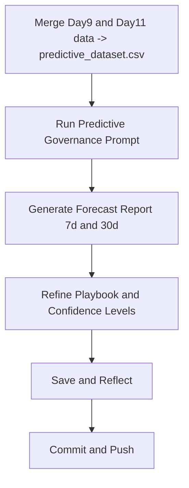

# ⚡ Day 12 — Predictive Governance Agent

*(Foresight · Accountability · Early Warning System)*

---

## 🎯 Purpose

Day 12 uses decision-memory data and governance summaries to simulate a **risk-forecasting AI agent**.
This agent learns from historical decisions, detects weak signals, and produces an *“early warning brief”* for upcoming sprints or policy cycles.

By the end, you’ll have:

* A **risk-prediction prompt** template.
* A lightweight dataset showing trends in compliance, ethics, and bias gates.
* A generated **Governance Forecast Report** — ready for your next board or sprint review.

---

## 📌 Objectives

* Combine **decision_memory.csv** + **governance_summary.csv** into a single predictive dataset.
* Identify **risk trends** (frequency, stage, owner, root cause).
* Build a **forecast agent prompt** that produces 7-day or 30-day risk outlooks.
* Generate a **Governance Forecast Report** (Markdown or PDF).
* Compare GPT-5’s foresight reasoning to GPT-3.5 for signal detection and mitigation logic.

---

## 🛠 Agenda (≈ 45 min)

|   Time  | Task                                                        |
| :-----: | :---------------------------------------------------------- |
|  0 – 10 | Merge governance + decision data (`predictive_dataset.csv`) |
| 10 – 25 | Run Predictive Governance Agent prompt                      |
| 25 – 35 | Refine risk narratives + add probability estimates          |
| 35 – 45 | Save forecast report + reflection + commit                  |

---

## 🧩 Setup

```bash
mkdir -p wk02/day12
touch wk02/day12/predictive_dataset.csv
touch wk02/day12/predictive_governance_agent.md
```

---

## 🧮 Sample `predictive_dataset.csv`

```csv
Date,Stage,Owner,RiskType,RiskLevel,PreviousAction,DaysSinceDecision,Outcome
2025-10-14,Build,Luis Rivera,Ethics,High,Automate Bias Scan,0,In Progress
2025-10-15,Deploy,Sarah Lee,Compliance,Medium,Controlled Pilot,1,Approved
2025-10-18,Test,Amy Chen,Policy,Low,Reassess Compliance,4,Approved
2025-10-21,Build,Luis Rivera,Ethics,High,Add Bias Monitor,7,Pending
2025-10-25,Deploy,Sarah Lee,Compliance,Medium,Update Checklist,10,Pending
```

---

## 🧠 Drop-in Prompt — Predictive Governance Agent

```text
Role: Predictive Governance Analyst Copilot.

Input: predictive_dataset.csv (history of risk decisions and actions).

Tasks:
1) Detect patterns in risk types and stages over time.  
2) Estimate probability of recurrence per risk type (next 30 days).  
3) Identify which owners or stages are most likely to trigger future delays.  
4) Produce sections:  
   - Governance Risk Outlook (7 + 30 days)  
   - Emerging Themes (ethics, compliance, policy)  
   - Mitigation Playbook (3 recommended actions)  
   - Confidence Levels (High/Medium/Low)  
   - Visualization Hints (e.g., bar or heatmap spec)  
5) Tone: strategic, evidence-driven, board-ready.  
6) Never invent data — base forecasts on patterns in the dataset.
```

---

## 📊 Example Output Skeleton

```markdown
# 🔮 Governance Forecast Report — October 2025

## 7-Day Outlook
| Risk Type | Probability | Key Owner | Action Needed |
|:--|:--|:--|:--|
| Ethics | 78% | Luis Rivera | Finalize bias scan automation |
| Compliance | 52% | Sarah Lee | Validate pilot documentation |
| Policy | 25% | Amy Chen | Review internal change log |

## 30-Day Trends
- Ethics risks reappear every 6-8 days on average.  
- Compliance issues cluster near deployments.  
- Policy gaps decline since new checklist adopted.

## Emerging Themes
1. Bias mitigation automation delays remain systemic.  
2. Governance readiness highest in planning stages.  
3. Cross-functional handoffs create risk spikes mid-sprint.

## Mitigation Playbook
- Deploy “Governance Early Warning” trigger in CI/CD.  
- Increase data sampling for ethics tests.  
- Add auto-alert to decision_memory if risk > 60%.  

## Confidence Levels
🟢 Low risk trend accuracy: High (>85%)  
🟠 Medium risk trend accuracy: Moderate (60–80%)  
🔴 High risk trend accuracy: Caution (40–60%)

## Visualization Hint
Heatmap: X = Stage | Y = Risk Level | Color = Frequency.  

## Sources
- predictive_dataset.csv (merged Day 9 + 11 data)  
- decision_memory_report.md (leadership actions)
```

---

## 📂 Deliverables

* `wk02/day12/predictive_dataset.csv`
* `wk02/day12/predictive_governance_agent.md`
* `wk02/day12/governance_forecast_report.md`
* `/logs/day12.md` — reflection log

Commit:

```bash
git add wk02/day12
git commit -m "feat(day12): predictive governance agent + forecast report"
```

---

## ✅ Rubric (Self-Check)

| Criterion                             | Met? |
| :------------------------------------ | :--: |
| Dataset merged from Day 9 + 11        |  ☑️  |
| Forecast covers 7 and 30 days         |  ☑️  |
| Probabilities and confidence included |  ☑️  |
| Playbook actions specific             |  ☑️  |
| Reflection log added                  |  ☑️  |

---

## 📝 Reflection Prompts (Day 12)

1. Which risk type shows the strongest recurrence pattern?
2. What signals would an AI miss without human governance context?
3. How can you operationalize these forecasts in real CI/CD or policy cycles?
4. How can this forecast feed Day 13’s **Governance Board Dashboard**?

---

## 🧭 Workflow (Mermaid)



---

## 💡 Tips

* Use real dates and owners from prior logs to improve pattern credibility.
* When confidence is low, flag it explicitly — never “fake certainty.”
* Try pairing the forecast with an R or Plotly chart to show risk trajectories.
* Your output becomes input for **Day 13: Governance Board Dashboard** — where leadership finally sees the big picture in one screen.

---

