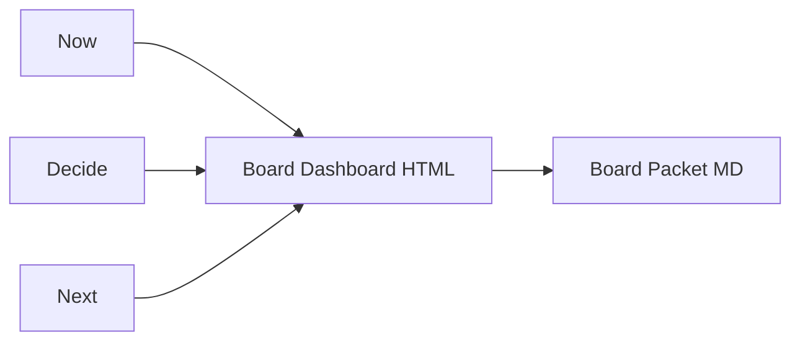

# 🏛️ Day 13 — Governance Board Dashboard

*(Single Pane of Truth for Leadership)*

## 🎯 Purpose

Turn your pipeline signals (Day 9), executive report (Day 10), and forecast (Day 12) into a **board-grade dashboard** that shows:

* Current SDLC health and gate status
* Executive insights and actions due
* Predictive risk outlook (7d / 30d)
* Traceable links to decisions (Day 11)

---

## 📌 Objectives

* Compose a **single-pane dashboard** that merges status, insights, and forecast.
* Add **governance heatmaps** and **owner accountability**.
* Export a **shareable HTML** and a compact **Board Packet** (Markdown).
* Keep strict traceability to logs, constraints, and sources.

---

## 🛠 Agenda (≈ 45–60 min)

|  Time | Task                                           |
| :---: | :--------------------------------------------- |
|  0–10 | Create files + copy inputs (Day 9, 10, 11, 12) |
| 10–25 | Define dashboard layout + data bindings        |
| 25–45 | Build charts + compile board packet            |
| 45–60 | Export HTML + write reflection + commit        |

---

## 🧩 Setup

```bash
mkdir -p wk02/day13
cp wk02/day09/build_status.csv wk02/day13/
cp wk02/day10/executive_ai_report_agent.md wk02/day13/
cp wk02/day11/decision_memory/decision_log.csv wk02/day13/
cp wk02/day12/predictive_dataset.csv wk02/day13/
touch wk02/day13/board_dashboard_spec.md
touch wk02/day13/board_dashboard_packet.md
```

---

## 📊 Dashboard Spec (drop-in) — `board_dashboard_spec.md`

```markdown
# Governance Board Dashboard — Spec

## Goal
Provide one screen that answers:
- Where are we now?
- Where are the risks?
- What did we decide?
- What will likely happen next?

## Data Inputs
- build_status.csv         (Day 9)
- decision_log.csv         (Day 11)
- predictive_dataset.csv   (Day 12)
- executive_ai_report_agent.md (Day 10 narrative)

## Layout (three zones)
1) **Now** — SDLC stage status + gates (Policy, Ethics, Compliance)
2) **Decide** — Executive insights + actions due + owners
3) **Next** — Predictive risk outlook (7d / 30d) + mitigation playbook

## Visuals
- Status Bar: Stage vs Status (low/med/high risk colors)
- Governance Heatmap: Stage x RiskType colored by frequency
- Actions Table: Owner | Action | Due | Blocker
- Outlook Cards: Ethics / Compliance / Policy with next-30-day probability

## Export
- HTML dashboard (board_dashboard.html)
- Board Packet (board_dashboard_packet.md)

## Governance
- Link to constraints.md (Day 7)
- Decision trace: link each action to DecisionID in decision_log.csv
- Evidence box: list data files and timestamps
```

---

## 🧪 Sample Transform Logic (pseudocode)

```python
# Inputs: build_status.csv, decision_log.csv, predictive_dataset.csv
# Outputs: aggregated tables for visuals

# 1) Current status and gates
# - Map Pending/Reviewing/Pending -> risk level
# - Create stage_status table with Owner and LastUpdated

# 2) Governance heatmap
# - From predictive_dataset.csv: count RiskType by Stage
# - Normalize counts to frequency bands (Low/Med/High)

# 3) Actions due (Decision trace)
# - Load decision_log.csv
# - For Outcome In Progress or Approved with FollowUp date → Actions table

# 4) Outlook cards
# - From predictive_dataset.csv trends → Ethics / Compliance / Policy probabilities
```

---

## 🖼️ Wire Diagram (Mermaid)

> ASCII-only labels; each edge on its own line for GitHub safety.



---

## 🗂 Board Packet Template — `board_dashboard_packet.md`

```markdown
# 🏛️ Governance Board Packet — Week 42

## 1) Pipeline Summary (Now)
- Build: In Progress, Ethics Gate Pending
- Test: Running, Compliance Review Pending
- Deploy: Scheduled, Policy Gate Approved

## 2) Actions Due (Decide)
| DecisionID | Owner | Action | Due | Status |
|:--|:--|:--|:--|:--|
| D-002 | Luis Rivera | Automate bias scan in CI CD | Oct 18 | In Progress |
| D-003 | Sarah Lee | Compliance sign off for pilot | Oct 19 | Pending |

## 3) Risk Outlook (Next)
- Ethics: 75 percent probability in next 7 days
- Compliance: 55 percent probability in next 30 days
- Policy: 20 percent probability in next 30 days

## 4) Executive Insights
- Ethics automation is the main blocker to cycle time
- Compliance sign-off clusters near deployments
- Decision discipline improving; logs complete for last two sprints

## 5) Recommendations
1. Add CI trigger for bias checks before Test stage begins
2. Create compliance preflight checklist in Deploy stage
3. Expand Decision Memory tags for rationale themes

## 6) Evidence and Traceability
- build_status.csv (timestamp)
- decision_log.csv (entries D-001 to D-003)
- predictive_dataset.csv (merged Day 9 and Day 11)
- executive_ai_report_agent.md (summary text)
- constraints.md (Day 7 context pack)
```

---

## 📂 Deliverables

* `wk02/day13/board_dashboard_spec.md`
* `wk02/day13/board_dashboard_packet.md`
* `wk02/day13/*.csv` (copied)
* Exported `board_dashboard.html` (when you render)
* `/logs/day13.md` — reflection (3 bullets)

Commit:

```bash
git add wk02/day13
git commit -m "feat(day13): governance board dashboard spec + packet + inputs"
```

---

## ✅ Rubric (Self-Check)

| Criterion                                    | Met? |
| :------------------------------------------- | :--: |
| Single screen covers Now, Decide, Next       |  ☑️  |
| Governance heatmap and actions table defined |  ☑️  |
| Decision trace links to DecisionID           |  ☑️  |
| Board Packet provides executive sections     |  ☑️  |
| Evidence box enumerates data sources         |  ☑️  |

---

## 📝 Reflection Prompts (Day 13)

1. Does the dashboard make the **next action** obvious to leadership?
2. Which visual cue reduces **time-to-decision** the most?
3. Are any **governance gates** still invisible or ambiguous?
4. What would you automate next (alerts, status emails, PDF packet build)?

---

## 💡 Tips

* Keep labels terse and executive-friendly; detail lives in the Packet.
* Use the **Decision Memory System** to populate the Actions table automatically.
* If you add auto-export, version the HTML/Packet with dates (`YYYY-MM-DD`).
* For live data, wire to your CI/CD provider logs or a small ETL script; your spec already anticipates it.

---

**Day 13** gives leaders their **single source of truth**.
Next, **Day 14** will handle **stakeholder communications**—automated weekly updates tailored to Engineering, Legal, and the Board.

