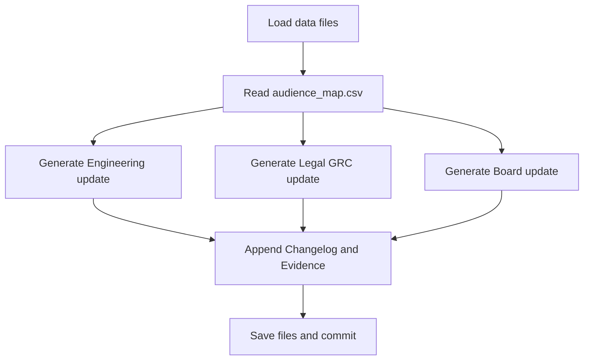

# 📣 Day 14 — Stakeholder Comms Agent

*(Engineering · Legal/GRC · Board — tailored from one source of truth)*

## 🎯 Purpose

Convert Week 2’s outputs (Days 9–13) into **audience-specific updates** on a schedule.
Ship clear, trustworthy messages that:

* Pull from the **same data & governance evidence**,
* Adapt tone, depth, and next-step clarity by audience,
* Are **ready to send** (email/Slack/memo) with versioned artifacts.

---

## 📌 Objectives

* Define **stakeholder profiles** (channel, tone, must-know fields).
* Create a **Comms Agent** prompt that emits 3 variants (Engineering, Legal/GRC, Board).
* Wire inputs from existing files: `build_status.csv`, `decision_log.csv`, `predictive_dataset.csv`, `board_dashboard_packet.md`.
* Produce **ready-to-send** drafts + a compact **Changelog & Evidence** footer.

---

## 🛠 Agenda (≈ 45–60 min)

|  Time | Task                                                     |
| :---: | :------------------------------------------------------- |
|  0–10 | Create folder + audience map                             |
| 10–25 | Draft Comms Agent prompt + run with this week’s data     |
| 25–45 | Review tone, add evidence links, finalize three variants |
| 45–60 | Save + reflect + commit                                  |

---

## 🧩 Setup

```bash
mkdir -p wk02/day14
cp wk02/day09/build_status.csv wk02/day14/
cp wk02/day11/decision_memory/decision_log.csv wk02/day14/
cp wk02/day12/predictive_dataset.csv wk02/day14/
cp wk02/day13/board_dashboard_packet.md wk02/day14/
touch wk02/day14/audience_map.csv
touch wk02/day14/comms_agent_prompt.md
touch wk02/day14/engineering_update.md
touch wk02/day14/legal_grc_update.md
touch wk02/day14/board_update.md
```

---

## 👥 Audience Map (drop-in) — `audience_map.csv`

```csv
Audience,Channel,Tone,Length,MustKnow,CTA
Engineering,Slack,Concise-technical,120-180,"Stage status, blockers, owners, due dates","Confirm fixes and dates"
Legal-GRC,Email,Formal-compliance,150-220,"Gates status, policy/ethics findings, audit steps","Acknowledge reviews and provide sign-offs"
Board,PDF-or-Email,Executive-brief,120-180,"Outcomes, risks, forecast, decisions due","Approve plan or request clarifications"
```

---

## 🧠 Comms Agent Prompt — `comms_agent_prompt.md`

```text
Role: Stakeholder Communications Agent.

Inputs:
- build_status.csv (stage + gates + owners)
- decision_log.csv (DecisionID, owner, rationale, follow-up)
- predictive_dataset.csv (risk trends 7d/30d)
- board_dashboard_packet.md (executive narrative)
- audience_map.csv (channel, tone, length, must-know, CTA)

Tasks:
1) Produce THREE audience-specific updates: Engineering (Slack), Legal/GRC (Email), Board (Executive Brief).
2) Keep each update within the audience length range and tone.
3) Include: Current status, Top 2 risks, Actions due (owner + date), and specific CTA.
4) Append a compact "Changelog & Evidence" footer with file names + timestamps.
5) Do not invent data; if unknown, state "Pending" and reference the source file.
6) Ensure language is respectful, direct, and free of jargon for the Board variant.

Output:
- engineering_update.md (Slack-ready)
- legal_grc_update.md (Email-ready)
- board_update.md (Executive-ready)
```

---

## ✉️ Output Skeletons

### `engineering_update.md` (Slack-ready)

```markdown
# Engineering Update — Week 42

**Now**
- Build: In Progress — Ethics gate pending (Owner: Luis, due Oct 18)
- Test: Running — Compliance review pending (Owner: Sarah)

**Top Risks**
1) Bias scanner not integrated into CI/CD (blocks Test)  
2) Compliance checklist incomplete for Deploy

**Actions Due**
- Luis → Complete bias integration by Oct 18
- Sarah → Compliance sign-off by Oct 19

**CTA**
Please confirm dates or propose new owners within this thread.

_Changelog & Evidence: build_status.csv (2025-10-14), decision_log.csv (D-001–D-003), predictive_dataset.csv; see board_dashboard_packet.md_
```

### `legal_grc_update.md` (Email-ready)

```markdown
Subject: Weekly Governance Update — Gates & Actions (Week 42)

Hello team,

**Gate Status**
- Ethics: Pending at Build; remediation in progress
- Compliance: Pending at Test and Deploy
- Policy: Approved at Plan

**Risks & Mitigations**
- Ethics risk likely in next 7 days; action: CI bias scan integration
- Compliance clustering near Deploy; action: preflight checklist

**Actions & Owners**
- Luis: finalize ethics integration by Oct 18
- Sarah: compliance sign-off by Oct 19

**Request**
Please acknowledge gate ownership and confirm the review schedule for this week.

Regards,  
Comms Agent

Changelog & Evidence — build_status.csv (2025-10-14); decision_log.csv (D-001–D-003); predictive_dataset.csv; board_dashboard_packet.md
```

### `board_update.md` (Executive-ready)

```markdown
# Board Brief — Week 42 (Governance + Delivery)

**Status**: Build and Test active; Deploy scheduled.  
**Gates**: Ethics pending (Build); Compliance pending (Test/Deploy).  
**Outlook**: 7-day Ethics risk 70–80%; 30-day Compliance risk ~55%.

**Decisions/Actions Due**
- Approve CI bias check at Build entry (reduces Test delays)
- Confirm compliance preflight for Deploy
- Track DecisionIDs D-002, D-003 to close next sprint

**Risks & Recommendations**
- Time-to-deploy risk if Ethics integration slips → add CI trigger  
- Compliance documentation standardize before pilot → avoid rollback

**Ask**
Approve the mitigation plan or request alternatives for next sprint.

_Evidence: build_status.csv; decision_log.csv; predictive_dataset.csv; board_dashboard_packet.md_
```

---

## 📂 Deliverables

* `wk02/day14/audience_map.csv`
* `wk02/day14/comms_agent_prompt.md`
* `wk02/day14/engineering_update.md`
* `wk02/day14/legal_grc_update.md`
* `wk02/day14/board_update.md`
* `/logs/day14.md` — reflection (3 bullets)

Commit:

```bash
git add wk02/day14
git commit -m "feat(day14): stakeholder comms agent + audience-specific updates"
```

---

## ✅ Rubric (Self-Check)

| Criterion                                        | Met? |
| :----------------------------------------------- | :--: |
| Three variants generated (Eng, Legal/GRC, Board) |  ☑️  |
| Tone/length matches audience map                 |  ☑️  |
| Actions include owner + date + CTA               |  ☑️  |
| Evidence footer lists exact files                |  ☑️  |
| No invented data; unknowns labeled Pending       |  ☑️  |

---

## 📝 Reflection Prompts (Day 14)

1. Which variant most reduced back-and-forth for its audience?
2. What evidence or link would build **more trust** for Legal/GRC or the Board?
3. Where can you automate distribution (Slack webhook, email digest, PDF export)?
4. What “red flag” rule should trigger an **instant alert** instead of waiting for weekly updates?

---

## 🧭 Workflow (Mermaid)



---

## 💡 Tips

* Keep **ASCII-only** labels in Mermaid to avoid GitHub parsing errors.
* If any gate is **red**, open with that for Legal/GRC and Board; engineers can take granular items first.
* Snap a PNG of your **Day 13 dashboard** and attach to the Board update.
* Consider scheduling these with a cron or GitHub Action once templates stabilize.

---

