# ⚙️ Day 15 — Policy-Aware Runbook Agent

*(Auto-response playbooks for Ethics, Compliance, and Policy events)*

## 🎯 Purpose

Transform your static dashboards and stakeholder comms into **living policy runbooks** that trigger the right sequence of actions when governance thresholds are crossed.

You’re not just observing — you’re **orchestrating compliant, ethical recovery** automatically.

---

## 📌 Objectives

* Detect when a **governance gate** (Ethics / Compliance / Policy) turns 🟥 red.
* Auto-generate an **incident-specific runbook** with owners, timelines, and evidence.
* Link the runbook to your **Decision Memory** and **Board Dashboard**.
* Produce ready-to-send updates for Engineering, Legal/GRC, and the Board.

---

## 🛠 Agenda (≈ 60 min)

|  Time | Task                                                  |
| :---: | :---------------------------------------------------- |
|  0–10 | Define trigger conditions (red gates / risk ≥ 70%)    |
| 10–25 | Write Runbook Agent prompt                            |
| 25–40 | Generate sample runbooks (Ethics, Compliance, Policy) |
| 40–55 | Link to Day 13–14 data and Decision Memory            |
| 55–60 | Save + commit + reflect                               |

---

## 🧩 Setup

```bash
mkdir -p wk02/day15
cp wk02/day13/board_dashboard_packet.md wk02/day15/
cp wk02/day11/decision_memory/decision_log.csv wk02/day15/
cp wk02/day12/predictive_dataset.csv wk02/day15/
touch wk02/day15/runbook_agent_prompt.md
touch wk02/day15/ethics_runbook.md
touch wk02/day15/compliance_runbook.md
touch wk02/day15/policy_runbook.md
```

---

## 🧠 Runbook Agent Prompt — `runbook_agent_prompt.md`

```text
Role: Policy-Aware Runbook Agent

Inputs:
- predictive_dataset.csv → current risk levels by gate
- decision_log.csv → owner, follow-up date, decision status
- board_dashboard_packet.md → context and recommendations

Rules:
1. If RiskLevel ≥ 70 for any gate (Ethics, Compliance, Policy), generate a Runbook.  
2. Each Runbook includes:
   - Incident Header (ID, Gate, Trigger Date)  
   - Summary (what happened + data point)  
   - Immediate Actions (3–5 items with owners + due dates)  
   - Governance Context (citations to policies / laws)  
   - Communications Plan (who is notified + how)  
   - Audit Evidence (files + timestamps)  
3. Generate three versions (Ethics / Compliance / Policy) if applicable.  
4. Output in Markdown for insertion into Git or Docs.  
5. If no red gate, output “System nominal — no runbook required.” 
```

---

## 📋 Example Output — `ethics_runbook.md`

```markdown
# 🟥 Ethics Runbook — Incident ER-2025-1014  
**Trigger:** Bias Detection Failure in Model CI/CD (78 %)   
**Date:** Oct 14 2025  

## Summary
Automated scan flagged potential bias in loan-eligibility model (>5 % variance by region).  
Gate = Ethics; threshold = 70 %; actual = 78 %.  

## Immediate Actions
| Owner | Action | Due |
|:--|:--|:--:|
| Luis Rivera | Pause deployment branch | Oct 15 |
| Sarah Lee | Re-run bias mitigation pipeline | Oct 16 |
| Priya Chen | Update Model Card + Ethics Report | Oct 17 |

## Governance Context
- Policy Ref: AI Ethics Standard 3.2 (Non-Discrimination)  
- Legal Basis: EU AI Act Article 10(5)  
- Org Control: DecisionID D-002  

## Communications Plan
Notify: Engineering, Legal/GRC, Board.  
Channel: Slack + Email.  
Escalation to Chief Ethics Officer if >80 % risk or repeat within 7 days.  

## Audit Evidence
- predictive_dataset.csv (timestamp 2025-10-14)  
- decision_log.csv (D-002)  
- board_dashboard_packet.md (section 3.2)  
```

---

## 🧭 Workflow Diagram (ASCII-safe)

```mermaid
flowchart LR
  A[Monitor Predictive Dataset] --> B{Gate ≥ 70% Risk?}  
  B -- Yes --> C[Generate Runbook]  
  C --> D[Notify Stakeholders]  
  D --> E[Update Decision Memory]  
  E --> F[Commit Runbook to Repo]  
  B -- No --> G[System Nominal]
```



---

## 📂 Deliverables

* `wk02/day15/runbook_agent_prompt.md`
* `wk02/day15/ethics_runbook.md` / `compliance_runbook.md` / `policy_runbook.md`
* Updated Decision Memory (log link added)
* `/logs/day15.md` (3-bullet reflection)

Commit:

```bash
git add wk02/day15  
git commit -m "feat(day15): policy-aware runbook agent + sample incidents"
```

---

## ✅ Rubric (Self-Check)

| Criterion                                  | Met? |
| :----------------------------------------- | :--: |
| Runbooks generated for ≥ 1 red gate        |  ☑️  |
| Includes owners, due dates, citations      |  ☑️  |
| Governance context mapped to Decision IDs  |  ☑️  |
| Communications plan defined                |  ☑️  |
| Linked back to Dashboard & Decision Memory |  ☑️  |

---

## 📝 Reflection Prompts (Day 15)

1. Which gate is most likely to fail first, and why?
2. What threshold should trigger human review vs auto runbook?
3. Where can you auto-archive these runbooks for auditors (Git, S3, SharePoint)?
4. How could you expand to sector-specific policies (health, finance, education)?

---

## 💡 Tips

* If you use JSON risk streams, wrap in a Python watcher to trigger Day 15 prompt automatically.
* Add “Compliance Clock”: auto-remind owners 72 h before deadline.
* Use metadata tags (e.g., `incident_type=ethics`, `severity=high`) for searchability.
* Keep all runbooks under DACR-licensed repo for audit consistency.

---

