# 📊 Day 15 — Vibe Coding: *Google Colab Data Agent Scaffold*

Spin up a **Colab notebook** that acts like a *data agent*: it ingests, cleans, visualizes, and exports — all in ≤30 minutes.

⏱ **Target Time:** ≤ 30 minutes

---

## 🌟 Objective

Build a **Google Colab** notebook that:

* Loads a CSV (from URL or local upload)
* Cleans & standardizes the data
* Creates one quick chart (auto-fallback if columns don’t match)
* Exports a cleaned CSV + PNG chart (drop them into your repo for Week 3)

---

## 🛠 Steps

### 1️⃣ Create the Notebook

1. Go to [Google Colab](https://colab.research.google.com)
2. **New Notebook** → rename:
   `W3D15_Data_Agent_Starter.ipynb`

---

### 2️⃣ Cell 1 — Load Data

```python
# ==== Day 15: Data Agent Starter (Colab) ====
import pandas as pd
import matplotlib.pyplot as plt

# ---- Option A: Public dataset (restaurant tips) ----
DATA_URL = "https://raw.githubusercontent.com/mwaskom/seaborn-data/master/tips.csv"

# ---- Option B: Upload your own ----
# DATA_URL = None

if DATA_URL:
    df = pd.read_csv(DATA_URL)
else:
    from google.colab import files
    import io
    uploaded = files.upload()
    fname = next(iter(uploaded))
    df = pd.read_csv(io.BytesIO(uploaded[fname]))

print("Rows, Columns:", df.shape)
display(df.head())
display(df.info())
```

---

### 3️⃣ Cell 2 — Clean & Standardize

```python
# ---- Basic cleaning ----

# Normalize column names
df.columns = (
    df.columns
      .str.strip()
      .str.replace(r"[^0-9a-zA-Z]+", "_", regex=True)
      .str.lower()
      .str.strip("_")
)

# Drop duplicates
before = len(df)
df = df.drop_duplicates()
after = len(df)

# Fill numeric NaNs with median
num_cols = df.select_dtypes(include="number").columns
df[num_cols] = df[num_cols].fillna(df[num_cols].median(numeric_only=True))

print(f"Deduped {before - after} rows. Nulls remaining:\n", df.isna().sum())
display(df.head())
```

---

### 4️⃣ Cell 3 — Derive Metric & Visualize

```python
# ---- Metric + Chart ----

if "total_bill" in df.columns and "tip" in df.columns:
    df["tip_percent"] = (df["tip"] / df["total_bill"]) * 100
    summary = df.groupby("day")["tip_percent"].mean().reset_index().sort_values("tip_percent", ascending=False)

    print("Average tip % by day:")
    display(summary)

    plt.figure()
    plt.bar(summary["day"].astype(str), summary["tip_percent"])
    plt.title("Average Tip % by Day")
    plt.xlabel("Day")
    plt.ylabel("Tip %")
    plt.tight_layout()
    plt.savefig("W3D15_tip_by_day.png", dpi=150)
    plt.show()
else:
    # Generic fallback: bar chart of first categorical column
    cat_cols = df.select_dtypes(include="object").columns.tolist()
    if cat_cols:
        col = cat_cols[0]
        counts = df[col].value_counts().sort_values(ascending=False)
        print(f"Counts for '{col}':")
        display(counts)

        counts.plot(kind="bar", title=f"Counts by {col}")
        plt.tight_layout()
        plt.savefig("W3D15_counts.png", dpi=150)
        plt.show()
```

---

### 5️⃣ Cell 4 — Export Files

```python
# ---- Export cleaned CSV + chart(s) ----
out_csv = "W3D15_clean.csv"
df.to_csv(out_csv, index=False)

try:
    from google.colab import files
    files.download(out_csv)
    import os
    for f in ["W3D15_tip_by_day.png", "W3D15_counts.png"]:
        if os.path.exists(f):
            files.download(f)
except Exception as e:
    print("Download hint:", e)
    print("If downloads are blocked, use File > Download or mount Drive below.")

# Optional: Save to Drive
# from google.colab import drive
# drive.mount('/content/drive')
# !cp W3D15_clean.csv /content/drive/MyDrive/
```

---

## 🔗 Pipeline Diagram

```mermaid
%%{ init: { "theme": "dark" } }%%
flowchart LR
  CSV["CSV (URL/Upload)"] --> CLEAN["🔧 Clean & Standardize"]
  CLEAN --> VIZ["📊 Chart"]
  VIZ --> PNG["🖼 PNG Export"]
  CLEAN --> OUT["📂 Cleaned CSV"]
```



---

## 📂 Deliverables

* `W3D15_Data_Agent_Starter.ipynb` (download as `.ipynb`)
* `W3D15_clean.csv`
* `W3D15_tip_by_day.png` *(or fallback `W3D15_counts.png`)*
* `Day15_notes.md` including:

  * Dataset used (URL or filename)
  * 2–3 insights from the chart
  * One idea for weekly use of this pipeline

---

## 🎯 Role Relevance

* **Data Pros:** instant EDA scaffold for CSVs
* **Entrepreneurs:** KPI snapshots from exports (sales/ops)
* **Analysts:** quick weekly chart for briefings
* **MBA / PMPs:** evidence visuals for decks
* **Veterans in Transition:** mission-style pipeline — *ingest → clean → visualize → brief*

---

✨ This Day is about **scaffolding**: build once, reuse weekly. Next Days will layer on automation + APIs.


