# 📊 Day 16 — Vibe Coding: *Kaggle Dataset Access + Robust Cleaning*

Spin up a **Colab-powered cleaning pipeline** for a Kaggle dataset.
Learn how to **ingest → audit → clean → export** in a way that’s *repeatable, documented, and portfolio-worthy*.

⏱ **Target Time:** ≤ 30 minutes

---

## ✅ Prereqs

* Free **Kaggle** account → [kaggle.com](https://www.kaggle.com)
* One dataset (≤ 50 MB, CSV-based) downloaded locally

---

## 🌟 Objective

Create a **Google Colab notebook** that:

* Loads a Kaggle CSV
* Audits + profiles the dataset
* Runs a **robust cleaning pass** (types, nulls, dedupe, outliers)
* Exports:

  * `W3D16_clean.csv` — Cleaned data
  * `W3D16_profile.md` — Profile summary
  * `W3D16_Kaggle_Cleaning.ipynb` — Notebook

---

## 🛠 Steps

### 1️⃣ Pick Your Dataset

* Go to Kaggle, search for something aligned to your goals (sales, healthcare, HR, finance, cybersecurity).
* Download → unzip → choose one CSV.
* Keep it small (≤ 50 MB) for speed.

---

### 2️⃣ Create Your Notebook

* Open [Colab](https://colab.research.google.com)
* **New Notebook** → rename: `W3D16_Kaggle_Cleaning.ipynb`

---

### 3️⃣ Cell 1 — Load Data

```python
# ==== Day 16: Kaggle Cleaning Pipeline (Colab) ====
import pandas as pd, numpy as np, io
from google.colab import files, data_table

print("Upload your Kaggle CSV:")
uploaded = files.upload()
fname = next(iter(uploaded))
df = pd.read_csv(io.BytesIO(uploaded[fname]))

print("Loaded:", fname, "| Shape:", df.shape)
data_table.enable_dataframe_formatter()
df.head()
```

---

### 4️⃣ Cell 2 — Audit & Standardize

```python
# ---- Normalize column names ----
df.columns = (
    df.columns
      .str.strip()
      .str.replace(r"[^0-9a-zA-Z]+", "_", regex=True)
      .str.lower()
      .str.strip("_")
)

# ---- Audit helper ----
def audit_dataframe(df):
    info = []
    for col in df.columns:
        s = df[col]
        info.append({
            "column": col,
            "dtype": str(s.dtype),
            "non_null": s.notna().sum(),
            "nulls": s.isna().sum(),
            "null_%": round(100 * s.isna().mean(), 2),
            "unique": s.nunique(dropna=True)
        })
    return pd.DataFrame(info).sort_values(["null_%", "unique"], ascending=[False, True])

profile = audit_dataframe(df)
print("Shape:", df.shape)
profile
```

---

### 5️⃣ Cell 3 — Robust Cleaning

```python
# ---- Parse date-like columns ----
date_like = [c for c in df.columns if "date" in c or "time" in c or c.endswith(("_dt","_at"))]
for c in date_like:
    try: df[c] = pd.to_datetime(df[c], errors="coerce")
    except: pass

# ---- Clean strings ----
obj_cols = df.select_dtypes(include="object").columns
for c in obj_cols:
    df[c] = df[c].astype(str).str.strip().replace({"": np.nan})

# ---- Try numeric coercion ----
for c in obj_cols:
    try_series = pd.to_numeric(df[c], errors="coerce")
    if try_series.notna().mean() > 0.6:
        df[c] = try_series

# ---- Fill NaNs ----
num_cols = df.select_dtypes(include=[np.number]).columns
cat_cols = df.select_dtypes(exclude=[np.number, "datetime64[ns]"]).columns

if len(num_cols): df[num_cols] = df[num_cols].fillna(df[num_cols].median(numeric_only=True))
for c in cat_cols:
    if df[c].isna().any():
        mode_val = df[c].mode(dropna=True)
        if not mode_val.empty: df[c] = df[c].fillna(mode_val[0])

# ---- Drop dups ----
before = len(df); df = df.drop_duplicates(); after = len(df)
print("Dropped dups:", before - after)

# ---- Optional: Clip numeric outliers (IQR) ----
def clip_iqr(s, k=1.5):
    q1, q3 = s.quantile([0.25,0.75]); iqr = q3 - q1
    return s.clip(lower=q1-k*iqr, upper=q3+k*iqr)

for c in num_cols: df[c] = clip_iqr(df[c])
```

---

### 6️⃣ Cell 4 — Profile & Export

```python
# ---- Profile to Markdown ----
lines = [
    "# W3D16 Profile Report\n",
    f"**Rows x Cols:** {df.shape[0]} x {df.shape[1]}\n",
    "## Column Summary\n",
    profile.to_markdown(index=False),
    "\n## Sample Rows\n",
    df.head(10).to_markdown(index=False)
]
md = "\n".join(lines)

# Save
df.to_csv("W3D16_clean.csv", index=False)
with open("W3D16_profile.md","w") as f: f.write(md)

print("Exports: W3D16_clean.csv & W3D16_profile.md")

# Offer downloads
try:
    files.download("W3D16_clean.csv")
    files.download("W3D16_profile.md")
except: print("If downloads blocked → File > Download or mount Drive.")
```

---

## 🔗 Pipeline Diagram

```mermaid
%%{ init: { "theme": "dark" } }%%
flowchart LR
  KAGGLE["📦 Kaggle Dataset"] --> LOAD["⬆️ Upload to Colab"]
  LOAD --> AUDIT["🔍 Audit & Standardize"]
  AUDIT --> CLEAN["🧼 Robust Cleaning"]
  CLEAN --> PROFILE["📝 Profile Report (MD)"]
  CLEAN --> CLEANCSV["📂 W3D16_clean.csv"]
```



---

## 📂 Deliverables

* `W3D16_Kaggle_Cleaning.ipynb`
* `W3D16_clean.csv`
* `W3D16_profile.md`
* `Day16_notes.md` (dataset link, why it matters, 2–3 issues fixed)

---

## 🎯 Role Relevance

* **Data Pros** → repeatable Kaggle → clean → export scaffold
* **Entrepreneurs** → transform raw exports into KPI-ready CSVs
* **Analysts** → cleaner inputs = fewer dashboard errors
* **MBA / PMPs** → show you can operationalize data hygiene
* **Veterans in Transition** → mission-style pipeline: *acquire → sanitize → brief*

---

✨ **Pro tip:** Re-run this template weekly with a new Kaggle dataset to expand your repo into a *Data Hygiene Portfolio*.

---

👉 Want me to also draft a **Day 16 showcase README snippet** (with shields.io badges + “How it works” summary) so it doubles as a portfolio project page?


