# 📊 Day 17 — Vibe Coding: *Data Dictionary + Analyst Brief (from Cleaned CSV)*

Spin a cleaned CSV into a **shareable data dictionary**, a **crisp analyst brief**, and a **correlation heatmap**—in one Colab run.

⏱ **Timebox:** ≤ 30 minutes

---

## 🌟 Objective

Transform your cleaned file into:

* **Data Dictionary** — column types, nulls, uniques, examples/ranges
* **Analyst Brief** — plain-English insights + next steps
* **Correlation Heatmap** — numeric columns only (labeled + saved)

---

## ✅ Prereqs

* A cleaned CSV from Day 16 (use your file name): **`WD316_clean.csv`** *(or `W3D16_clean.csv` if you kept that name)*

---

## 🛠 Steps

### 1️⃣ Create the Colab Notebook

* Open [Google Colab](https://colab.research.google.com) → **New Notebook**
* Rename: `W3D17_Data_Dictionary_and_Brief.ipynb`

---

### 2️⃣ Cell 1 — Load the Cleaned CSV

```python
# ==== Day 17: Load Cleaned CSV ====
import pandas as pd, numpy as np, io, os
from google.colab import files

# 👉 Upload your cleaned CSV from Day 16
#    (use WD316_clean.csv or W3D16_clean.csv — both supported)
print("Upload your cleaned CSV (WD316_clean.csv or W3D16_clean.csv):")
uploaded = files.upload()
fname = next(iter(uploaded))  # first uploaded filename
df = pd.read_csv(io.BytesIO(uploaded[fname]))
print("Loaded:", fname, "| Shape:", df.shape)

# Normalize column names (defensive)
df.columns = (pd.Index(df.columns)
                .str.strip()
                .str.replace(r"[^0-9A-Za-z]+","_", regex=True)
                .str.lower()
                .str.strip("_"))

display(df.head())
```

---

### 3️⃣ Cell 2 — Build the Data Dictionary

```python
# ==== Data Dictionary ====
def data_dictionary(df: pd.DataFrame, max_examples:int=3) -> pd.DataFrame:
    rows = []
    for col in df.columns:
        s = df[col]
        dtype = str(s.dtype)
        non_null = int(s.notna().sum())
        nulls = int(s.isna().sum())
        null_pct = round(100 * s.isna().mean(), 2)
        unique = int(s.nunique(dropna=True))
        # Examples or numeric range
        if s.dtype == "object":
            ex = ", ".join(
                s.dropna().astype(str).value_counts().head(max_examples).index
            )
        else:
            try:
                ex = f"min={pd.to_numeric(s, errors='coerce').min()}, max={pd.to_numeric(s, errors='coerce').max()}"
            except:
                ex = ""
        rows.append({
            "column": col,
            "dtype": dtype,
            "non_null": non_null,
            "nulls": nulls,
            "null_%": null_pct,
            "unique": unique,
            "examples_or_range": ex
        })
    return pd.DataFrame(rows)

dd = data_dictionary(df)
dd_md = "# W3D17 Data Dictionary\n\n" + dd.to_markdown(index=False)

with open("W3D17_Data_Dictionary.md","w",encoding="utf-8") as f:
    f.write(dd_md)

print("Saved: W3D17_Data_Dictionary.md")
display(dd.head(10))
```

---

### 4️⃣ Cell 3 — Correlation Heatmap (Modern, Labeled)

> Uses **matplotlib** only (no seaborn). Adds value labels and saves PNG.

```python
# ==== Correlation Heatmap (numeric only) ====
import matplotlib.pyplot as plt
import numpy as np

num = df.select_dtypes(include=[np.number])
if num.shape[1] >= 2:
    corr = num.corr(numeric_only=True)
    labels = corr.columns.tolist()

    plt.figure(figsize=(6.5,5.5))
    im = plt.imshow(corr, interpolation="nearest")
    plt.title("W3D17 Correlation Heatmap (numeric)", pad=10)
    plt.xticks(range(len(labels)), labels, rotation=45, ha="right")
    plt.yticks(range(len(labels)), labels)
    cbar = plt.colorbar(im, fraction=0.046, pad=0.04)

    # value labels on each cell
    for i in range(corr.shape[0]):
        for j in range(corr.shape[1]):
            val = corr.values[i, j]
            plt.text(j, i, f"{val:.2f}", ha="center", va="center", fontsize=8)

    plt.tight_layout()
    plt.savefig("W3D17_correlations.png", dpi=150)
    plt.show()
    print("Saved: W3D17_correlations.png")
else:
    print("Not enough numeric columns for a heatmap.")
```

---

### 5️⃣ Cell 4 — Auto-Generate Analyst Brief

```python
# ==== Analyst Brief (auto-drafted) ====
lines = []
lines.append("# W3D17 Analyst Brief\n")
lines.append(f"**Rows × Cols:** {df.shape[0]} × {df.shape[1]}\n")

# Missingness snapshot
missing = df.isna().mean().sort_values(ascending=False)
hi_missing = missing[missing > 0].head(5)
if not hi_missing.empty:
    lines.append("## Missingness (Top Columns)")
    for c, p in hi_missing.items():
        lines.append(f"- **{c}**: {p:.1%} missing")
    lines.append("")

# Numeric highlights
num = df.select_dtypes(include=[np.number])
if not num.empty:
    desc = num.describe().T
    lines.append("## Numeric Highlights")
    for c in desc.index[:min(5, len(desc))]:
        m = desc.loc[c, "mean"]
        p25, p75 = desc.loc[c, "25%"], desc.loc[c, "75%"]
        lines.append(f"- **{c}** → mean ≈ {m:.2f}, IQR [{p25:.2f}, {p75:.2f}]")
    lines.append("")

# Categorical highlights
cat = df.select_dtypes(exclude=[np.number])
if not cat.empty:
    lines.append("## Categorical Highlights")
    for c in cat.columns[:3]:
        vc = cat[c].astype(str).value_counts(dropna=True).head(5)
        vals = "; ".join([f"{k} ({v})" for k, v in vc.items()])
        lines.append(f"- **{c}** top values: {vals}")
    lines.append("")

# Suggested next steps
lines.append("## Next Steps")
lines.append("- Validate top KPIs with stakeholders.")
lines.append("- Confirm which columns feed your weekly dashboard.")
lines.append("- Log any data quality risks (nulls, odd categories, outliers).\n")

brief = "\n".join(lines)
with open("W3D17_Analyst_Brief.md","w",encoding="utf-8") as f:
    f.write(brief)

print("Saved: W3D17_Analyst_Brief.md")
```

---

### 6️⃣ Cell 5 — Download Artifacts

```python
# ==== Download files ====
from google.colab import files

for f in ["W3D17_Data_Dictionary.md", "W3D17_Analyst_Brief.md", "W3D17_correlations.png"]:
    if os.path.exists(f):
        try:
            files.download(f)
        except Exception as e:
            print("Manual download hint:", f, e)
```

💡 **Optional polish:** paste your *Data Dictionary* and *Brief* back into ChatGPT with:

> “You are a senior data analyst. Refine this into 5 crisp bullets and 3 data-quality risks for an exec audience.”

---

## 🔗 Workflow Map (Day 17)

```mermaid
%%{ init: { "theme": "dark" } }%%
flowchart LR
  CLEAN["🧽 Clean CSV (Day 16)"] --> DICT["📚 Data Dictionary (MD)"]
  CLEAN --> BRIEF["📝 Analyst Brief (MD)"]
  CLEAN --> HEAT["🔥 Correlation Heatmap (PNG)"]
  DICT --> DELIV["📦 Deliverables"]
  BRIEF --> DELIV
  HEAT --> DELIV
```



---

## 📂 Deliverables

* `W3D17_Data_Dictionary.md`
* `W3D17_Analyst_Brief.md`
* `W3D17_correlations.png` *(if ≥2 numeric cols)*
* `W3D17_Data_Dictionary_and_Brief.ipynb`

---

## 🎯 Role Relevance

* **Analysts / Data Pros** — instant schema + insights you can ship
* **Entrepreneurs / PMs** — fast readout for client/investor updates
* **MBA / PMP** — slide-ready takeaways grounded in the data
* **Veterans in Transition** — SITREP style: facts → insights → actions

---

Want me to tailor the **Analyst Brief** template for your *exact* Day16 columns (e.g., segment, country, product KPIs) so it auto-writes the bullets you care about most?

