# 📊 Day 18 — Vibe Coding: *Observable Tiny Interactive Chart (from Cleaned CSV)*

Spin your Day 16 cleaned CSV into a **shareable interactive chart** on Observable.
Publish it, export a PNG, and link it in your repo.

⏱ **Timebox:** ≤ 30 minutes

---

## 🌟 Objective

* Load your cleaned CSV (**`WD316_clean.csv`** or **`W3D16_clean.csv`**)
* Build a tiny **interactive bar chart** (pick category + metric + aggregation)
* **Publish** notebook + **export PNG/SVG** for your repo

---

## 🛠 Steps

### 1️⃣ Create an Observable Notebook

1. Go to **observablehq.com** → Sign in (free).
2. **New → Notebook** → name: `W3D18_Interactive_Chart`.

---

### 2️⃣ Load Your Data (choose ONE)

#### Option A — Upload as a File Attachment (easiest)

1. In the notebook, open **Files** (📎) → **Upload** → pick your CSV.

   * Preferred: `WD316_clean.csv`
   * Also supported: `W3D16_clean.csv`
2. New cell:

```js
import * as Plot from "@observablehq/plot";
import * as d3 from "d3";

// Try either filename (first one found wins)
const fileNames = ["WD316_clean.csv", "W3D16_clean.csv"];
let data;
for (const f of fileNames) {
  try { data = await FileAttachment(f).csv({ typed: true }); break; }
  catch (e) {}
}
if (!data) throw new Error("Upload WD316_clean.csv or W3D16_clean.csv in the Files panel.");
```

#### Option B — Load from GitHub Raw URL

1. In GitHub → open your CSV → **Raw** → copy URL.
2. New cell (replace URL):

```js
import * as Plot from "@observablehq/plot";
import * as d3 from "d3";

const data = await d3.csv(
  "https://raw.githubusercontent.com/USER/REPO/BRANCH/Week3_Data_Analysis_Agents/Day16/WD316_clean.csv",
  d3.autoType
);
```

---

### 3️⃣ Identify Numeric vs. Categorical + Controls

```js
// Columns
const cols = Object.keys(data[0] ?? {});
const numericCols = cols.filter(c => typeof (data.find(d => d[c] != null)?.[c]) === "number");
const categoricalCols = cols.filter(c => !numericCols.includes(c));

// Controls (Observable Inputs)
viewof category = Inputs.select(categoricalCols, {label: "Group by (category)", value: "segment"});
viewof metric   = Inputs.select(numericCols, {label: "Measure", value: "total"});
viewof agg      = Inputs.select(["sum","mean","count"], {label: "Aggregation", value: "sum"});
viewof limitN   = Inputs.range([3, 30], {label: "Top N (by value)", step: 1, value: 10});
viewof sortDir  = Inputs.select(["desc","asc"], {label: "Sort", value: "desc"});
```

---

### 4️⃣ Build the Interactive Bar Chart (modern + tiny)

```js
// Aggregate using selected controls
const roll = {
  sum:  v => d3.sum(v, d => d[metric]),
  mean: v => d3.mean(v, d => d[metric]),
  count:v => v.length
}[agg];

const grouped = d3.rollups(
  data.filter(d => d[category] != null && (agg === "count" || d[metric] != null)),
  v => roll(v),
  d => String(d[category])
);

// Sort / limit
grouped.sort((a, b) => sortDir === "desc" ? d3.descending(a[1], b[1]) : d3.ascending(a[1], b[1]));
const top = grouped.slice(0, limitN);

// Lightweight, clean chart
Plot.plot({
  marginLeft: 80,
  width: 700,
  y: { label: `${agg}(${metric})`, grid: true },
  x: { label: category, tickRotate: -20 },
  marks: [
    Plot.barY(top, { x: d => d[0], y: d => d[1] }),
    Plot.ruleY([0])
  ]
})
```

---

### 5️⃣ Publish & Export

* **Share → Publish** (or **Draft link**) → copy your notebook URL.
* On the chart: `⋯` → **Download PNG** (or SVG) → save as `W3D18_chart.png`.

**Embed for your repo README (optional):**

```md
> Live interactive version: https://observablehq.com/@YOUR_HANDLE/W3D18_Interactive_Chart


```

---

## 🔧 Troubleshooting (fast)

* **“No such file”**: ensure the filename in Files matches `WD316_clean.csv` or update the array.
* **All bars 0**: try `agg = "sum"` and `metric = "total"` (your Day16 schema).
* **Encoding/typed issues**: switch `FileAttachment(...).csv({ typed: true })` to `false` and coerce types in code.
* **Notebooks private**: publish or share draft link so others can view.

---

## 📂 Deliverables

Commit to **Day18** folder:

* `W3D18_Interactive_Chart.md` (include: notebook URL, category, metric, agg, 2 insights)
* `W3D18_chart.png` (exported from Observable)

*(If using Option B) Include the exact **GitHub raw CSV URL** at the top of the MD.*

---

## 🎯 Role Relevance

* **Analysts / Data Pros** — rapid, shareable EDA slices
* **Entrepreneurs / PMs** — market/KPI visuals without dev lift
* **MBA/PMP** — slide-ready graphics; tweak groupings on the fly
* **Veterans in Transition** — quick SITREP visuals (group → measure → brief)

---

## 🔗 Workflow Map

```mermaid
%%{ init: { "theme": "dark" } }%%
flowchart LR
  CLEAN["🧽 Clean CSV (Day 16)"] --> LOAD["📎 Load in Observable"]
  LOAD --> CHART["📊 Interactive Chart (Plot)"]
  CHART --> PUBLISH["🌐 Publish / Draft Link"]
  CHART --> EXPORT["🖼 PNG/SVG Export"]
  PUBLISH --> DELIV["📦 Repo Deliverables"]
  EXPORT --> DELIV
```



---

## ✨ Bonus Ideas (2-min polish)

* Add a **secondary filter** (e.g., country == "US") using `Inputs.select` and filter before rollups.
* Add a **tooltip**: `Plot.tip(top, {x: d=>d[0], y: d=>d[1]})` for quick value hover (Plot supports tips).
* Export **SVG** too for crisp slides.

Want me to add a **country filter** + **tooltip** block to the notebook so your learners get an A+ interactive feel in seconds?
