# 📊 Day 19 — Vibe Coding: *Observable Mini Dashboard (2 Charts + Filter)*

Spin your cleaned CSV into a **tiny, shareable dashboard** in Observable:

* **Chart 1:** Top-N ranking (avg of chosen metric)
* **Chart 2:** Distribution (histogram) *or* Trend (if a date column exists)
* **Interactive filter:** dropdown or search box
* **Publish + export PNGs** for your repo

⏱ **Timebox:** ≤ 30 minutes

---

## 🌟 Objective

* Build a **2-chart mini dashboard** in Observable.
* Add **at least one filter** (dropdown or text search).
* Publish and save **2 exported PNGs** for your repo.

---

## 🛠 Steps

### 1️⃣ Create Notebook

* Go to [observablehq.com](https://observablehq.com) → **New → Notebook**
* Name it: `W3D19_Mini_Dashboard`

---

### 2️⃣ Load Data

**Option A — Upload (📎 panel)**

```js
import * as Plot from "@observablehq/plot";
import * as d3 from "d3";

const data = await FileAttachment("WD316_clean.csv").csv({ typed: true });
// fallback if you uploaded W3D16_clean.csv
// const data = await FileAttachment("W3D16_clean.csv").csv({ typed: true });
```

**Option B — GitHub Raw URL**

```js
import * as Plot from "@observablehq/plot";
import * as d3 from "d3";

const data = await d3.csv(
  "https://raw.githubusercontent.com/USER/REPO/BRANCH/Week3_Data_Analysis_Agents/Day16/WD316_clean.csv",
  d3.autoType
);
```

---

### 3️⃣ Auto-Detect Columns + Controls

```js
const cols = Object.keys(data[0] ?? {});
const numericCols = cols.filter(c => typeof (data.find(d => d[c] != null)?.[c]) === "number");
const categoricalCols = cols.filter(c => !numericCols.includes(c));

// Dashboard controls
viewof groupBy = Inputs.select(categoricalCols, { label: "Group by", value: "segment" });
viewof metric  = Inputs.select(numericCols, { label: "Measure", value: "total" });
viewof topN    = Inputs.range([3, 25], { label: "Top N", step: 1, value: 10 });

// Simple search filter
const searchCol = categoricalCols[0];
viewof search = Inputs.text({ label: `Filter (${searchCol})`, placeholder: "type to filter…" });
```

---

### 4️⃣ Filter + Aggregate Data

```js
// Filter rows
const filtered = search
  ? data.filter(d => String(d[searchCol] ?? "").toLowerCase().includes(search.toLowerCase()))
  : data;

// Group + average metric
const grouped = d3.rollups(
  filtered.filter(d => d[groupBy] != null && d[metric] != null),
  v => d3.mean(v, d => d[metric]),
  d => String(d[groupBy])
)
.sort((a, b) => d3.descending(a[1], b[1]))
.slice(0, topN);
```

---

### 5️⃣ Chart 1 — Ranking

```js
Plot.plot({
  marginLeft: 120,
  width: 800,
  height: 420,
  x: { label: "Avg " + metric },
  y: { label: groupBy },
  marks: [
    Plot.barX(grouped, { y: d => d[0], x: d => d[1], fill: "#4C72B0" }),
    Plot.ruleX([0])
  ]
})
```

---

### 6️⃣ Chart 2 — Distribution *or* Trend

```js
const dateCol = cols.find(c => /date|time|_at$|_dt$/i.test(c));
let chart2;

if (dateCol && filtered.some(d => d[dateCol] instanceof Date)) {
  // Time trend
  const byDay = d3.rollups(
    filtered.filter(d => d[dateCol] && d[metric] != null),
    v => d3.mean(v, d => d[metric]),
    d => d3.timeDay(d[dateCol])
  ).sort((a, b) => d3.ascending(a[0], b[0]));

  chart2 = Plot.plot({
    width: 800,
    height: 320,
    x: { label: dateCol },
    y: { label: "Avg " + metric },
    marks: [
      Plot.line(byDay, { x: d => d[0], y: d => d[1], stroke: "#E15759" }),
      Plot.ruleY([0])
    ]
  });
} else {
  // Distribution histogram
  chart2 = Plot.plot({
    width: 800,
    height: 320,
    x: { label: metric },
    y: { label: "Count" },
    marks: [
      Plot.rectY(
        filtered.filter(d => d[metric] != null),
        Plot.binX({ y: "count" }, { x: d => d[metric], fill: "#59A14F" })
      ),
      Plot.ruleY([0])
    ]
  });
}

chart2
```

---

### 7️⃣ Publish + Export

* **Share → Publish** (or copy draft link)
* From chart menu (**…**) → Download as **PNG** → save as:

  * `W3D19_ranking.png`
  * `W3D19_distribution_or_trend.png`

---

## 📦 Deliverables

* `W3D19_Dashboard.md`

  * Notebook URL
  * Group-by, metric, Top-N chosen
  * 2–3 insights from charts
* `W3D19_ranking.png`
* `W3D19_distribution_or_trend.png`

---

## 💼 Why This Hits

* **Analysts / Data Pros** — instant 2-chart dashboard for ad-hoc requests
* **Entrepreneurs** — lightweight pitch visuals in under 30 mins
* **MBA / PMPs** — slide-ready dashboards with clear controls
* **Veterans in Transition** — interactive SITREP brief: group → metric → trend

---

## 🔗 Workflow Map

```mermaid
%%{ init: { "theme": "dark" } }%%
flowchart TD
  CLEAN["🧽 Clean CSV (Day 16)"] --> NOTEBOOK["📓 Observable Notebook (Day 19)"]
  NOTEBOOK --> RANK["📊 Chart 1: Ranking"]
  NOTEBOOK --> DIST["📈 Chart 2: Dist/Trend"]
  NOTEBOOK --> FILTER["🔍 Interactive Filter"]
  RANK --> EXPORT["🖼 Export PNGs"]
  DIST --> EXPORT
  FILTER --> EXPORT
  EXPORT --> DELIV["📦 Repo Deliverables"]
```



---

