# 🎛️ Day 20 — Vibe Coding: *Merge Multiple Sources (Google Sheet + Cleaned CSV)*

Blend your **Automation\_Inbox** Google Sheet with your **Day 16 cleaned CSV** into one tidy table—then auto-generate a mini **merge report** you can commit.

⏱ **Timebox:** ≤ 30 minutes

---

## 🌟 Objective

* Load **Automation\_Inbox** (as CSV) + **cleaned Day16 CSV**
* Normalize columns, detect a **join key** (prefers `url`)
* **Merge or Union**, then export:

  * `W3D20_merged.csv`
  * `W3D20_merge_report.md` (key, match counts, sample rows)

---

## ✅ Before You Start

* Google Sheet: **Automation\_Inbox**
* Cleaned CSV from Day 16: **`WD316_clean.csv`** (or `W3D16_clean.csv`)

---

## 🔗 Get a CSV Link for Your Google Sheet

**Option A (fastest):**
Sheets → **File → Share → Publish to web** → **CSV** → **Publish** → copy link
*(Unpublish later if you want.)*

**Option B (manual format):**

```
https://docs.google.com/spreadsheets/d/<SHEET_ID>/export?format=csv&gid=<TAB_GID>
```

---

## 🧪 Colab Notebook

Open Colab → **New Notebook** → rename: `W3D20_Merge_Sources.ipynb`

### 1) Load Both Sources

```python
# ==== Day 20: Merge Sources (Sheet + Clean CSV) ====
import pandas as pd, numpy as np, io, os
from google.colab import files

# -- Paste your published Google Sheet CSV link here --
SHEET_CSV_URL = "PASTE_YOUR_GOOGLE_SHEET_CSV_URL_HERE"

# Load Google Sheet
df_sheet = pd.read_csv(SHEET_CSV_URL)
print("Sheet shape:", df_sheet.shape)
display(df_sheet.head())

# Load Day16 cleaned CSV (supports both names)
print("Upload WD316_clean.csv (or W3D16_clean.csv)")
uploaded = files.upload()
fname = next(iter(uploaded))
df_csv = pd.read_csv(io.BytesIO(uploaded[fname]))
print("Day16 CSV shape:", df_csv.shape)
display(df_csv.head())
```

### 2) Normalize Columns & Pick a Join Key

```python
def normalize_cols(df):
    df = df.copy()
    df.columns = (pd.Index(df.columns)
                    .str.strip()
                    .str.replace(r"[^0-9A-Za-z]+", "_", regex=True)
                    .str.lower()
                    .str.strip("_"))
    return df

df_sheet = normalize_cols(df_sheet)
df_csv   = normalize_cols(df_csv)

# Label sources (helps with QA)
df_sheet["_source"] = "sheet"
df_csv["_source"]   = "csv"

# Try join keys in priority order (favor url)
priority = ["url", "id", "order_id", "email", "title", "name"]
common_keys = [k for k in priority if k in df_sheet.columns and k in df_csv.columns]

if common_keys:
    KEY = common_keys[0]
else:
    # fallback: any common column
    inter = sorted(set(df_sheet.columns).intersection(df_csv.columns))
    KEY = inter[0] if inter else None

print("Detected KEY:", KEY)
print("Common columns (first 10):", sorted(set(df_sheet.columns).intersection(df_csv.columns))[:10])
```

### 3) Merge (or Union if no Key)

```python
report = []
def h1(text): report.append(f"# {text}")
def line(t=""): report.append(t)

if KEY:
    merged = pd.merge(
        df_csv, df_sheet,
        on=KEY, how="outer",
        suffixes=("_csv", "_sheet"),
        indicator=True
    )
    counts = merged["_merge"].value_counts()
    left_only  = int(counts.get("left_only", 0))
    right_only = int(counts.get("right_only", 0))
    both       = int(counts.get("both", 0))

    h1("W3D20 Merge Report")
    line(f"**Join key:** `{KEY}`")
    line(f"**Left-only (CSV not in Sheet):** {left_only}")
    line(f"**Right-only (Sheet not in CSV):** {right_only}")
    line(f"**Matched (both):** {both}")
    line("")
else:
    # No key → union + dedupe
    cols = sorted(set(df_csv.columns).union(df_sheet.columns))
    merged = pd.concat(
        [df_csv.reindex(columns=cols), df_sheet.reindex(columns=cols)],
        ignore_index=True
    )

    h1("W3D20 Merge Report")
    line("**Join key:** None (union)")

    if "url" in merged.columns:
        before = len(merged)
        merged = merged.drop_duplicates(subset=["url"])
        removed = before - len(merged)
        line(f"**Dedupe by `url`:** removed {removed} duplicates")
    else:
        before = len(merged)
        merged = merged.drop_duplicates()
        removed = before - len(merged)
        line(f"**Row-level dedupe:** removed {removed} duplicates")
    line("")

line(f"**Final shape:** {merged.shape[0]} rows × {merged.shape[1]} cols")
line("")
line("## Sample rows")
line(merged.head(10).to_markdown(index=False))
```

### 4) Save Outputs

```python
merged.to_csv("W3D20_merged.csv", index=False)
with open("W3D20_merge_report.md", "w", encoding="utf-8") as f:
    f.write("\n".join(report))

print("Saved → W3D20_merged.csv, W3D20_merge_report.md")
```

### 5) (Optional) Quick Quality Checks

```python
# Top-null columns
nulls = merged.isna().mean().sort_values(ascending=False).head(10)
print("Top 10 null% columns:\n", nulls)

# Source counts (if preserved post-merge)
if "_source_csv" in merged.columns or "_source_sheet" in merged.columns:
    pass  # suffixing depends on your schema
elif "_source" in merged.columns:
    print("\nRows by _source:")
    print(merged["_source"].value_counts(dropna=False))
```

---

## 📦 Deliverables

* `W3D20_Merge_Sources.ipynb`
* `W3D20_merged.csv`
* `W3D20_merge_report.md`
* `Day20_notes.md` (join key used + surprises in unmatched counts)

---

## 🔗 Workflow Map

```mermaid
%%{ init: { "theme": "dark" } }%%
flowchart LR
  SHEET["📄 Google Sheet (Automation_Inbox)"] --> MERGE["🔀 Merge / Union"]
  CSV["📂 Clean CSV (Day 16)"] --> MERGE
  MERGE --> OUTCSV["📁 W3D20_merged.csv"]
  MERGE --> REPORT["📝 W3D20_merge_report.md"]
```



---

## 💼 Why This Hits

* **Analysts / Data Pros** — quick multi-source blend for dashboards
* **Entrepreneurs** — stitch CRM + ops data without engineering help
* **MBA / PMPs** — tidy evidence packs for exec reviews
* **Veterans in Transition** — fuse sources into a single SITREP-style table

---

### ⚠️ Tips & Safety

* Use a **throwaway publish link** for Sheets; unpublish later if needed.
* Prefer **`url`** as a stable join key; titles/names are noisy.
* If columns collide, rely on the `suffixes=("_csv","_sheet")` to track provenance.

Want me to add a **ready-to-fill `Day20_notes.md` template** (with checkboxes for key, left-only/right-only counts, and takeaways) to lock in your portfolio style?

