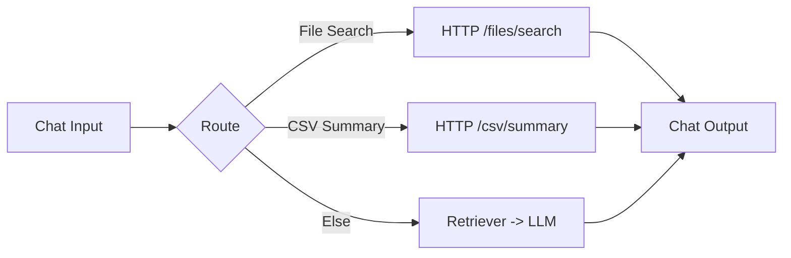

# ✅ Day 17 — Multi-Tool Local Agent (Search + CSV Summary + RAG)

**Save as:** `wk03/day17_multi_tool_agent.md`

---

## 🎯 Purpose

Give your agent **three local skills** — file search, CSV profiling, and RAG fallback — so it can **find**, **summarize**, and **explain** without cloud dependencies.

---

## 📌 Objectives

- Launch a tiny **FastAPI** with `/files/search` + `/csv/summary`.  
- Route intents using **If/Else Router** in Flowise.  
- Keep outputs **concise**, **cited**, and **actionable**.

---

## ⏱ Agenda (≈ 45–60 min)

1) API up → 2) Flowise router → 3) Prompts → 4) Tests → 5) Export + commit.

---

## 🔧 Local Tools API

```bash
mkdir -p scripts && cd scripts
python -m venv .venv && source .venv/bin/activate   # Windows: .\.venv\Scripts\Activate
pip install fastapi uvicorn pandas

# Add local_tools_server.py (with /health, /files/search, /csv/summary)
uvicorn local_tools_server:app --reload --port 8001

# Health: http://127.0.0.1:8001/health -> {"status":"ok"}
````

### Endpoints Overview

* `/files/search` → returns file names + small snippets.
* `/csv/summary` → returns rows, columns, null rates, and type hints.

---

## 🛠 Flowise Routing

### Router Logic

* If message contains `(find|where|search|contains)` → **HTTP: /files/search**
* If message contains `(csv|columns|nulls|schema|summary)` → **HTTP: /csv/summary**
* Else → **Retriever → LLM** (RAG fallback)

---

### System Prompt (Flowise Prompt Node)

```text
You have three pathways:

1) If FILE_SEARCH_JSON exists:
   Summarize matches → show filename + snippet (max 10).

2) If CSV_SUMMARY_JSON exists:
   Report rows, columns, null %, compact schema table.

3) Else:
   Use RAG (retrieved repo context only).

Always:
- Include an Action List (2–4 bullets).
- Cite filenames when present.
- Ask ONE clarifying question only if context is thin.
```

---

## 🧪 Test Scenarios

### 1️⃣ File Search

> “Find where the daily digest is configured.”

### 2️⃣ CSV Summary

> “Summarize W3D17_clean.csv — rows, columns, nulls.”

### 3️⃣ RAG Fallback

> “What are Week 2 deliverables and validations?”

---

## 📂 Deliverables

* `scripts/local_tools_server.py`
* `wk03/day17/W3D17_flowise_chatflow.json`
* `wk03/day17/W3D17_notes.md` (+ optional screenshot)

---

## ✅ Rubric

* Router → correct pathway **3/3**
* CSV output includes **nulls + schema**
* RAG fallback **cites filenames**
* Outputs include **Action List**

---

## 🧭 Flow (Mermaid)



---

## 🧰 Troubleshooting

* **Router misses intent:** add synonyms; lower-case input.
* **Empty snippets:** increase search preview length server-side.
* **CSV failure:** confirm file path + permissions.

---

## 🔮 Upgrades

* Swap keyword routing for an **intent classifier** (few-shot).
* Add `/md/toc` endpoint to auto-generate a **table of contents** for large docs.
* Add `/csv/profiling` with lightweight **outlier detection**.

```
```


