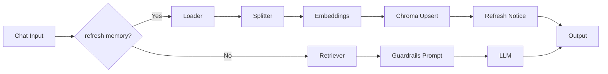

# ✅ Day 18 — Refreshable RAG + Guardrails & Citations

**Save as:** `wk03/day18_refreshable_rag.md`

---

## 🎯 Purpose

Allow non-technical users to type **“refresh memory”** to re-index the repo.  
Every answer includes **Sources + Confidence + Action Items**, or asks **one clarifying question** when context is thin.

---

## 📌 Objectives

- Refresh branch (**Loader → Splitter → Embeddings → Chroma upsert**)  
- Add a **Guardrails prompt** to standardize trust, brevity, and evidence  
- Tune the **Retriever** for high signal / low noise  

---

## 🛠 Branching Logic

- **If** input contains `refresh memory` → Refresh branch → “Memory refresh complete…”  
- **Else** → Normal **Retriever → Guardrails Prompt → LLM → Output**

---

### 🧩 Guardrails Prompt (paste as template)

```text
You answer ONLY with information grounded in retrieved context.

Policy:
- If low/no results: say you lack context and ask ONE clarifying question.
- Always include a “Sources” section listing filenames/paths (max 5).
- Do not fabricate citations or numbers.

Format:
- Brief Answer: 3–6 bullets
- Action Items: 2–4 bullets
- Confidence: High | Medium | Low (one reason)
- Sources: bullet list of file paths

Context:
{{context}}
````

---

### Retriever Defaults

* `topK = 4`
* `threshold = 0.35–0.45`
* `chunk = 1000`
* `overlap = 150`

---

## 🧪 Test Prompts

1️⃣ “What are the **Week 2 deliverables** and how do I **validate** them?”
2️⃣ “Summarize **Day 17 outputs** for a VP (bullets + actions).”
3️⃣ `refresh memory` → add/update a file → “What changed since last refresh?”

---

## 📂 Deliverables

* `wk03/day18/W3D18_prompt_template.txt`
* `wk03/day18/W3D18_flowise_chatflow.json`
* `wk03/day18/W3D18_tests.md` *(paste outputs of the 3 tests)*

---

## ✅ Rubric

* Refresh works; “Memory refresh complete…” displays
* All answers include **Sources + Confidence**
* Clarifying question appears when context is thin

---

## 🧭 Flow (Mermaid)



---

## 🧰 Troubleshooting

* **Refresh does nothing:** confirm Chroma upsert ON + globs correct.
* **No sources:** ensure retriever returns `filePath` metadata.
* **Overly long answers:** lower LLM max tokens; keep `topK=3–4`.

---

## 🔮 Upgrades

* **Auto-refresh** on commit via Git hook or GitHub Action.
* **Confidence gating:** only answer if similarity ≥ threshold.
* **Delta-diff:** post-refresh compare chunk hashes; add “What changed” section.

```
```

