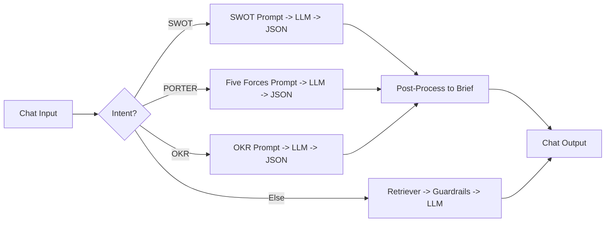

# ✅ Day 19 — Strategy Modules (SWOT · Five Forces · OKRs) with RAG Evidence

**Save as:** `wk03/day19_strategy_modules.md`

---

## 🎯 Purpose

Attach **agent-callable strategy modules** that output **valid JSON + executive briefs**, grounded in **repo evidence** with **citations** and **confidence**.

---

## 📌 Objectives

- Create three **JSON-first prompt templates** (SWOT, Five Forces, OKRs).  
- Configure the **router** to detect intent; missing parameters default to national level.  
- Build a **post-processor** that converts JSON → 5–7 bullet brief + 3 actions + sources.

---

## 🗂 Files (place in `wk03/day19/`)

- `W3D19_swot_prompt.txt`  
- `W3D19_porter_prompt.txt`  
- `W3D19_okrs_prompt.txt`  
- `W3D19_flowise_chatflow.json`  
- `W3D19_examples.md` *(one JSON + brief per module)*

Use your earlier **JSON-only templates**.  
Ensure they **cite filenames** and include **confidence** + **notes**.  
Keep **temperature low** and set **“JSON only”** instructions clearly.

---

## 🛠 Router (Flowise)

**Routing Logic:**

- Contains `swot` → **SWOT Prompt → LLM → JSON**  
- Contains `porter` or `five forces` → **Porter Prompt → LLM → JSON**  
- Contains `okr` or `goals` → **OKR Prompt → LLM → JSON**  
- Else → **Default RAG (Retriever → Guardrails → LLM)**

---

## 🛠 Post-Processor Prompt (JSON → Brief)

```text
You receive a JSON object for a strategy module. Convert to a concise brief.

Rules:
- 5–7 bullets + 3 Action Items
- Include Confidence and Sources (from JSON)
- If any field is missing, say "Unknown" and note the gap.

JSON:
{{module_json}}
````

---

## 🧪 Test Prompts

1️⃣ “Run a **SWOT** for healthcare in **Oromia**, 2023–2024.”
2️⃣ “Do **Porter’s** for education in **Addis Ababa**, next 12 months.”
3️⃣ “Draft **OKRs** for maternal health, H1 2025, focus = antenatal care.”

---

## 📂 Deliverables

* Module prompts (`.txt`)
* Flow export (`.json`)
* `W3D19_examples.md` with example JSON + brief

---

## ✅ Rubric

* Valid **JSON output** (parseable)
* Brief matches JSON; **sources + confidence** included
* Router hits correct module **3/3**; sensible defaults applied

---

## 🧭 Flow (Mermaid)



---

## 🧰 Troubleshooting

* **Text mixed with JSON:** add “OUTPUT JSON ONLY”; lower temperature; add stop sequences.
* **No sources:** ensure retriever injects metadata; force filenames in module schema.
* **Ambiguous intent:** prompt for missing `sector`, `region`, `timeframe`, `focus`.

---

## 🔮 Upgrades

* Save JSON to `/data/strategy/` and auto-render briefs to `/docs/strategy/`.
* Add **validation script** to check JSON schema compliance.

```
```


