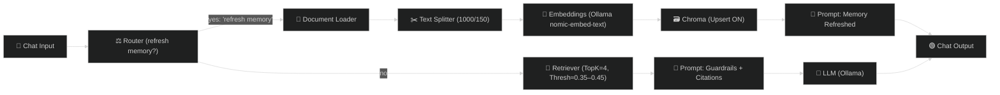

# ⚡️ Day 24 — Refreshable RAG + Source-Linked Answers (Memory + Citations)

## 🎯 Objective

Give your local Flowise agent three pro-level upgrades—still **100% free & local**:

1. 🔄 **Refresh Memory on Demand** — type `refresh memory` to re-index your repo
2. 📎 **Source Citations by Filename** — every answer lists where the info came from
3. 🛡 **Guardrails** — confidence rating, “don’t know” fallback, clarifying question when context is thin

⏱ **Timebox:** \~30 minutes

---

## ✨ Why This Slaps

* **Auditable** answers (with sources) 👉 trust + compliance
* **Repeatable** results 👉 clean retrieval, less noise
* **Self-healing** 👉 re-index from chat when docs update

---

## 🧪 Quickstart (5 minutes)

1. **Duplicate** your Day 22/23 chatflow → name it `W4D24_Refreshable_RAG`.
2. **Tune retriever:**

   * Text Splitter → `chunkSize=1000`, `chunkOverlap=150`
   * Retriever (Chroma) → `topK=4`, **Score Threshold** ≈ `0.35–0.45`, Search=`similarity`
   * Chroma → Collection:`aimastery_w4`, **Upsert/Update ON**
3. **Add Router**:

   * If message **contains** `refresh memory` → route to **Document Loader → Splitter → Embeddings → Chroma (Upsert)** → then output “Memory refreshed.”
   * Else → normal **Retriever → Prompt → LLM → Output**
4. **Swap your Prompt** with the **Guardrails + Citations** template below.
5. **Test** the three prompts at the bottom. Done.

---

## 🧠 Prompt Template (Guardrails + Citations)

Save as `W4D24_prompt_template.txt`, then paste into your **Prompt Template** node (before LLM):

```
You are a Strategic AI Coach answering ONLY with information grounded in retrieved context from this repo.

POLICY:
- If retriever returns low-similarity or no results:
  Say: "I don’t have enough context in this repo to answer confidently."
  Then ask ONE clarifying question.
- Always include a "Sources" section listing file paths and/or filenames from document metadata.
- Do NOT fabricate citations, numbers, or promises.
- Keep answers crisp and decision-oriented.

FORMAT:
- Brief Answer: 3–6 bullets max
- Action Items: 2–4 bullets
- Confidence: High | Medium | Low (one short reason)
- Sources: bullet list of file paths (max 5)

CONTEXT TO USE:
{{context}}
```

> Heads up: Ensure your retriever exposes `metadata.source` or `filePath`. (In Flowise, Chroma does this; keep the field names consistent.)

---

## 🧩 Flow Wiring (Refresher)

**Router Branch A (Refresh Memory):**

* IF chat contains `refresh memory`
  → **Document Loader (Local Files)**
  → **Text Splitter**
  → **Ollama Embeddings (nomic-embed-text)**
  → **Chroma (Upsert ON)**
  → **Prompt Template (just say: “Memory refresh complete…”)**
  → **Chat Output**

**Router Branch B (Normal Q\&A):**

* ELSE
  → **Retriever (Chroma)**
  → **Prompt Template (Guardrails + Citations)**
  → **LLM (Ollama)**
  → **Chat Output**

---

## 🧱 Suggested Node Texts

### “Memory Refreshed” Prompt (Branch A)

```
Memory refresh complete. I re-indexed the repo (Markdown/CSV/TXT).
Ask your question again for updated context.
```

### “Citations + Guardrails” Prompt (Branch B)

Use `W4D24_prompt_template.txt` from above.

---

## 🔧 Retriever Tuning (Noise → Signal)

* **K=4** is a sweet spot for small repos
* **Score Threshold 0.35–0.45** trims junk (raise to be stricter)
* Keep **chunkSize=1000 / overlap=150** for markdown-heavy repos

---

## 🧪 Test Prompts (Paste in Flowise)

1. **“What are the Week 2 deliverables and how do I validate them?”**
   Expect: bullets + **Sources** + **Confidence**
2. **“Summarize Day 21 outputs for an MBA student — bullets + actions.”**
   Expect: short, on-point brief + **Sources**
3. **Type:** `refresh memory` → change a file →
   **“What changed in Week 2’s automation since last refresh?”**
   Expect: acknowledgments + new sources reflected

---

## 📦 Deliverables

Save to `Week4_Autonomous_Strategic_Agents/Day24/`:

* `W4D24_prompt_template.txt` — the exact template you used
* `W4D24_flowise_chatflow.json` — exported updated flow
* `W4D24_tests.md` — paste the 3 prompt results (copy output from Flowise)
* *(Optional)* `W4D24_flow_screenshot.png` — diagram of refresh route

---

## 🧰 Troubleshooting

* **No Sources?** Ensure retriever includes metadata + your prompt asks for Sources
* **Refresh not working?** Confirm Router keyword, loader globs, and **Chroma Upsert ON**
* **Answers too long?** Lower LLM max tokens; keep `topK=3–4`
* **Still noisy?** Raise threshold to `0.5`, or add a pre-filter (e.g., only `.md`)

---

## 🧭 Upgrade Path (Day 25+ ideas)

* **Delta-diff answers**: compare pre/post refresh chunk hashes → summarize changes
* **Auto-refresh on commit**: small watcher script hits a hidden “refresh” route
* **Confidence gating**: only answer if similarity ≥ threshold, else ask a follow-up

---

## 🗺 Diagram (Optional Mermaid)

If your repo renders Mermaid:


