# ⚡️ Day 24 — Refreshable RAG + Source-Linked Answers (Memory + Citations)

## 🎯 Objective

Evolve your Flowise agent into a **refreshable, governance-ready knowledge system** — still **100% free & local**:

1. 🔄 **Refresh Memory on Demand** — type `refresh memory` to re-index your repo (citizen reports, policies, budgets).  
2. 📎 **Source Citations by Filename** — every answer lists **where the info came from** (compliance & audit trail).  
3. 🛡 **Guardrails** — confidence rating, *“don’t know”* fallback, clarifying question when context is thin.  

⏱ **Timebox:** ~30 minutes  

---

## ✨ Why This Matters (Ethiopia Focus)

- **Auditable** 👉 Source-linked answers build trust in public decision-making.  
- **Repeatable** 👉 RAG tuned for **clean retrieval of citizen data & policy docs**.  
- **Self-healing** 👉 Local staff can type *“refresh memory”* after uploading new reports — no IT overhead.  

This means Ethiopian municipalities, NGOs, or civic orgs can **analyze policy, budget, or survey updates instantly** while keeping **data local**.

---

## 🧪 Quickstart (5 minutes)

1. **Duplicate** your Day 22/23 chatflow → name it `W4D24_Refreshable_RAG`.  
2. **Tune retriever:**  
   - Text Splitter → `chunkSize=1000`, `chunkOverlap=150`  
   - Retriever (Chroma) → `topK=4`, **Score Threshold** ≈ `0.35–0.45`, Search=`similarity`  
   - Chroma → Collection:`aimastery_w4`, **Upsert/Update ON**  
3. **Add Router**:  
   - If message **contains** `refresh memory` → route to **Document Loader → Splitter → Embeddings → Chroma (Upsert)** → then output “Memory refreshed.” 
   - Else → normal **Retriever → Prompt → LLM → Output**  
4. **Swap your Prompt** with the **Guardrails + Citations** template (below).  
5. **Test** the three prompts (see bottom).  

---

## 🧠 Prompt Template (Guardrails + Citations)

Save as `W4D24_prompt_template.txt` and paste into your **Prompt Template** node (before LLM):

```
You are a Strategic AI Coach answering ONLY with information grounded in retrieved context from this repo.

POLICY:
- If retriever returns low-similarity or no results:
  Say: "I don’t have enough context in this repo to answer confidently."
  Then ask ONE clarifying question.
- Always include a "Sources" section listing file paths and/or filenames from document metadata.
- Do NOT fabricate citations, numbers, or promises.
- Keep answers crisp and decision-oriented.

FORMAT:
- Brief Answer: 3–6 bullets max
- Action Items: 2–4 bullets
- Confidence: High | Medium | Low (one short reason)
- Sources: bullet list of file paths (max 5)

CONTEXT TO USE:
{{context}}
```

---

## 🧩 Flow Wiring (Refresher)

**Router Branch A (Refresh Memory):**

* IF chat contains `refresh memory`  
  → **Document Loader (Local Files)**  
  → **Text Splitter**  
  → **Ollama Embeddings (nomic-embed-text)**  
  → **Chroma (Upsert ON)**  
  → **Prompt Template: "Memory refresh complete…"**  
  → **Chat Output**  

**Router Branch B (Normal Q&A):**

* ELSE  
  → **Retriever (Chroma)**  
  → **Prompt Template (Guardrails + Citations)**  
  → **LLM (Ollama)**  
  → **Chat Output**  

---

## 🧱 Suggested Node Texts

### “Memory Refreshed” Prompt (Branch A)

```
Memory refresh complete. I re-indexed the repo (Markdown/CSV/TXT).
Ask your question again for updated context.
```

### “Citations + Guardrails” Prompt (Branch B)

Use `W4D24_prompt_template.txt`.

---

## 🔧 Retriever Tuning (Noise → Signal)

- **K=4** is a sweet spot for civic repos with policy PDFs or survey CSVs.  
- **Score Threshold 0.35–0.45** trims junk (raise to be stricter for compliance docs).  
- **chunkSize=1000 / overlap=150** balances context with detail.  

---

## 🧪 Test Prompts (Copy into Flowise)

1. **“What are the Week 2 deliverables and how do I validate them?”**  
   Expect: bullets + **Sources** + **Confidence**.  
2. **“Summarize Day 21 outputs for an MBA student — bullets + actions.”**  
   Expect: crisp briefing + **Sources**.  
3. **Type:** `refresh memory` → update a file →  
   **“What changed in Ethiopia’s service delivery data since last refresh?”**  
   Expect: new **sources reflected** + confidence rating.  

---

## 📦 Deliverables

Save to `Week4_Autonomous_Strategic_Agents/Day24/`:

- `W4D24_prompt_template.txt` — your exact template  
- `W4D24_flowise_chatflow.json` — exported flow  
- `W4D24_tests.md` — copy outputs from the 3 test prompts  
- *(Optional)* `W4D24_flow_screenshot.png` — diagram of refresh route  

---

## 🧰 Troubleshooting

- **No Sources?** Ensure retriever includes `metadata.source` or `filePath`.  
- **Refresh not working?** Confirm Router keyword, loader globs, and Chroma Upsert = ON.  
- **Answers too long?** Lower LLM max tokens; keep `topK=3–4`.  
- **Still noisy?** Raise threshold to `0.5`, or restrict loader to `.md` + `.csv`.  

---

## 🧭 Upgrade Path (Day 25+ Ideas)

- **Delta-diff answers**: compare pre/post refresh chunk hashes → “what changed” view.  
- **Auto-refresh on commit**: trigger refresh when repo updates.  
- **Confidence gating**: only answer if similarity ≥ threshold, else ask clarifying question.  
- **Civic focus**: Ethiopia use case → daily refresh of **budget + healthcare + citizen feedback** CSVs.  

---

## 🗺 Diagram (Mermaid)

```mermaid
%%{ init: { 'theme': 'dark' } }%%
flowchart LR
  IN["💬 Chat Input"]
  R["⚖️ Router (refresh memory?)"]
  DL["📁 Document Loader"]
  TS["✂️ Text Splitter (1000/150)"]
  EMB["🧬 Embeddings (Ollama nomic-embed-text)"]
  VS["🗃 Chroma (Upsert ON)"]
  RET["🔎 Retriever (TopK=4, Thresh≈0.35–0.45)"]
  PTREF["🧾 Prompt: Memory Refreshed"]
  PTRAG["🧾 Prompt: Guardrails + Citations"]
  LLM["🧠 LLM (Ollama)"]
  OUT["🟢 Chat Output"]

  IN --> R
  R -->|yes: 'refresh memory'| DL --> TS --> EMB --> VS --> PTREF --> OUT
  R -->|no| RET --> PTRAG --> LLM --> OUT
```


````
