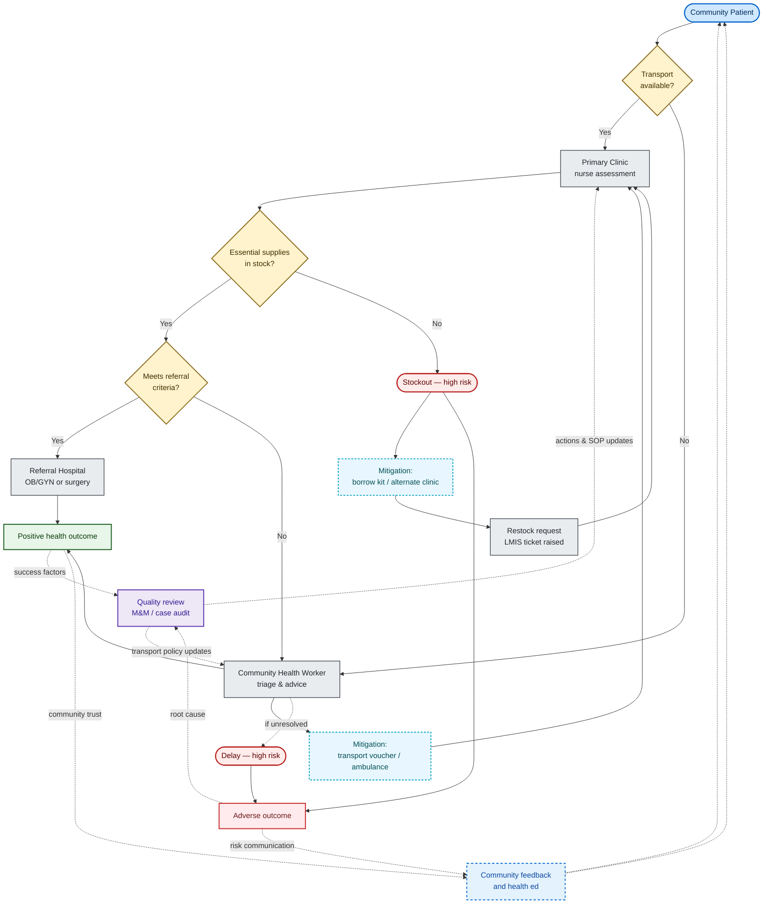

#  W4D28 — Mermaid Playbook: Making Advanced Diagrams & Strategic Templates for Ethiopian NGOs

##  Purpose  
As the **AI Strategist Lead**, your job is to equip Ethiopian nonprofits with **best-in-class visual tools** and actionable prompts. This playbook shows two things:

1. **How to write advanced Mermaid diagrams** that render cleanly on GitHub.  
2. **Five essential AI prompt templates** tailored to common nonprofit challenges in Ethiopia.

---

## 1. Meta Prompt for Clean GitHub-Compatible Mermaid

Use this core prompt to generate diagrams that are **renderable in GitHub README files** (avoiding syntax pitfalls like unsupported symbols or breaks).

```text
You are an AI Strategist Lead.  
Help me generate an **advanced, boardroom-ready Mermaid flowchart** that works in GitHub Markdown.

GUIDELINES:
- Use only clean Mermaid syntax: no `%`, `~`, Unicode arrows, or parentheses that break parsing.
- Label nodes clearly with words (e.g., "Process", "Decision", "Yes", "No").
- Use `<br/>` for multi-line node labels.
- Include multiple branches (e.g., Yes⁄No, Safe⁄At Risk).
- At the end, give 2–3 short narrative bullets for explaining the diagram to boards or funders.

EXAMPLE INPUT:
- Structure: "Client Intake" → "Service Delivery" → "Follow-Up"  
- Branch: "Insurance Payment OK?"  

EXPECTED OUTPUT:
- A valid Mermaid diagram block
- Narrative bullets for stakeholder presentation
````

---

## 2. 5 Strategic Prompts for Ethiopian Nonprofits

Use these as templates for mission-critical AI workflows. Replace placeholders or adapt domains as needed.

### Prompt 1: Program Theory of Change

```text
Create a Mermaid flowchart mapping:
Input → Activity → Output → Outcome → Impact  
Context: Ethiopian rural education program  
Include risk nodes like “Funding Delay” or “Transport Issues”.  
Also provide 2 narrative bullets for board storytelling.
```

### Prompt 2: Donor Funds Flow & Accountability

```text
Diagram how donor funds move:
Donor → HQ → Regional Office → Field Team → Beneficiaries  
Add checkpoints: “Audit”, “Field Verification”, “Community Feedback”.  
Highlight leakage risks.  
Include narrative bullets explaining governance structure.
```

### Prompt 3: Maternal Health Service Journey

```text
Map the patient path:
Community → Clinic Visit → Referral Hospital → Outcome  
Decision nodes: “Transport Available?”, “Supplies In Stock?”  
Mark high risk nodes in red.  
Add a narrative for health leadership brief.
```

### Prompt 4: Emergency Response Flowchart

```text
Flow: Weather Alert → Mobilization → Resource Dispatch → Community Delivery  
Branch: If “Insufficient Resources” → “Request Support from Donors”  
Include quick narrative bullets for government briefing.
```

### Prompt 5: M\&E Feedback Loop

```text
Visualize data cycle:
Collect Data → Clean → Analyze → Report → Act → Collect Data  
Include checks: “Data Quality OK?”, “Community Feedback Integrated?”  
Add round-trip flow arrow.  
Add narrative bullets for internal performance review.
```

---

## Why This Is Best-in-Class

* **GitHub‑safe syntax** avoids crashing render engines (based on GitHub’s current Mermaid version) ([github.blog][1], [docs.github.com][2], [reddit.com][3])
* **Clear labels** and `<br/>` ensure readability even in dense charts
* **Narrative bullets** translate visuals into strategic storytelling
* **Contextual relevance** aligns with Ethiopian nonprofit needs

---

## Sample Use-Case: Maternal Health Prompt + Output

**Prompt:**

```
Diagram the patient journey for maternal health services in rural Ethiopia:
Community → Clinic → Referral Hospital → Outcome  
Include decision nodes: "Transport Available?", "Supplies In Stock?".  
Highlight high-risk points. Add narrative bullets for a donor pitch.
```

**AI Response (example):**



**Narrative:**

* Delays at the transport and stock availability nodes risk patient outcomes.
* Highlight investments in transport logistics and supply chain as mitigation.

---

Place this file as `Week4_Autonomous_Strategic_Agents/Day28/W4D28_mermaid_playbook.md` in your repo, and it's ready to empower learners.

Let me know if you'd like me to include a rendered sample using real Ethiopian program data or prepare a slide deck snippet for quick deployment!

[1]: https://github.blog/developer-skills/github/include-diagrams-markdown-files-mermaid/?utm_source=chatgpt.com "Include diagrams in your Markdown files with Mermaid"
[2]: https://docs.github.com/en/get-started/writing-on-github/working-with-advanced-formatting/creating-diagrams?utm_source=chatgpt.com "Creating Mermaid diagrams"
[3]: https://www.reddit.com/r/github/comments/100mbuh/mermaid_diagram_not_working/?utm_source=chatgpt.com "Mermaid diagram not working : r/github"
