# 🎨 W4D20 — Mastery Program Assets (Governance & Political Toolkit Edition)


> **Scope note:** This is the Week 4 capstone (Day 20) for the 20-day program.

---

## 📑 Table of Contents

* [🎯 Purpose](#-purpose)
* [📂 Core Assets](#-core-assets)
* [📦 Deliverables](#-deliverables)
* [🗺 Workflow](#-workflow)
* [✅ By Now, You Can](#-by-now-you-can)
* [🛠 Troubleshooting Mermaid](#-troubleshooting-mermaid)
* [📝 Week 2 Summary Prompt (Days 6–10)](#-week-2-summary-prompt-days-610)

---

## 🎯 Purpose

This folder holds the **Day 20 mastery assets** — a boardroom-ready kit to:

* Distinguish **AI Governance** vs **AI Leadership**
* Translate Vibe Coding agents and workflows into **political/municipal use cases**
* Equip leaders with **visuals, calculators, and dashboards** they can deploy quickly

> Aligned with the updated program map: **W1 (1–5), W2 (6–10), W3 (11–15), W4 (16–20).**

---

## 📂 Core Assets

* `W4D20_ai_governance_vs_leadership.md` — roles, responsibilities, and overlap
* `W4D20_public_service_rag.md` — RAG for **citizen data + transparency** (local, private)
* `W4D20_assets.md` — this index file

**Optional add-ons**

* `templates/mermaid_snippets.md` (flowchart, gantt, pie quick-copy)
* `templates/badge_snippets.md` (Shields.io presets)
* `templates/board_slide_outline.md` (executive 1-pager)

---

## 📦 Deliverables

* Shields.io badges for repo branding
* Clickable ToC for quick navigation
* Advanced **Mermaid diagrams** for **policy & project tracking**
* Civic-oriented **Databutton** and **Lovable** starter notes/links

---

## 🗺 Workflow

```mermaid
flowchart LR
    A["🗂 Mastery Assets (Day 20)"]
    B["⚖️ AI Governance vs Leadership"]
    C["📚 Public Service RAG (citizen data)"]
    D["🎨 Badges & Boardroom Visuals"]
    E["⚡ Micro-Tools & Apps (Lovable, Databutton)"]

    A --> B
    A --> C
    A --> D
    A --> E
```



---

## ✅ By Now, You Can

* Explain **governance roles vs leadership actions** to stakeholders
* Use **repo-grounded RAG** to cite **file-based sources** in public-facing answers
* Ship **Lovable/Databutton micro-tools** (budget, permits, health) in hours
* Present **strategy → workflow → metrics** with clean visuals and evidence

---

## 🛠 Troubleshooting Mermaid

* Put **only Mermaid syntax** inside the \`\`\`mermaid code fence
* Close the fence with **three backticks** on their own line
* If you use an init/theme line, it must be the **first line** inside the block (e.g. `%%{ init: { "theme": "default" } }%%`)
* Avoid stray HTML (e.g., `<br/>`, `<code>`) inside Mermaid blocks

---

## 📝 Week 2 Summary Prompt (Days 6–10)

> Save as: `Week2_summary_prompt.md`

```markdown
# 📝 Week 2 Governance & Leadership Toolkit — Summary Prompt (Days 6–10)

You are an AI strategy consultant preparing a **Week 2 Governance & Leadership Report**.  
Generate a **boardroom-ready case study** summarizing outcomes from **Days 6–10**.

---

## Instructions

### 1) Cover Each Day (6 → 10)
Summarize each day for **government/municipal workflows**:
- **Day 6** — Political strategy flows: how issues become policy; where AI fits.
- **Day 7** — Context packs: enforce standards, rules, and ethics.
- **Day 8** — SDLC with governance gates: oversight & accountability.
- **Day 9** — Git without fear: audit trails & transparent collaboration.
- **Day 10** — Ship your site/app (Lovable/Replit) & micro-tools (Databutton).

### 2) Skills Checklist (What they can now do)
List actionable capabilities:
- Build political strategy **flowcharts** with AI touchpoints.
- Author **context packs** (governance, privacy, bias, terminology).
- Map **SDLC** with **governance checkpoints**.
- Use **Git** as an accountability system (clean commits, PRs, `.gitignore`).
- Ship a **Lovable/Replit** site and a **Databutton** civic data app.
- Deliver a **boardroom-ready demo** with PRD + Mermaid visuals.

### 3) Practice Routines (for mastery)
Propose a **repeatable 3-day cadence**:
- **Day A:** Redraw a municipal workflow (permits, disasters, inspections).
- **Day B:** Ship one micro-tool & publish link.
- **Day C:** Record a 3-minute demo (site + tool + governance note) and collect feedback.

### 4) Structure the Report
Use this outline:
- **Executive Summary** (1–2 paragraphs)
- **Toolkit Overview** (agents, tools, deliverables)
- **Applications for Municipalities** (Ethiopia/Caribbean examples)
- **Strengths & Limitations**
- **Next Steps** (Week 3 preview: data analysis agents; Week 4: strategic agents)

---

## Output
Produce a polished Markdown report titled:
**"Week 2 Governance & Leadership Toolkit — Vibe Coding Mastery Case Study"**
```

---

### How to use

* Replace your old Day-28 file with this **`W4D20_assets.md`**.
* Save the prompt above as **`Week2_summary_prompt.md`** next to it.
* Commit both. If Mermaid still fails to render, check that:

  * The mermaid block contains *only* Mermaid syntax
  * All code fences are properly closed
  * No HTML or stray backticks leaked into the block

---

**Mappings Recap (updated program):**

* **Week 1:** Days **1–5**
* **Week 2:** Days **6–10**
* **Week 3:** Days **11–15**
* **Week 4:** Days **16–20**

This doc, filenames, and prompts now align with the 20-day structure and your renamed Week folders.

