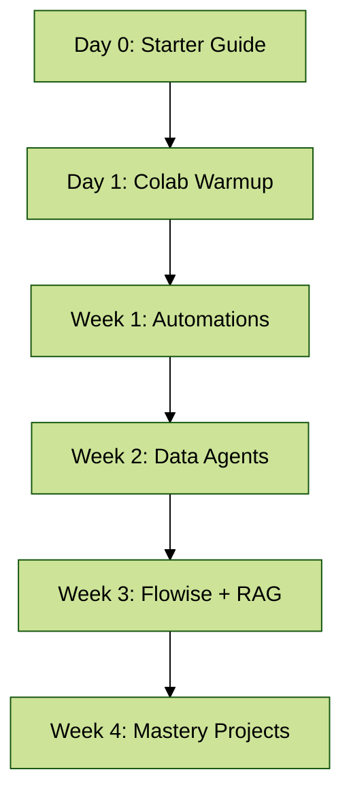

# 🚀 Vibe Coding Starter Guide

*Your Day Zero Playbook for the 28-Day Mastery Program*

[](https://flowiseai.com)
[](https://ollama.ai)
[](https://www.trychroma.com)
[](https://colab.research.google.com)

---

## 📖 Table of Contents

1. [What is Vibe Coding?](#what-is-vibe-coding)
2. [Toolbox Setup](#toolbox-setup)
3. [Visualizations That Vibe](#visualizations-that-vibe)
4. [Mini AI Glossary](#mini-ai-glossary)
5. [Troubleshooting & FAQ](#troubleshooting--faq)
6. [Day Zero Map](#day-zero-map)

---

## 🎶 What is Vibe Coding?

Vibe Coding = **creative flow + structured exploration + real data agents.**
It’s not just learning to code — it’s **building agents, charts, and workflows that *feel alive*.**

You’ll spend 28 days:

* Automating workflows 💻
* Building data agents with memory 📊
* Deploying local AI (no cloud needed) 🛡
* Visualizing insights in *style* 🎨
* Ending with a **portfolio-ready mastery project** 🚀

---

## 🧰 Toolbox Setup

**Core Tools:**

* **Colab** → free coding notebook in the browser
* **Flowise** → drag-drop AI workflows
* **Ollama** → runs local AI models (`llama3.1:8b`, `phi3:mini`)
* **Chroma** → stores & retrieves knowledge (vector search)
* **GitHub** → share your journey + deliverables

**Quick Install Checklist:**

```bash
# Ollama (Mac/Linux, or Windows installer)
ollama pull llama3.1:8b
ollama pull phi3:mini
ollama pull nomic-embed-text

# Flowise (Docker or Node.js)
docker run -d -p 3000:3000 flowiseai/flowise

# Chroma → embedded inside repo
# No separate install needed
```

✅ Pro Tip: If you get stuck, Day 0 has a “warm-up repo” with sample CSV + MD files.

---

## 📊 Visualizations That Vibe

* **Ranking Charts** → “Who’s on top?”
* **Trends** → “What’s changing over time?”
* **Distributions** → “What’s the shape of the data?”

**Colab Example:**

```python
import pandas as pd, matplotlib.pyplot as plt
df = pd.read_csv("W3D16_clean.csv")

rank = df.groupby("product")["total"].mean().sort_values()
rank.plot(kind="barh", color="#6C5CE7", figsize=(8,5))
plt.title("Average Total by Product")
plt.xlabel("USD")
plt.tight_layout()
plt.savefig("day0_chart.png")
```

✨ Style tips:

* Rotate labels so they don’t overlap
* Keep colors bold but consistent
* Always label axes + title

---

## 🧠 Mini AI Glossary

| Term                                     | Beginner Friendly                             | Advanced Angle                                  |
| ---------------------------------------- | --------------------------------------------- | ----------------------------------------------- |
| **Generative AI**                        | Makes text/images (ChatGPT, Stable Diffusion) | Pretrained LLMs fine-tuned on massive corpora   |
| **Agentic AI**                           | AI that “acts” (tools, memory, decisions)     | Autonomous orchestration using APIs, retrievers |
| **RAG** (Retrieval-Augmented Generation) | AI + your data (retrieves context → answers)  | Embeddings + vector stores + hybrid search      |
| **Embeddings**                           | Numbers that represent meaning                | Dense vectors powering semantic similarity      |
| **Vector Store**                         | Search brain for your data                    | Chroma, Pinecone, Weaviate                      |
| **Prompt Template**                      | Blueprint for AI responses                    | Controls tone, structure, guardrails            |

---

## ❓ Troubleshooting & FAQ

**Q: Ollama says “not found”?**
A: Run `ollama pull modelname` again. Models are local downloads.

**Q: Flowise not loading?**
A: Check port → `http://localhost:3000`. Restart with Docker or `npx flowise start`.

**Q: CSV not downloading in Colab?**
A: Use `files.download("filename.csv")`. Or mount Google Drive.

**Q: Answers feel “off”?**
A: Adjust retriever → lower `Top-K` to 3–4 and raise score threshold to 0.45.

---

## 🗺 Day Zero Map



---

## ✅ Your First Mission

1. Clone the repo or open it in Colab.
2. Run a “Day 1 warm-up” script (CSV → clean → chart).
3. Celebrate your first win 🎉 — because **Vibe Coding is about momentum, not perfection.**

---

⚡ With this guide, even total beginners can onboard smoothly, while advanced learners still see the full stack of what they’ll master.

---

Do you want me to also **split this guide into modular files** (`Toolbox.md`, `Visuals.md`, `FAQ.md`) for your repo, or keep it as one **Day Zero mega-guide**?
