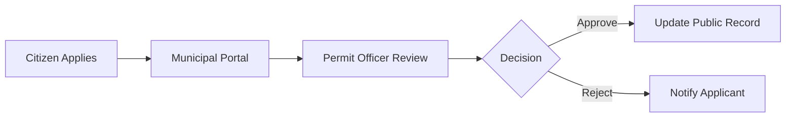
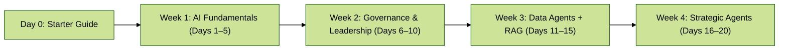

# 🚀 Vibe Coding Starter Guide (Governance + Leadership Edition)

*Your Day Zero Playbook for the 20-Day Mastery Program*

---

## 📖 Table of Contents

1. [What is Vibe Coding?](#-what-is-vibe-coding)
2. [Toolbox Setup](#-toolbox-setup)
3. [Visualizations That Vibe](#-visualizations-that-vibe)
4. [Mini AI + Governance Glossary](#-mini-ai--governance-glossary)
5. [Troubleshooting & FAQ](#-troubleshooting--faq)
6. [Day Zero Map](#-day-zero-map)
7. [Your First Mission](#-your-first-mission)

---

## 🎶 What is Vibe Coding?

Vibe Coding = **creative flow + structured exploration + civic outcomes.**
It’s not just learning to code — it’s **designing workflows, agents, and visual reports leaders can act on immediately.**

Over **20 days**, you’ll:

* Automate workflows 💻
* Build civic/data agents with guardrails 📊
* Deploy AI tools that respect governance + oversight 🛡
* Visualize insights in *boardroom-ready style* 🎨
* Finish with a **portfolio-ready mastery toolkit** 🚀

**Program map**

* **Week 1 (Days 1–5):** AI fundamentals, structured prompting, comparison & analysis flows
* **Week 2 (Days 6–10):** Governance & leadership (political flows, context packs, SDLC gates, Git, deploy)
* **Week 3 (Days 11–15):** Data analysis agents + RAG workflows
* **Week 4 (Days 16–20):** Strategic agents (local RAG, multi-tool, refreshable memory, scenario planning)

---

## 🧰 Toolbox Setup

**Core tools**

* **Lovable** → instantly ship landing pages & simple apps
* **Databutton** → tiny data calculators for civic use cases
* **Mermaid** → workflows, Gantt, and pie charts in Markdown
* **GitHub** → track decisions & create transparent audit trails

**Optional (technical learners)**

* **Colab** → Python notebook in the browser
* **Ollama** → run local AI models (`llama3.1:8b`, `phi3:mini`)
* **Flowise** → drag-drop agent orchestration (local RAG, routers, tools)
* **Chroma** → local vector store for Retrieval-Augmented Generation (RAG)

✅ **Pro tip:** Pick one builder to start (**Lovable** *or* **Replit**, **Databutton** *or* **Colab**). The goal is *momentum*, not tech overwhelm.

---

## 📊 Visualizations That Vibe

Leaders decide faster when the picture is clear. Your job: **show the right view, fast.**

* **Flowcharts** → “How does policy flow from idea → outcome?”
* **Pie Charts** → “Where are resources going?”
* **Gantt Charts** → “What’s the rollout timeline?”

**Example Mermaid (Permit Backlog Flow)**

---

## 🧠 Mini AI + Governance Glossary

| Term                                     | Beginner Friendly                            | Advanced Angle                                       |
| ---------------------------------------- | -------------------------------------------- | ---------------------------------------------------- |
| **Generative AI**                        | Makes text/images (e.g., ChatGPT)            | Pretrained LLMs, instruction-tuned pipelines         |
| **Agentic AI**                           | AI that “acts” (tools, memory, decisions)    | Orchestration across APIs/retrievers with guardrails |
| **RAG** (Retrieval-Augmented Generation) | AI + your docs (retrieves context → answers) | Hybrid search + embeddings + local vector stores     |
| **Context Pack**                         | Rulebook for AI (tone, scope, limits)        | Repo-linked prompts enforcing governance & ethics    |
| **Audit Trail**                          | Record of changes & decisions                | Git + PRs as transparent oversight logs              |

---

## ❓ Troubleshooting & FAQ

**I’m not technical — where do I start?**
Use **Lovable** (sites/apps) or **Databutton** (calculators). Both are no-/low-code.

**My Mermaid diagram won’t render.**
Ensure the code fence is exactly three backticks + `mermaid`, and contains **only** Mermaid syntax. Close with three backticks on a new line.

**How do I make this “boardroom ready”?**
Lead with **one diagram + 3 bullets**. Gantt/pie visuals communicate status faster than text walls.

**What if I don’t have data?**
Hardcode small examples (e.g., 100 permits, 10 staff). The point is *proof of concept*, not perfection.

---

## 🗺 Day Zero Map

---

## ✅ Your First Mission

1. Pick a **domain you care about** (permits, healthcare, disaster relief, campaigns).
2. Redraw its workflow in **Mermaid** (4–5 boxes + arrows).
3. Save as `day0_workflow.md`.
4. 🎉 Celebrate — you’ve built your first **boardroom-ready artifact**.

---

⚡ With this guide, both beginners and policy leaders can onboard smoothly.
By **Day 20**, you won’t just *learn AI tools* — you’ll **drive strategy with working prototypes, agents, and visuals**.

