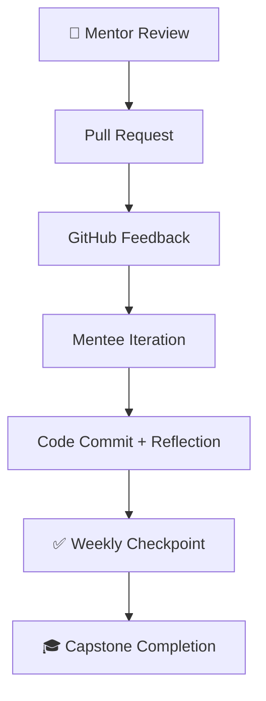

# 🚀 AI Model Mastery: Microsoft SWE Track

[](LICENSE)
[]()
[]()
[]()
[]()
[]()

---

## 🧭 Overview

**AI Model Mastery: Microsoft SWE Track** is a *hands-on, 20-day engineering accelerator* designed for aspiring **Software Engineers preparing for roles at Microsoft, Azure AI, or other cloud-first companies**.

This project bridges *theory* and *execution* — combining Python-based model development, API integration, and cloud deployment.
It’s built with mentorship in mind, enabling mentees to gain real-world project experience while mentors track progress through structured deliverables.

---

## 👥 Who This Is For

* 🎓 **Aspiring Software Engineers** preparing for Microsoft or Azure ML engineering roles.
* 🧑🏽‍💻 **Mentored Students** seeking real deliverables to showcase in technical interviews.
* ⚙️ **Developers Transitioning** from traditional software to AI product development.
* 🧠 **Instructors & Coaches** guiding students through practical, repository-based learning.

---

## 🧩 Mentorship Mode

**Mentorship Mode** is the defining feature of this repository.
It transforms the course from an individual learning path into a *guided apprenticeship* experience that mirrors Microsoft’s learning culture.

### 💡 Mentor Responsibilities

* Review pull requests weekly and provide structured feedback using GitHub Issues.
* Challenge the mentee to defend design and model choices.
* Conduct one 30-minute mock “Design Review” during Week 3 or 4.

### 🎯 Mentee Expectations

* Commit code daily with clear commit messages.
* Submit reflections in `reflections.md` after each week.
* Document all experiments in the `/deliverables/models/` directory.

### 🧱 Mentorship Deliverables

* **Week 1:** Data pipeline walkthrough
* **Week 2:** Model performance review
* **Week 3:** API & integration test
* **Week 4:** Capstone + technical interview simulation

---

## 📚 Learning Structure

| Week  | Focus                              | Core Deliverable                    |
| ----- | ---------------------------------- | ----------------------------------- |
| **1** | Data Cleaning + EDA                | Baseline regression model           |
| **2** | Model Building + Azure Integration | Trained model + evaluation notebook |
| **3** | API Integration + Plotly Dashboard | FastAPI + dashboard demo            |
| **4** | Capstone + Deployment              | Containerized AI microservice       |

Each week concludes with a checkpoint and reflection that simulates the structure of a real Microsoft sprint review.

---

## 🧠 Learning Outcomes

By completing this track, learners will:

* Design and train **machine learning models** from scratch.
* Deploy AI capabilities using **FastAPI** and **Azure ML**.
* Visualize performance metrics with **Plotly Studio** dashboards.
* Practice **GitHub workflows** (commits, PRs, branches) like a Microsoft SWE.
* Document model bias, lineage, and metrics with **Model Cards**.

---

## 📊 Tech & Tool Stack

| Category          | Tools                                        |
| ----------------- | -------------------------------------------- |
| **Languages**     | Python 3.11, Markdown                        |
| **Libraries**     | pandas, NumPy, scikit-learn, PyTorch, Plotly |
| **Frameworks**    | FastAPI, Streamlit, Dash                     |
| **Cloud/DevOps**  | Azure ML, Docker, GitHub Actions             |
| **Visualization** | Plotly Studio, Dash, Matplotlib              |
| **Mentorship**    | GitHub Projects, Issues, PR Reviews          |

---

## 🧱 Folder Structure

```plaintext
ai-model-mastery/
│
├── week1_data_and_basics/
│   ├── 01_data_loading.ipynb
│   ├── 02_feature_engineering.ipynb
│   └── 03_model_basics_linear_regression.ipynb
│
├── week2_build_a_model/
│   ├── 01_train_model_classification.ipynb
│   ├── 02_model_evaluation.ipynb
│   ├── 03_azure_ml_pipeline_setup.md
│
├── week3_ai_integration/
│   ├── 01_using_openai_api.ipynb
│   ├── 02_build_chatbot_fastapi.ipynb
│   └── 03_dashboard_plotly.ipynb
│
├── week4_capstone/
│   ├── dataset/
│   ├── model.py
│   ├── app.py
│   ├── Dockerfile
│   ├── reflections.md
│   └── README.md
│
└── docs/
    ├── technical_overview.md
    ├── mentorship_mode.md
    ├── interview_readiness_checklist.md
    └── github_etiquette_for_microsoft.md
```

---

## 🧩 Mermaid Mentorship Workflow



---

## ⚖️ License

This project is licensed under the **DACR License** — see the [LICENSE](LICENSE) file for details.

---

### 🌟 *“The best AI engineers don’t just code models — they build trust, systems, and habits that scale.”*

---


